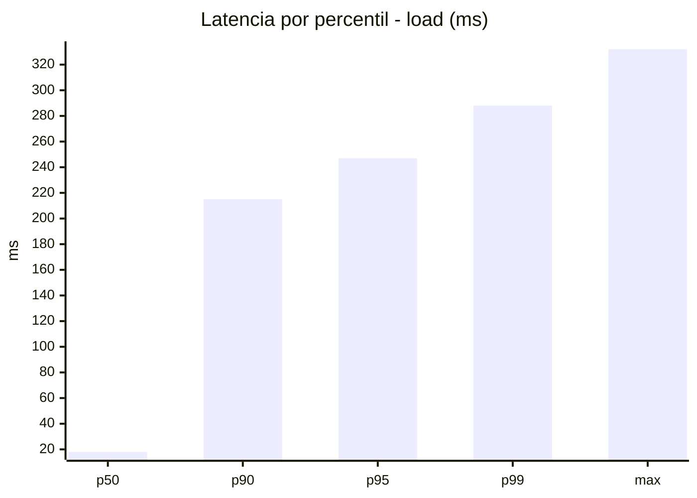
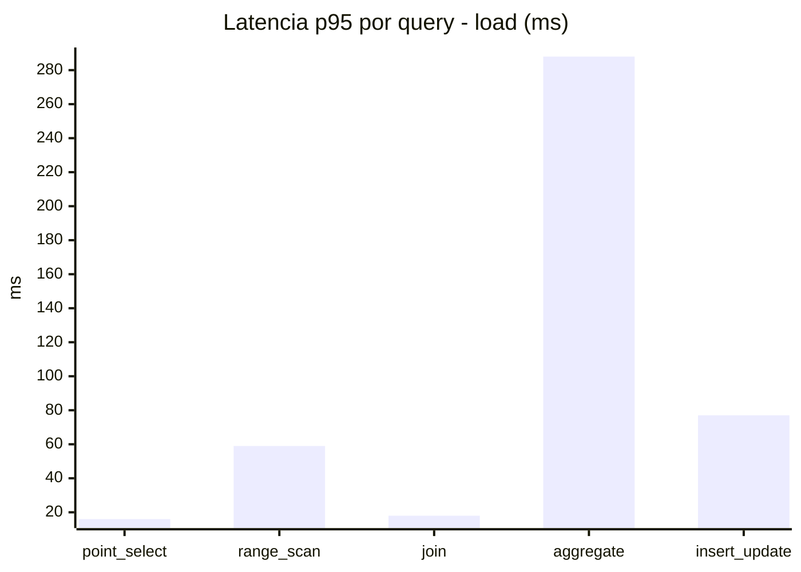
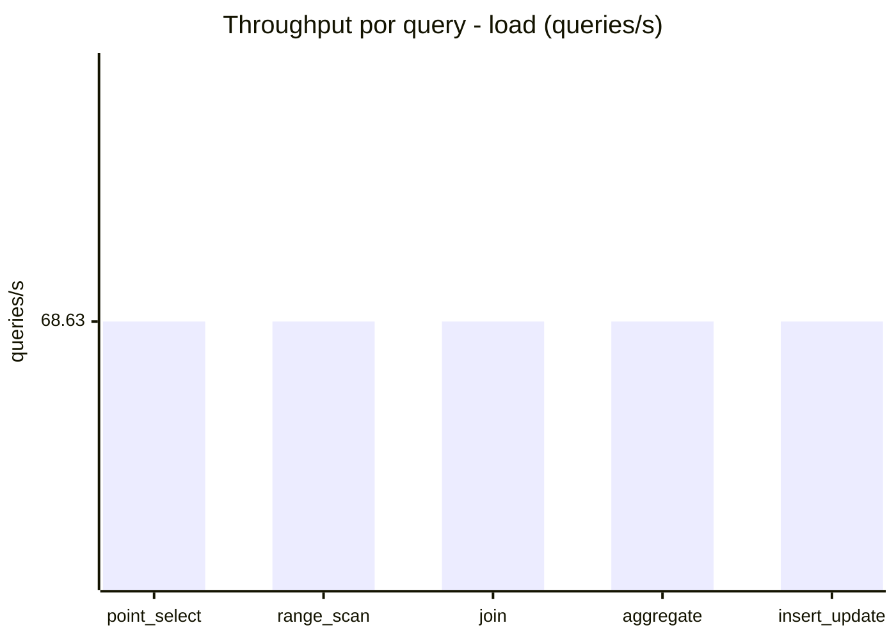
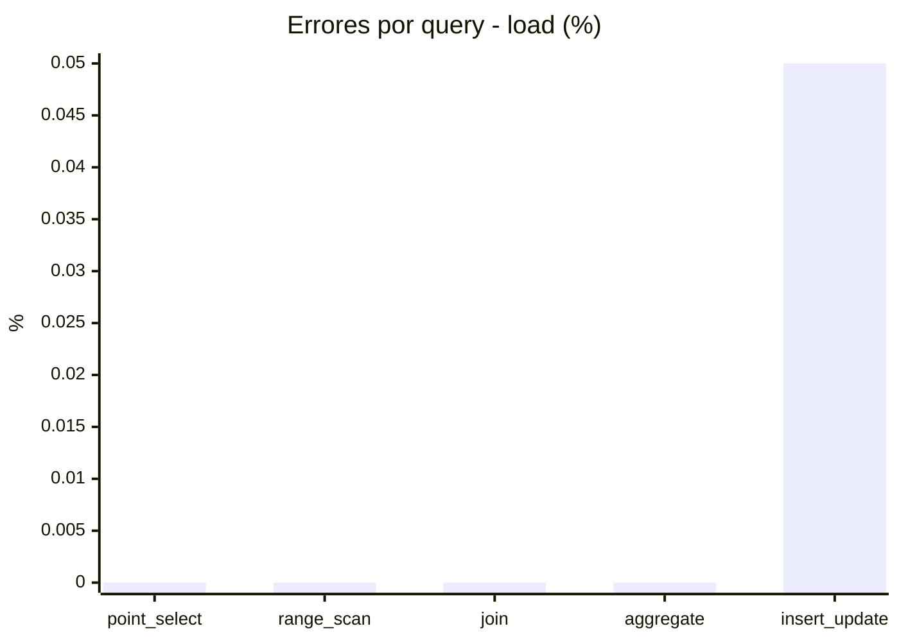
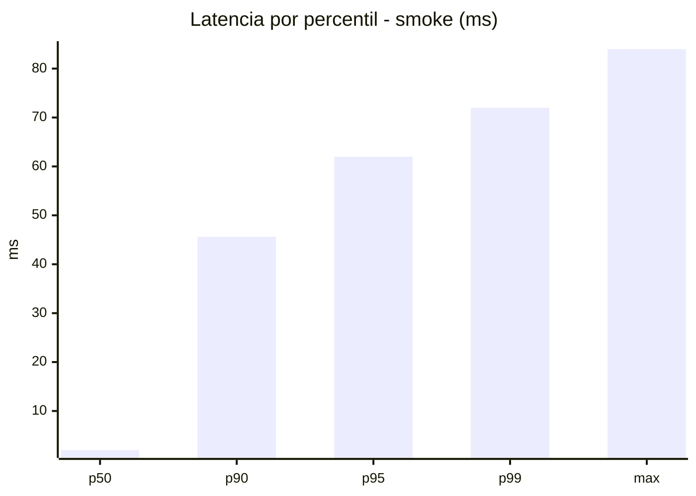
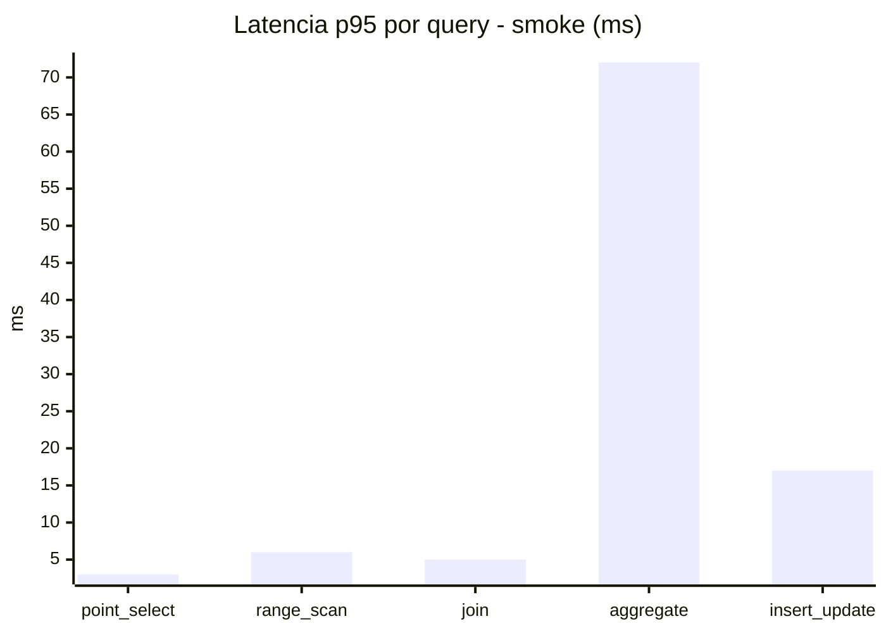
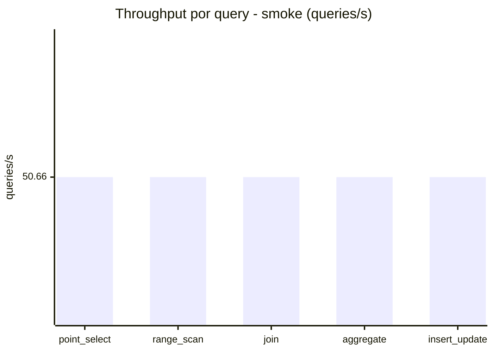
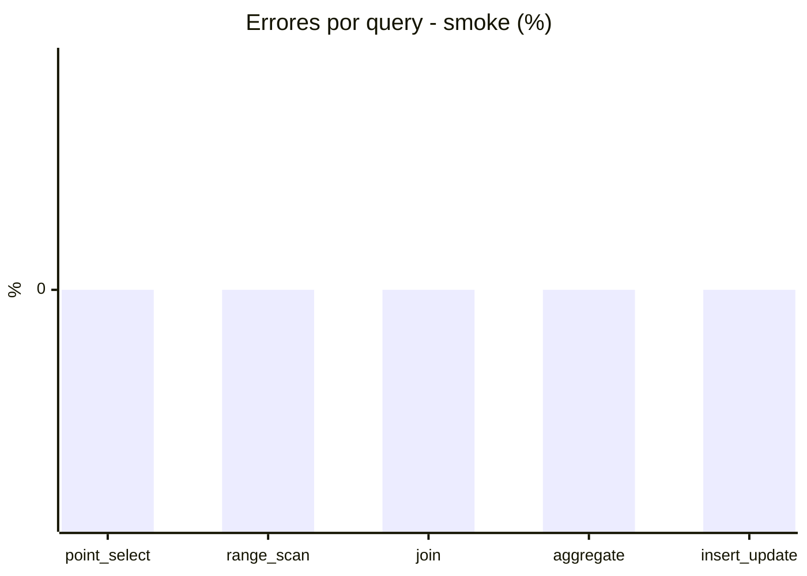

# Reporte de performance - SQL Server (k6)

**Fecha:** 2026-09-10 17:04 UTC  
**Veredicto (SLO):** `WARN`  
**Corrida:** [ver en GitHub Actions](https://github.com/lrbg/k6-sqlserver-lab/actions/runs/34505728596)  

## Analisis del agente de IA

WARN (fallback por umbrales)

- Error maximo: 0.01%
- p95 maximo: 247 ms

## Resultados

### Escenario: `load`

| Metrica | Valor |
| --- | --- |
| Queries ejecutadas | 20675 |
| Errores | 2 (0.01%) |
| Latencia media | 58.2 ms |
| p50 / p90 / p95 / p99 | 18 / 215 / 247 / 288 ms |
| Min / Max | 0 / 332 ms |
| Throughput | 343.14 queries/s |
| Duracion | 60.3 s |

Detalle por query

| Query | Ejecuciones | Error % | avg | p95 | p99 | q/s |
| --- | --- | --- | --- | --- | --- | --- |
| point_select | 4135 | 0% | 5.7 | 16 | 21 | 68.63 |
| range_scan | 4135 | 0% | 25.6 | 59 | 81 | 68.63 |
| join | 4135 | 0% | 8.5 | 18 | 22 | 68.63 |
| aggregate | 4135 | 0% | 213.3 | 288 | 310 | 68.63 |
| insert_update | 4135 | 0.05% | 37.8 | 77 | 96 | 68.63 |

### Escenario: `smoke`

| Metrica | Valor |
| --- | --- |
| Queries ejecutadas | 7605 |
| Errores | 0 (0%) |
| Latencia media | 11.8 ms |
| p50 / p90 / p95 / p99 | 2 / 45.6 / 62 / 72 ms |
| Min / Max | 0 / 84 ms |
| Throughput | 253.28 queries/s |
| Duracion | 30 s |

Detalle por query

| Query | Ejecuciones | Error % | avg | p95 | p99 | q/s |
| --- | --- | --- | --- | --- | --- | --- |
| point_select | 1521 | 0% | 0.8 | 3 | 5 | 50.66 |
| range_scan | 1521 | 0% | 3 | 6 | 11 | 50.66 |
| join | 1521 | 0% | 1.7 | 5 | 5 | 50.66 |
| aggregate | 1521 | 0% | 48.2 | 72 | 77.8 | 50.66 |
| insert_update | 1521 | 0% | 5.3 | 17 | 22.8 | 50.66 |

