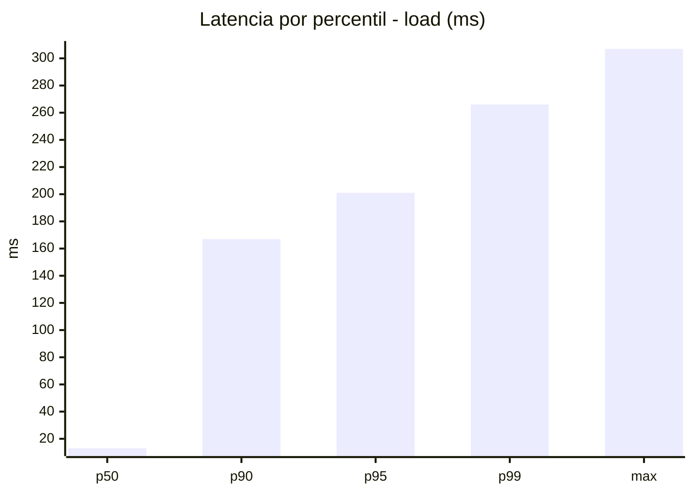
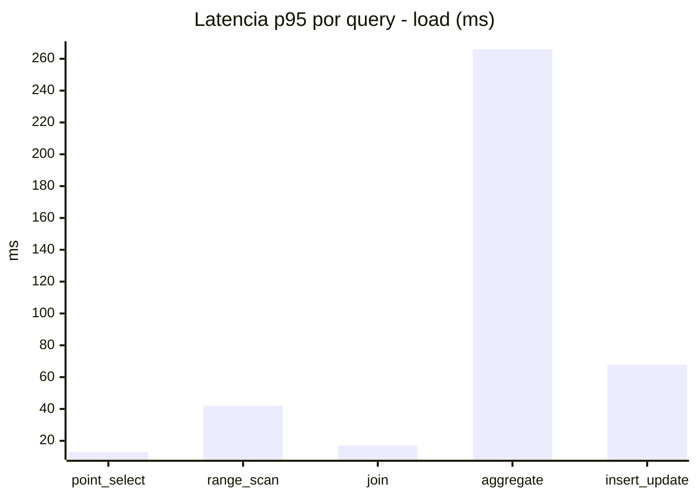
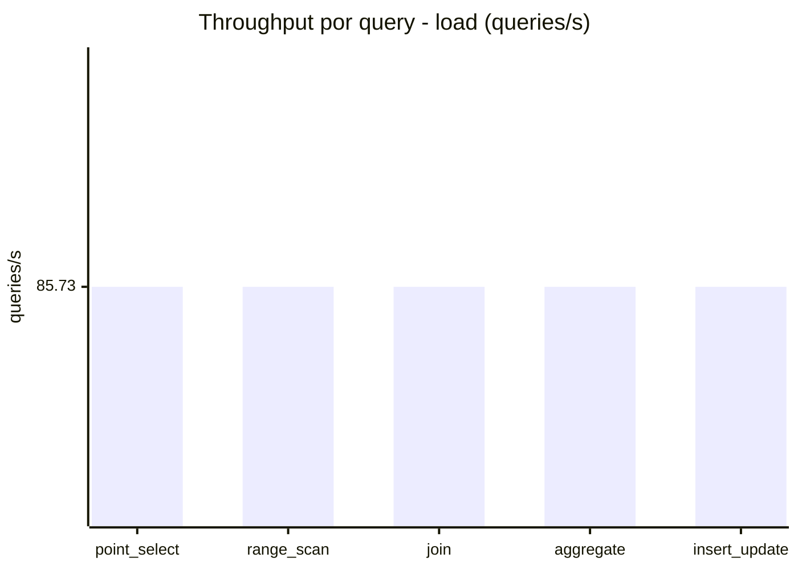
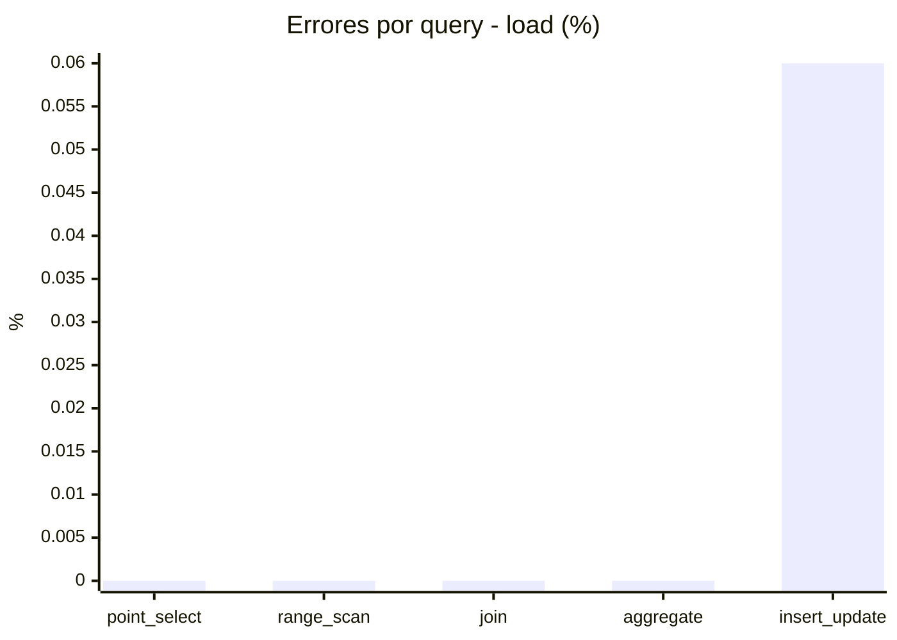
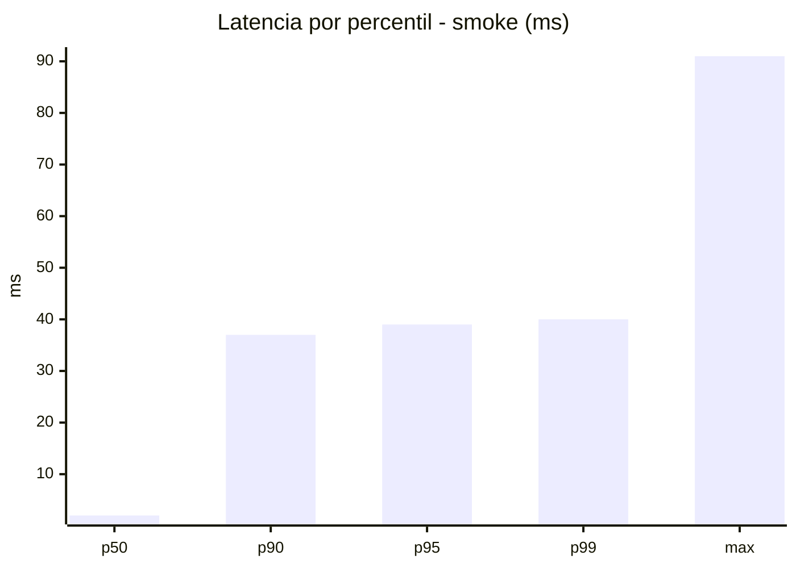
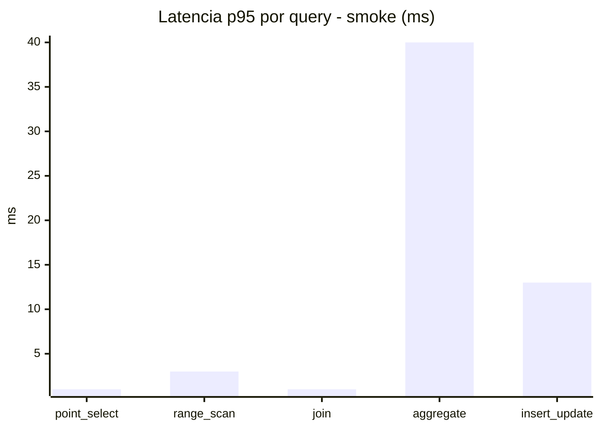
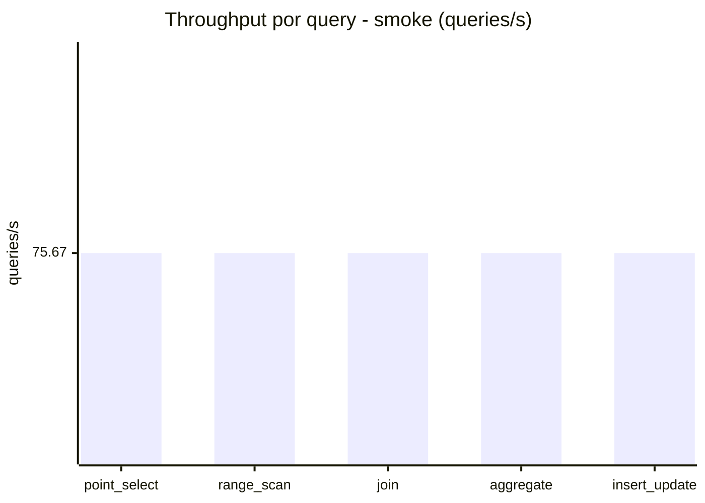
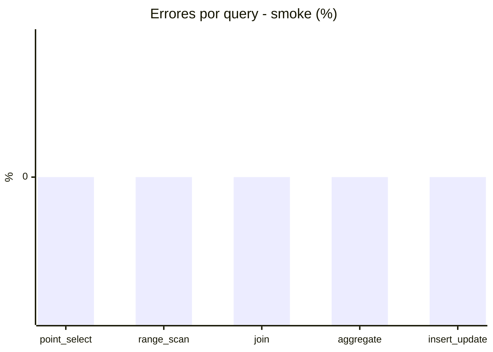

# Reporte de performance - SQL Server (k6)

**Fecha:** 2026-09-11 17:05 UTC  
**Veredicto (SLO):** `WARN`  
**Corrida:** [ver en GitHub Actions](https://github.com/lrbg/k6-sqlserver-lab/actions/runs/34625495275)  

## Analisis del agente de IA

WARN (fallback por umbrales)

- Error maximo: 0.01%
- p95 maximo: 201 ms

## Resultados

### Escenario: `load`

| Metrica | Valor |
| --- | --- |
| Queries ejecutadas | 25825 |
| Errores | 3 (0.01%) |
| Latencia media | 46.6 ms |
| p50 / p90 / p95 / p99 | 13 / 167 / 201 / 266 ms |
| Min / Max | 0 / 307 ms |
| Throughput | 428.65 queries/s |
| Duracion | 60.2 s |

Detalle por query

| Query | Ejecuciones | Error % | avg | p95 | p99 | q/s |
| --- | --- | --- | --- | --- | --- | --- |
| point_select | 5165 | 0% | 4.3 | 13 | 19 | 85.73 |
| range_scan | 5165 | 0% | 18.5 | 42 | 68.4 | 85.73 |
| join | 5165 | 0% | 7.1 | 17 | 23 | 85.73 |
| aggregate | 5165 | 0% | 174.1 | 266 | 283 | 85.73 |
| insert_update | 5165 | 0.06% | 28.8 | 67.8 | 107 | 85.73 |

### Escenario: `smoke`

| Metrica | Valor |
| --- | --- |
| Queries ejecutadas | 11360 |
| Errores | 0 (0%) |
| Latencia media | 7.9 ms |
| p50 / p90 / p95 / p99 | 2 / 37 / 39 / 40 ms |
| Min / Max | 0 / 91 ms |
| Throughput | 378.33 queries/s |
| Duracion | 30 s |

Detalle por query

| Query | Ejecuciones | Error % | avg | p95 | p99 | q/s |
| --- | --- | --- | --- | --- | --- | --- |
| point_select | 2272 | 0% | 0.5 | 1 | 1 | 75.67 |
| range_scan | 2272 | 0% | 2.3 | 3 | 7.9 | 75.67 |
| join | 2272 | 0% | 0.7 | 1 | 2 | 75.67 |
| aggregate | 2272 | 0% | 32.3 | 40 | 41 | 75.67 |
| insert_update | 2272 | 0% | 3.7 | 13 | 21 | 75.67 |

