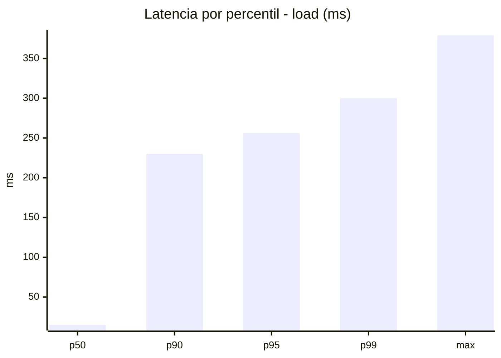
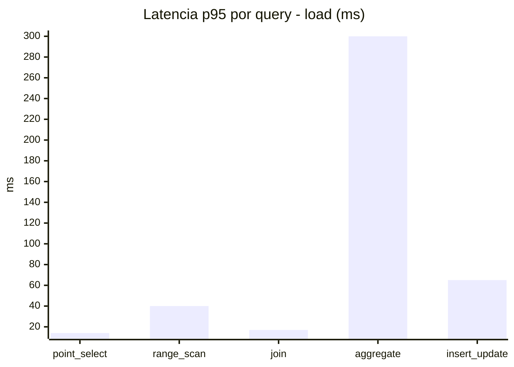
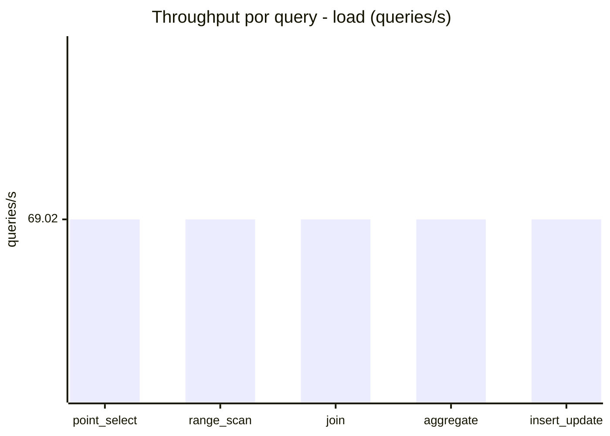
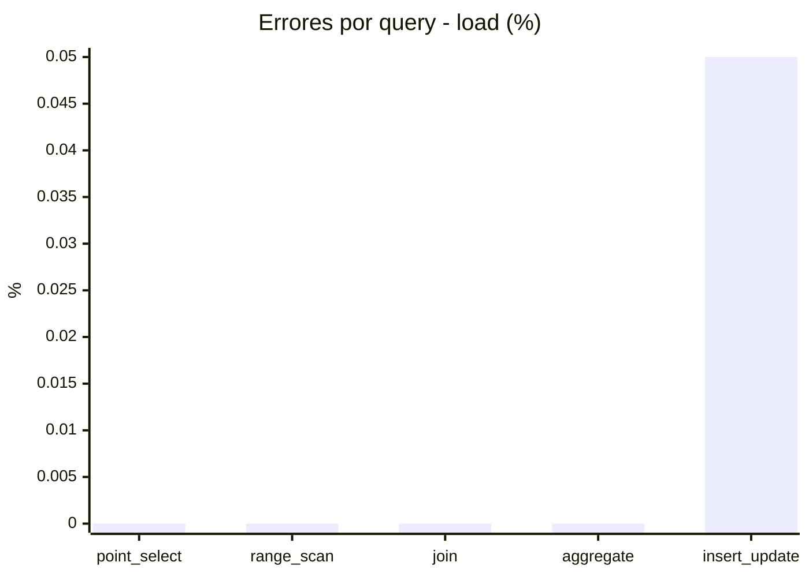
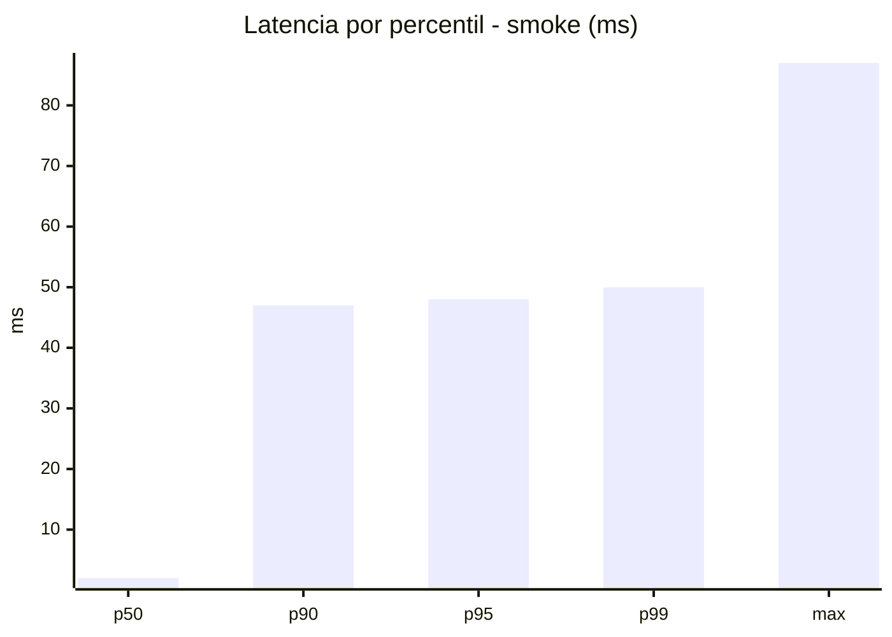
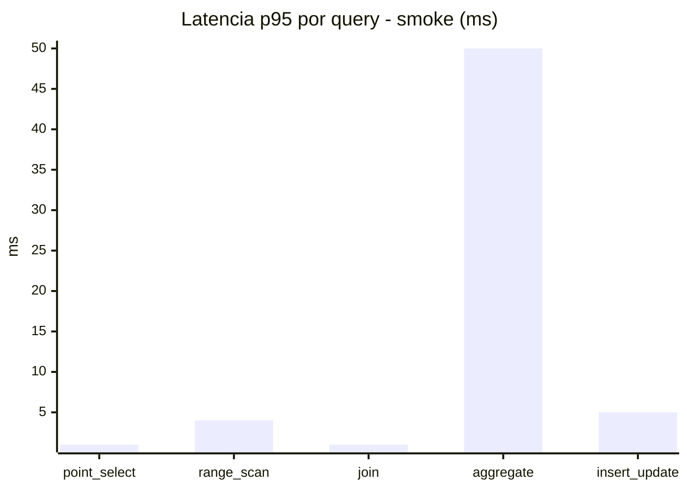
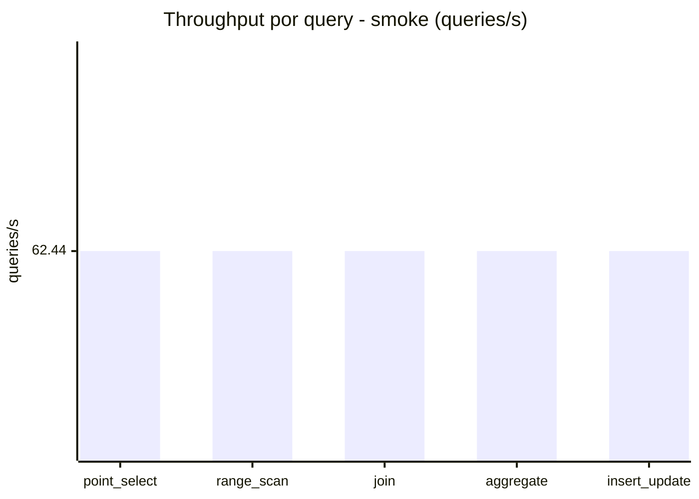
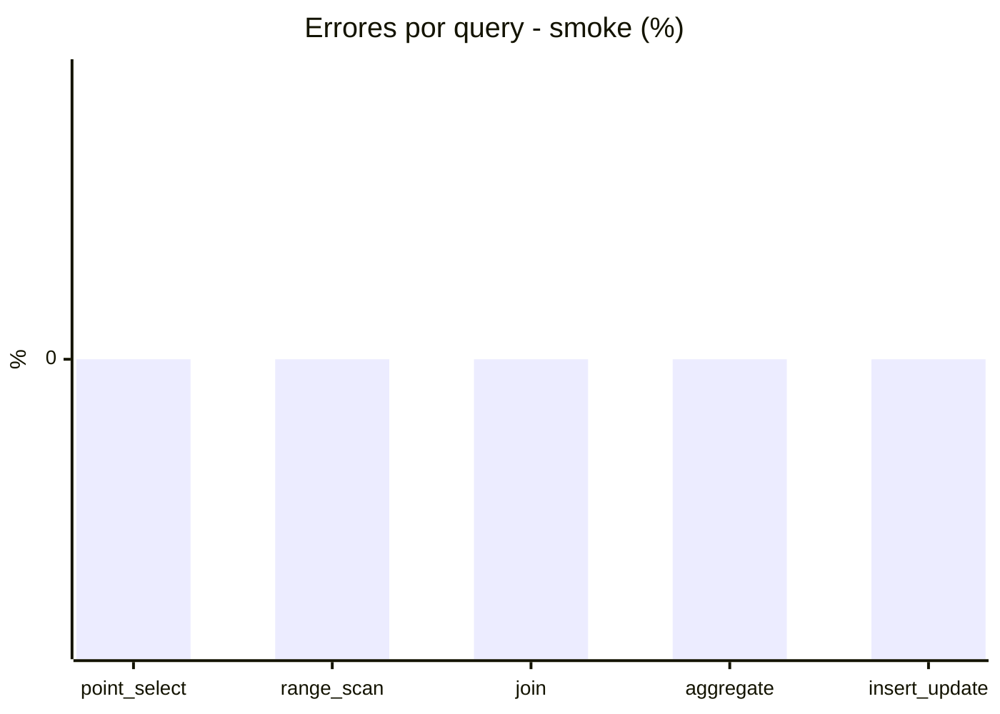

# Reporte de performance - SQL Server (k6)

**Fecha:** 2026-09-12 16:26 UTC  
**Veredicto (SLO):** `WARN`  
**Corrida:** [ver en GitHub Actions](https://github.com/lrbg/k6-sqlserver-lab/actions/runs/34705084053)  

## Analisis del agente de IA

WARN (fallback por umbrales)

- Error maximo: 0.01%
- p95 maximo: 256 ms

## Resultados

### Escenario: `load`

| Metrica | Valor |
| --- | --- |
| Queries ejecutadas | 20765 |
| Errores | 2 (0.01%) |
| Latencia media | 57.8 ms |
| p50 / p90 / p95 / p99 | 15 / 230 / 256 / 300 ms |
| Min / Max | 0 / 379 ms |
| Throughput | 345.1 queries/s |
| Duracion | 60.2 s |

Detalle por query

| Query | Ejecuciones | Error % | avg | p95 | p99 | q/s |
| --- | --- | --- | --- | --- | --- | --- |
| point_select | 4153 | 0% | 5.3 | 14 | 20 | 69.02 |
| range_scan | 4153 | 0% | 18.4 | 40 | 56 | 69.02 |
| join | 4153 | 0% | 8.5 | 17 | 21 | 69.02 |
| aggregate | 4153 | 0% | 227.5 | 300 | 317.5 | 69.02 |
| insert_update | 4153 | 0.05% | 29.5 | 65 | 85 | 69.02 |

### Escenario: `smoke`

| Metrica | Valor |
| --- | --- |
| Queries ejecutadas | 9380 |
| Errores | 0 (0%) |
| Latencia media | 9.6 ms |
| p50 / p90 / p95 / p99 | 2 / 47 / 48 / 50 ms |
| Min / Max | 0 / 87 ms |
| Throughput | 312.21 queries/s |
| Duracion | 30 s |

Detalle por query

| Query | Ejecuciones | Error % | avg | p95 | p99 | q/s |
| --- | --- | --- | --- | --- | --- | --- |
| point_select | 1876 | 0% | 0.6 | 1 | 2 | 62.44 |
| range_scan | 1876 | 0% | 2.7 | 4 | 7.3 | 62.44 |
| join | 1876 | 0% | 0.8 | 1 | 3 | 62.44 |
| aggregate | 1876 | 0% | 40.8 | 50 | 66.3 | 62.44 |
| insert_update | 1876 | 0% | 2.9 | 5 | 12 | 62.44 |

