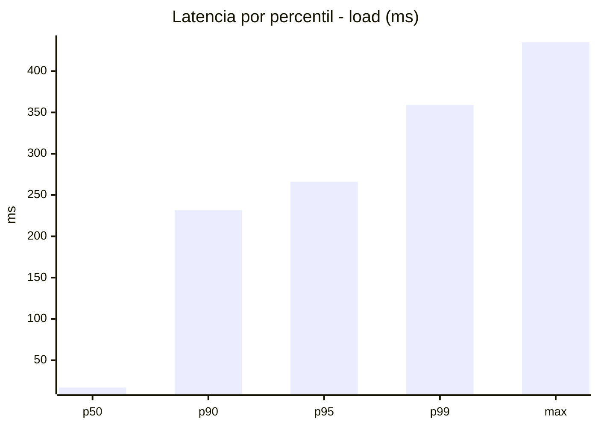
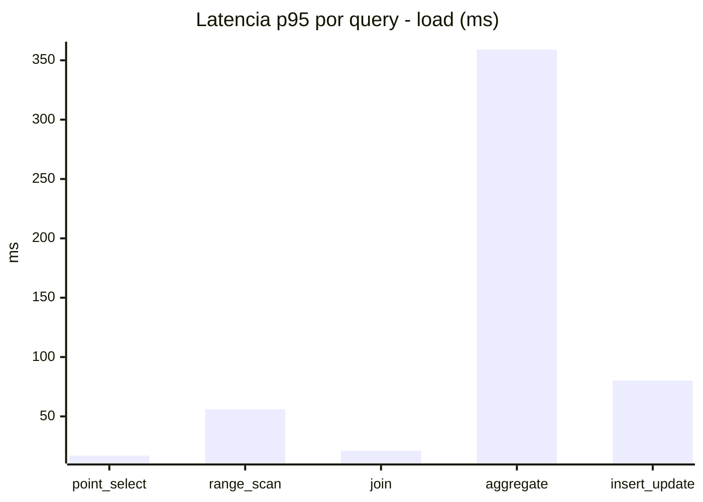
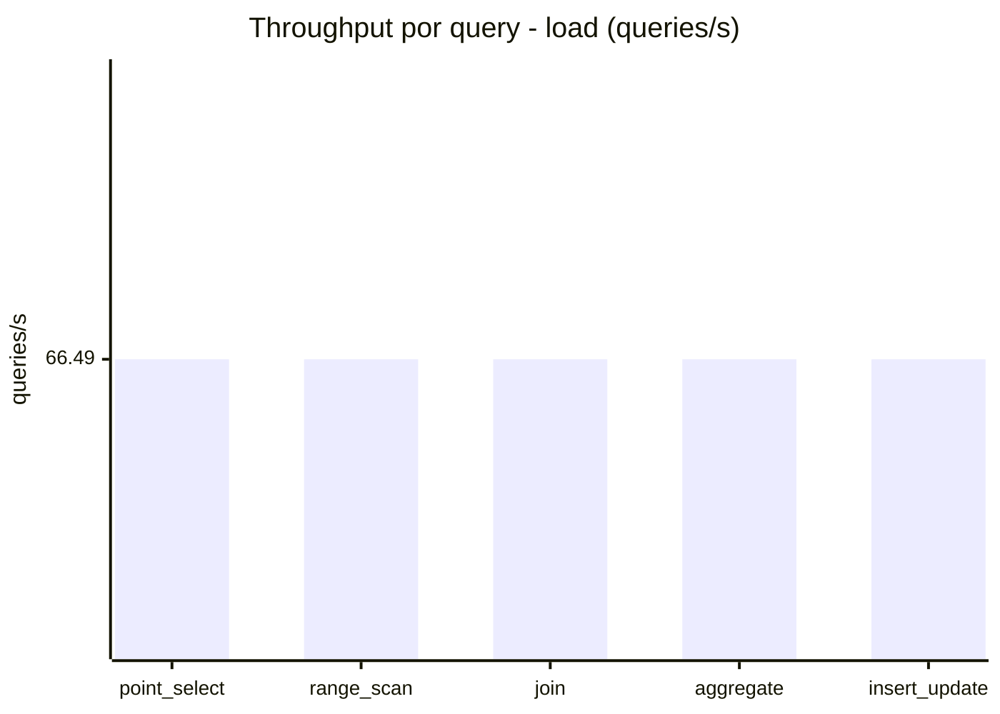
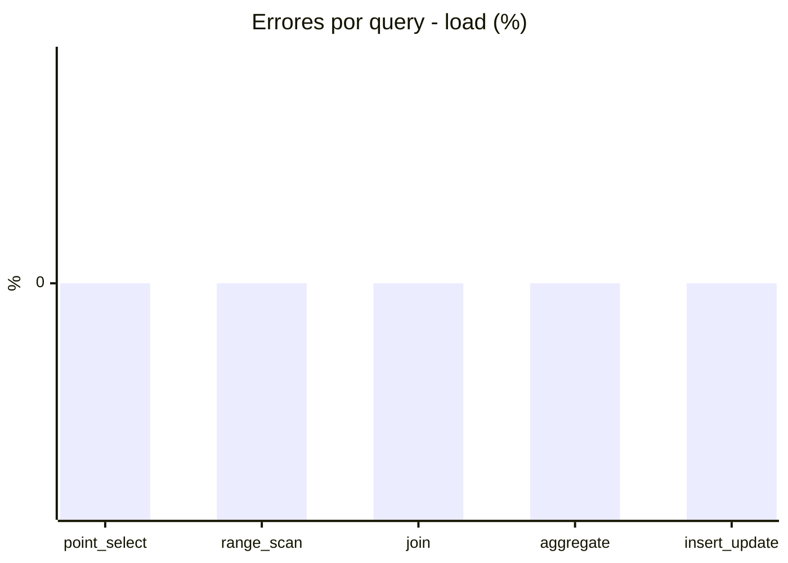
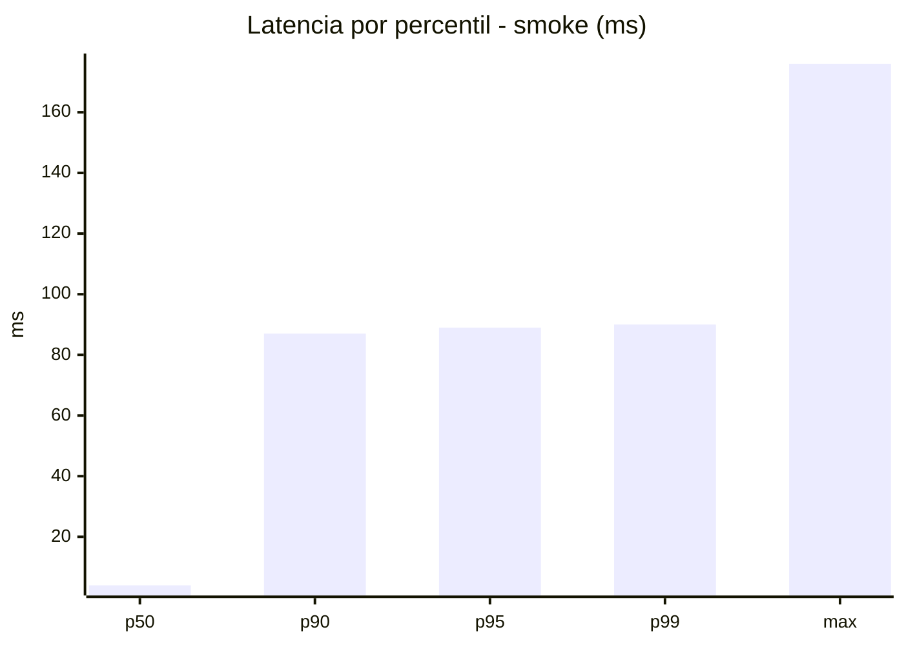
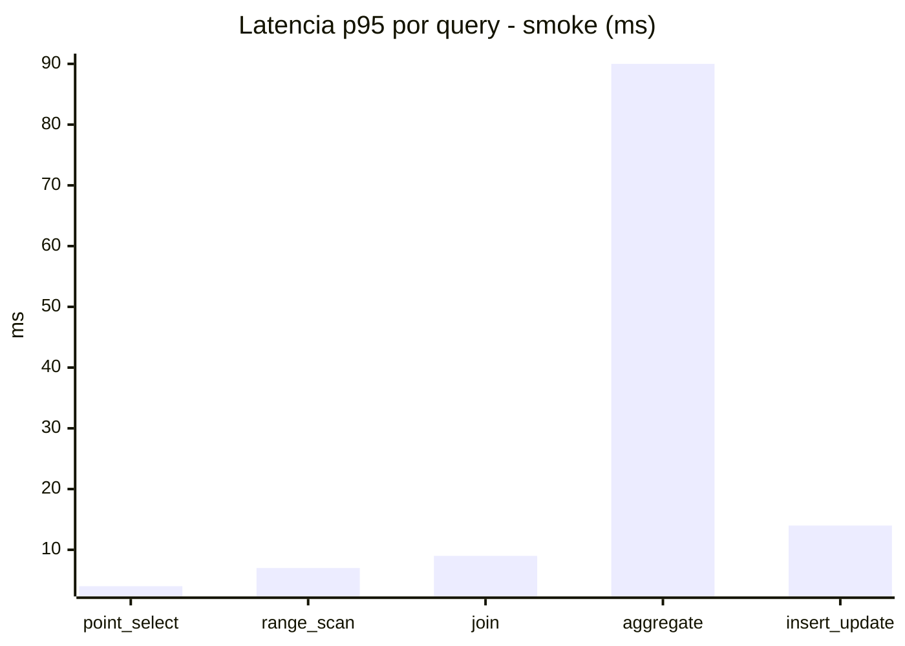
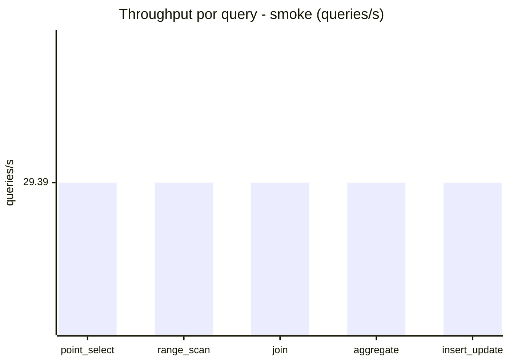
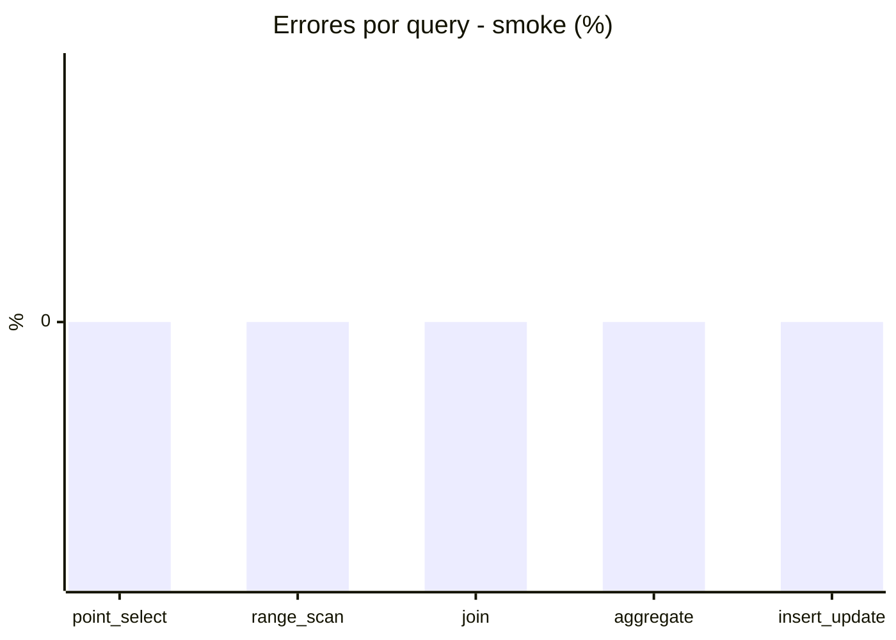

# Reporte de performance - SQL Server (k6)

**Fecha:** 2026-09-13 17:01 UTC  
**Veredicto (SLO):** `WARN`  
**Corrida:** [ver en GitHub Actions](https://github.com/lrbg/k6-sqlserver-lab/actions/runs/34770206943)  

## Analisis del agente de IA

WARN (fallback por umbrales)

- Error maximo: 0%
- p95 maximo: 266 ms

## Resultados

### Escenario: `load`

| Metrica | Valor |
| --- | --- |
| Queries ejecutadas | 19985 |
| Errores | 0 (0%) |
| Latencia media | 60.1 ms |
| p50 / p90 / p95 / p99 | 17 / 231.6 / 266 / 359 ms |
| Min / Max | 0 / 435 ms |
| Throughput | 332.43 queries/s |
| Duracion | 60.1 s |

Detalle por query

| Query | Ejecuciones | Error % | avg | p95 | p99 | q/s |
| --- | --- | --- | --- | --- | --- | --- |
| point_select | 3997 | 0% | 6.4 | 17 | 24 | 66.49 |
| range_scan | 3997 | 0% | 23.2 | 56 | 74 | 66.49 |
| join | 3997 | 0% | 9.2 | 21 | 26 | 66.49 |
| aggregate | 3997 | 0% | 226.1 | 359 | 382 | 66.49 |
| insert_update | 3997 | 0% | 35.6 | 80.2 | 105 | 66.49 |

### Escenario: `smoke`

| Metrica | Valor |
| --- | --- |
| Queries ejecutadas | 4410 |
| Errores | 0 (0%) |
| Latencia media | 20.4 ms |
| p50 / p90 / p95 / p99 | 4 / 87 / 89 / 90 ms |
| Min / Max | 0 / 176 ms |
| Throughput | 146.96 queries/s |
| Duracion | 30 s |

Detalle por query

| Query | Ejecuciones | Error % | avg | p95 | p99 | q/s |
| --- | --- | --- | --- | --- | --- | --- |
| point_select | 882 | 0% | 1.3 | 4 | 7.2 | 29.39 |
| range_scan | 882 | 0% | 3.9 | 7 | 11 | 29.39 |
| join | 882 | 0% | 3.9 | 9 | 9 | 29.39 |
| aggregate | 882 | 0% | 85.8 | 90 | 93.2 | 29.39 |
| insert_update | 882 | 0% | 7 | 14 | 27 | 29.39 |

