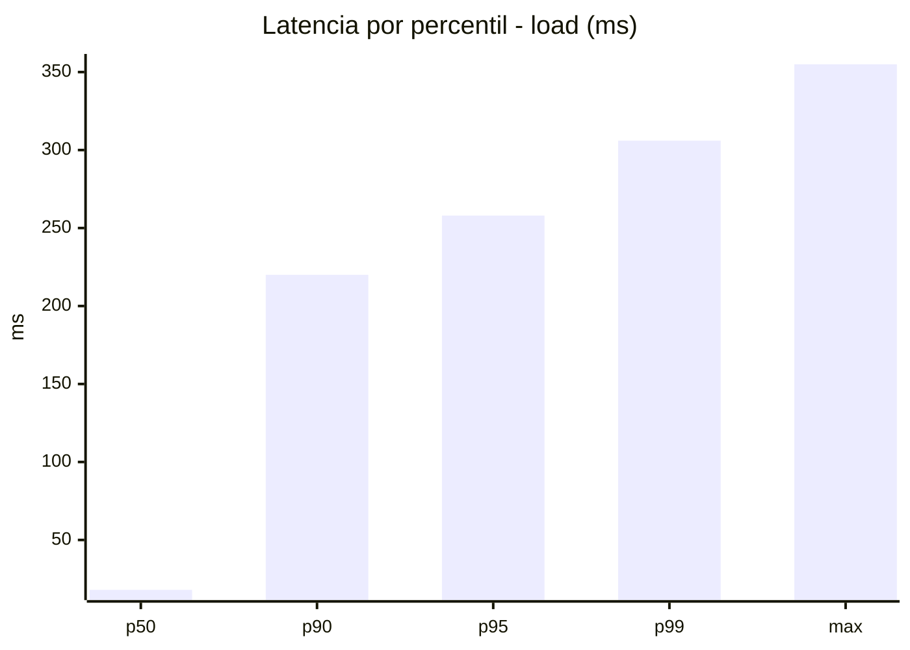
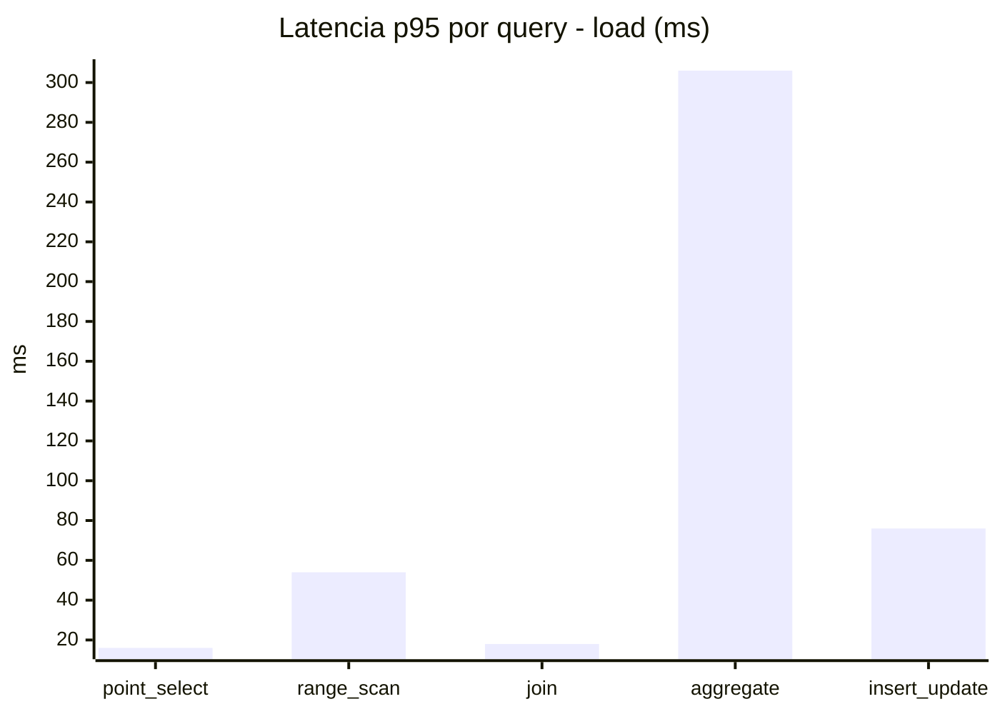
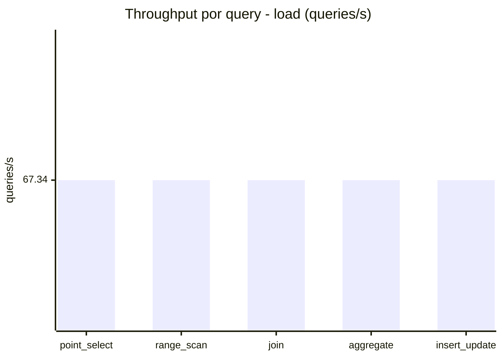
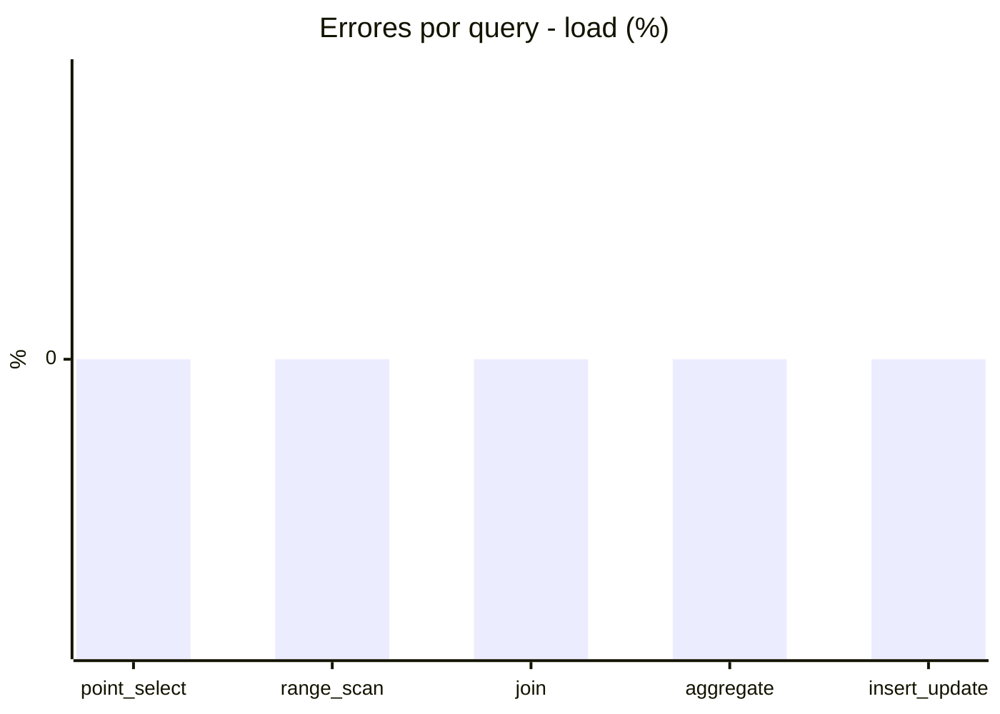
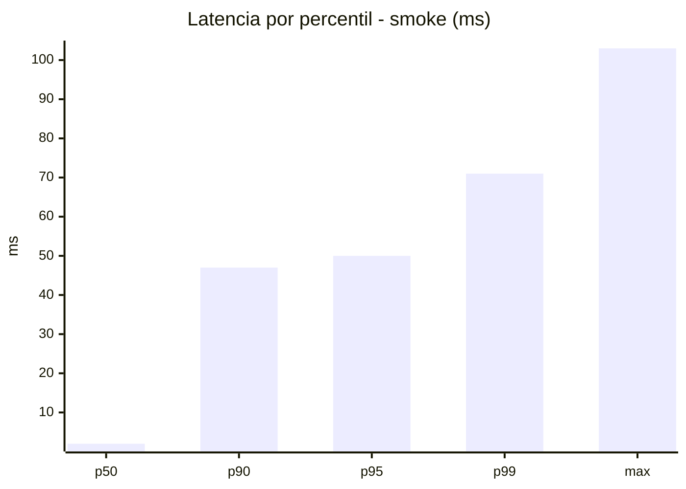
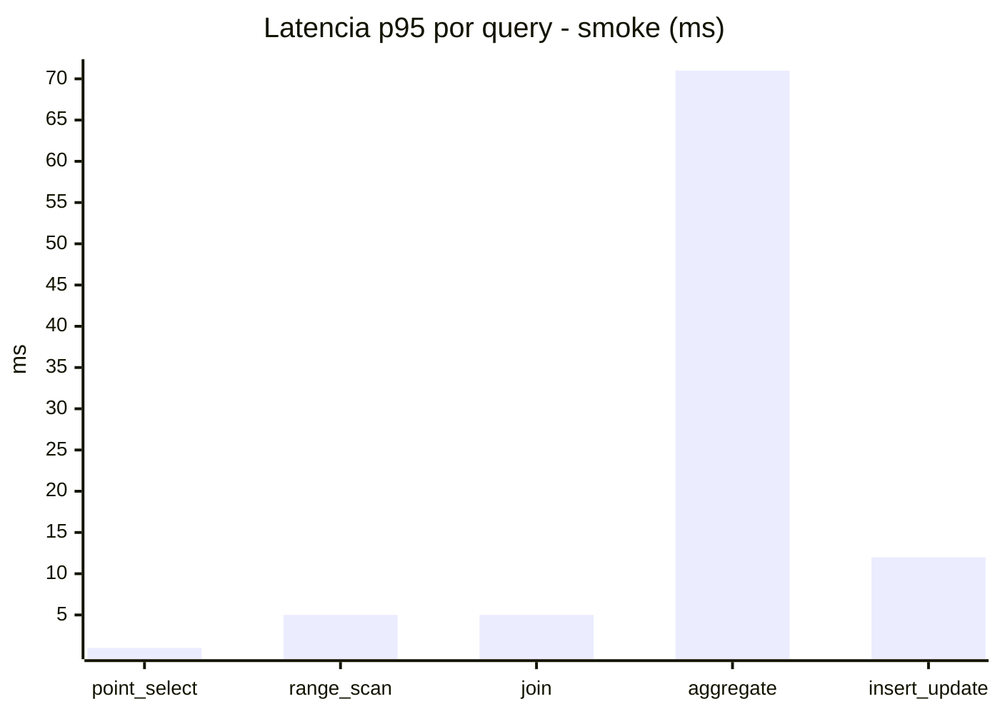
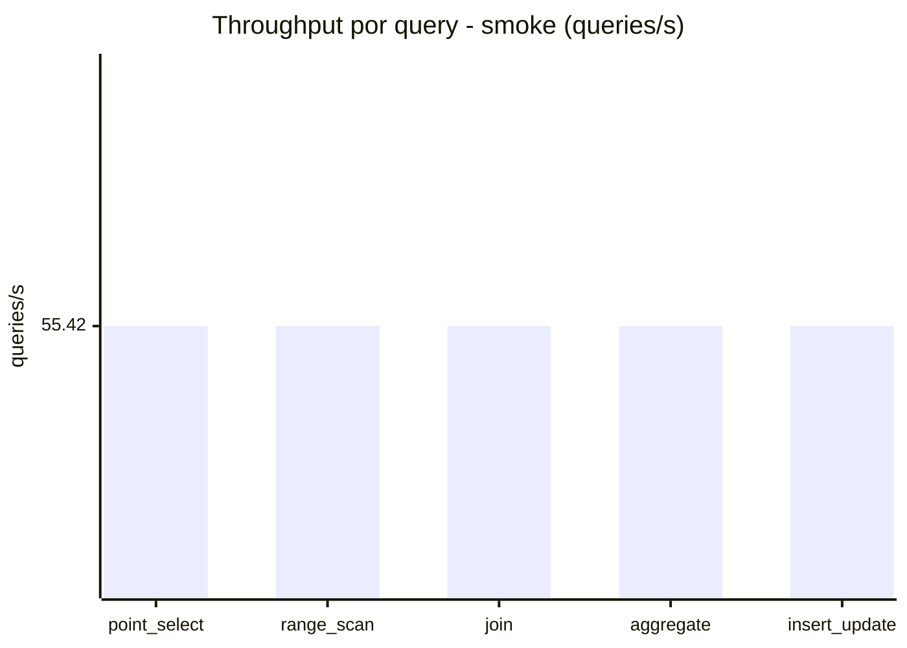
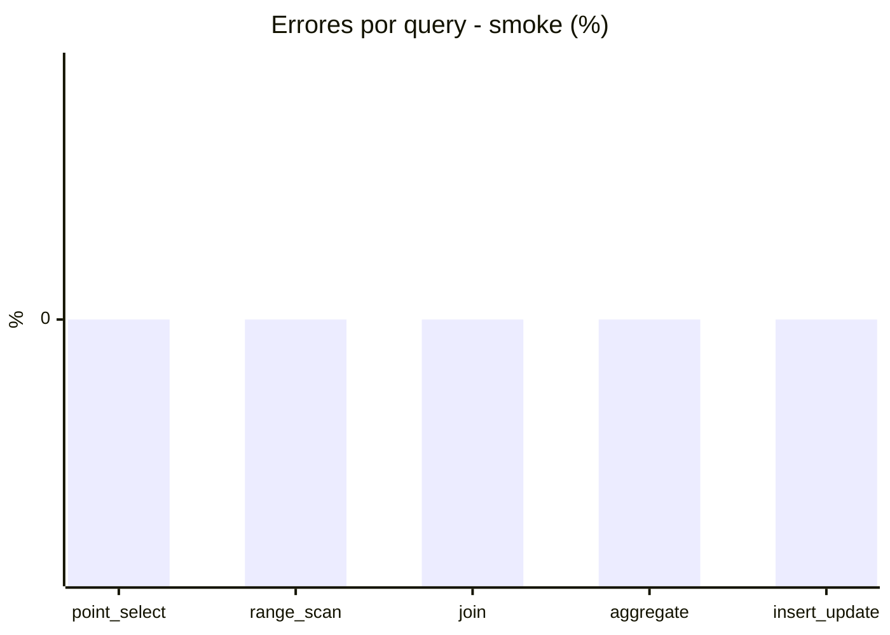

# Reporte de performance - SQL Server (k6)

**Fecha:** 2026-09-14 18:46 UTC  
**Veredicto (SLO):** `WARN`  
**Corrida:** [ver en GitHub Actions](https://github.com/lrbg/k6-sqlserver-lab/actions/runs/34882670541)  

## Analisis del agente de IA

WARN (fallback por umbrales)

- Error maximo: 0%
- p95 maximo: 258 ms

## Resultados

### Escenario: `load`

| Metrica | Valor |
| --- | --- |
| Queries ejecutadas | 20275 |
| Errores | 0 (0%) |
| Latencia media | 59.3 ms |
| p50 / p90 / p95 / p99 | 18 / 220 / 258 / 306 ms |
| Min / Max | 0 / 355 ms |
| Throughput | 336.71 queries/s |
| Duracion | 60.2 s |

Detalle por query

| Query | Ejecuciones | Error % | avg | p95 | p99 | q/s |
| --- | --- | --- | --- | --- | --- | --- |
| point_select | 4055 | 0% | 5.8 | 16 | 21 | 67.34 |
| range_scan | 4055 | 0% | 24.6 | 54 | 71 | 67.34 |
| join | 4055 | 0% | 8.7 | 18 | 22 | 67.34 |
| aggregate | 4055 | 0% | 220.8 | 306 | 320.5 | 67.34 |
| insert_update | 4055 | 0% | 36.5 | 76 | 97 | 67.34 |

### Escenario: `smoke`

| Metrica | Valor |
| --- | --- |
| Queries ejecutadas | 8320 |
| Errores | 0 (0%) |
| Latencia media | 10.8 ms |
| p50 / p90 / p95 / p99 | 2 / 47 / 50 / 71 ms |
| Min / Max | 0 / 103 ms |
| Throughput | 277.08 queries/s |
| Duracion | 30 s |

Detalle por query

| Query | Ejecuciones | Error % | avg | p95 | p99 | q/s |
| --- | --- | --- | --- | --- | --- | --- |
| point_select | 1664 | 0% | 0.7 | 1 | 4 | 55.42 |
| range_scan | 1664 | 0% | 2.9 | 5 | 10 | 55.42 |
| join | 1664 | 0% | 1.3 | 5 | 5 | 55.42 |
| aggregate | 1664 | 0% | 45.1 | 71 | 79 | 55.42 |
| insert_update | 1664 | 0% | 4 | 12 | 20 | 55.42 |

