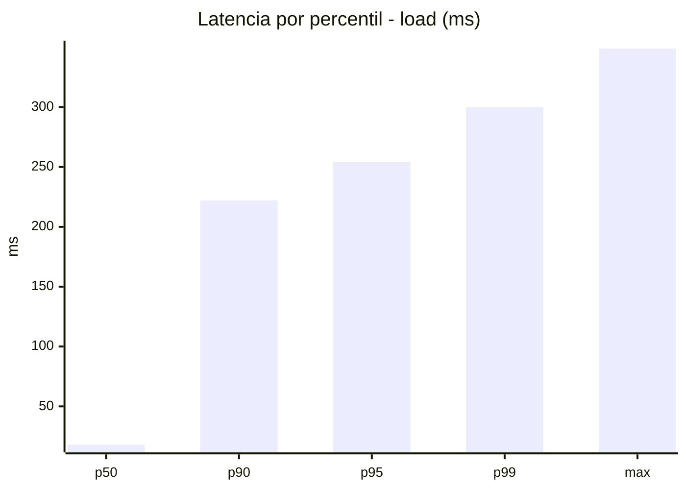
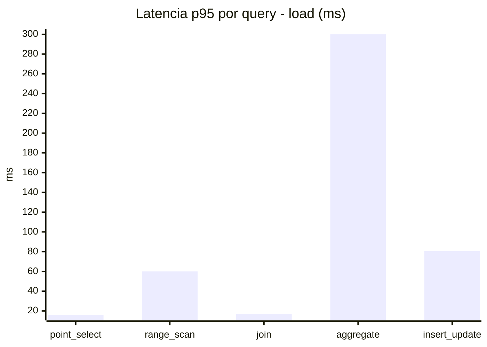
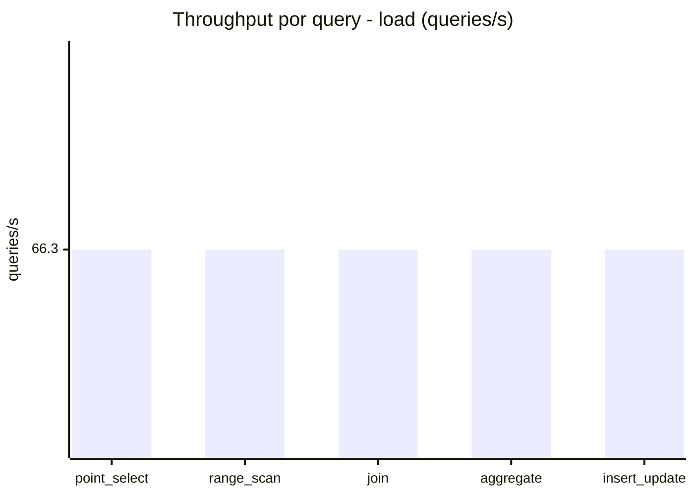
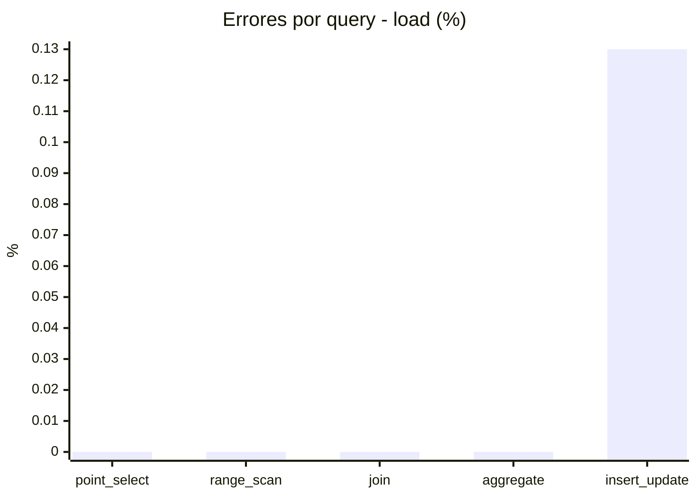
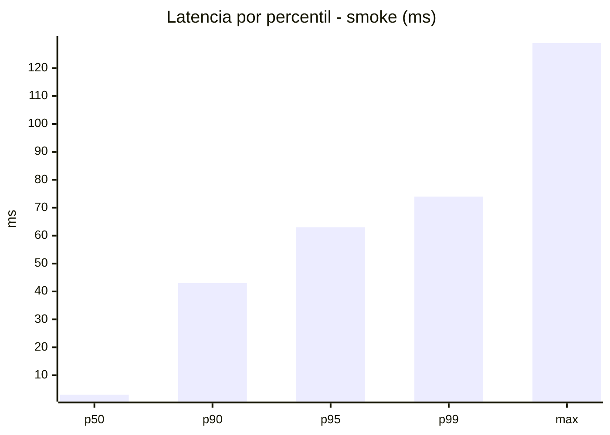
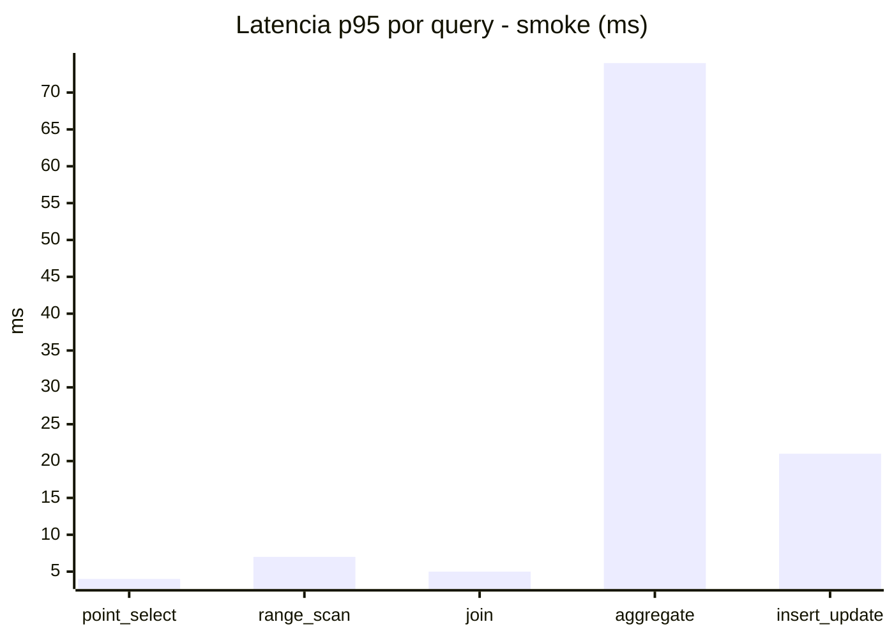
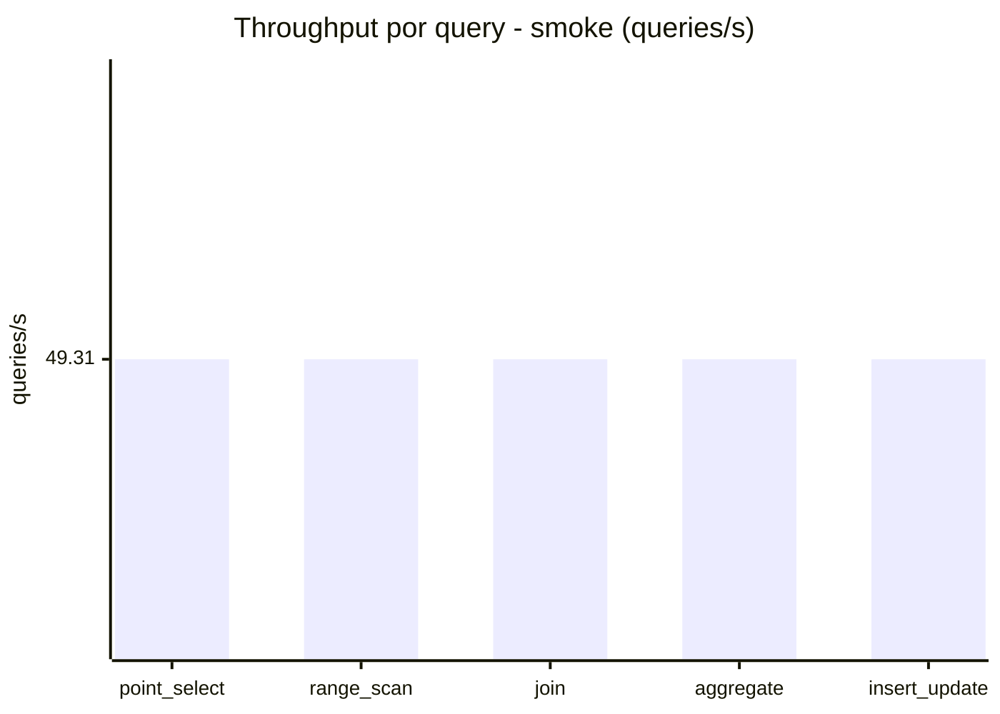
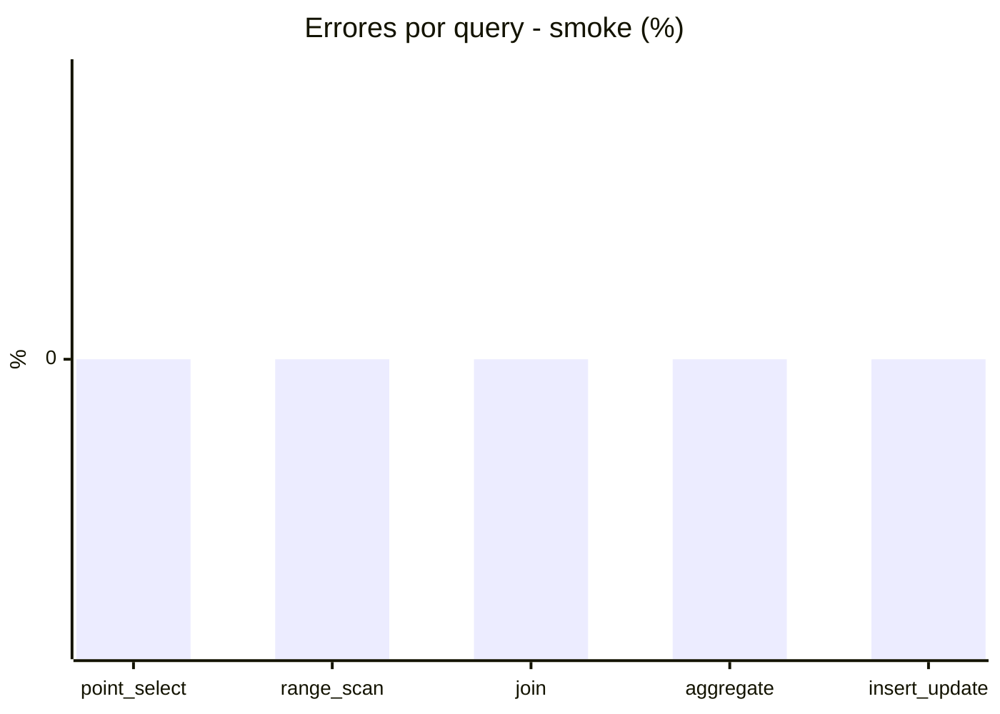

# Reporte de performance - SQL Server (k6)

**Fecha:** 2026-09-15 17:44 UTC  
**Veredicto (SLO):** `WARN`  
**Corrida:** [ver en GitHub Actions](https://github.com/lrbg/k6-sqlserver-lab/actions/runs/35002881314)  

## Analisis del agente de IA

WARN (fallback por umbrales)

- Error maximo: 0.03%
- p95 maximo: 254 ms

## Resultados

### Escenario: `load`

| Metrica | Valor |
| --- | --- |
| Queries ejecutadas | 19940 |
| Errores | 5 (0.03%) |
| Latencia media | 60.3 ms |
| p50 / p90 / p95 / p99 | 18 / 222 / 254 / 300 ms |
| Min / Max | 0 / 349 ms |
| Throughput | 331.52 queries/s |
| Duracion | 60.1 s |

Detalle por query

| Query | Ejecuciones | Error % | avg | p95 | p99 | q/s |
| --- | --- | --- | --- | --- | --- | --- |
| point_select | 3988 | 0% | 6.4 | 16 | 20 | 66.3 |
| range_scan | 3988 | 0% | 26.7 | 60 | 78 | 66.3 |
| join | 3988 | 0% | 8.5 | 17 | 21 | 66.3 |
| aggregate | 3988 | 0% | 220.2 | 300 | 325 | 66.3 |
| insert_update | 3988 | 0.13% | 39.4 | 80.6 | 100 | 66.3 |

### Escenario: `smoke`

| Metrica | Valor |
| --- | --- |
| Queries ejecutadas | 7405 |
| Errores | 0 (0%) |
| Latencia media | 12.1 ms |
| p50 / p90 / p95 / p99 | 3 / 43 / 63 / 74 ms |
| Min / Max | 0 / 129 ms |
| Throughput | 246.56 queries/s |
| Duracion | 30 s |

Detalle por query

| Query | Ejecuciones | Error % | avg | p95 | p99 | q/s |
| --- | --- | --- | --- | --- | --- | --- |
| point_select | 1481 | 0% | 0.9 | 4 | 5 | 49.31 |
| range_scan | 1481 | 0% | 3.1 | 7 | 10 | 49.31 |
| join | 1481 | 0% | 1.7 | 5 | 5 | 49.31 |
| aggregate | 1481 | 0% | 49.3 | 74 | 80 | 49.31 |
| insert_update | 1481 | 0% | 5.7 | 21 | 25 | 49.31 |

