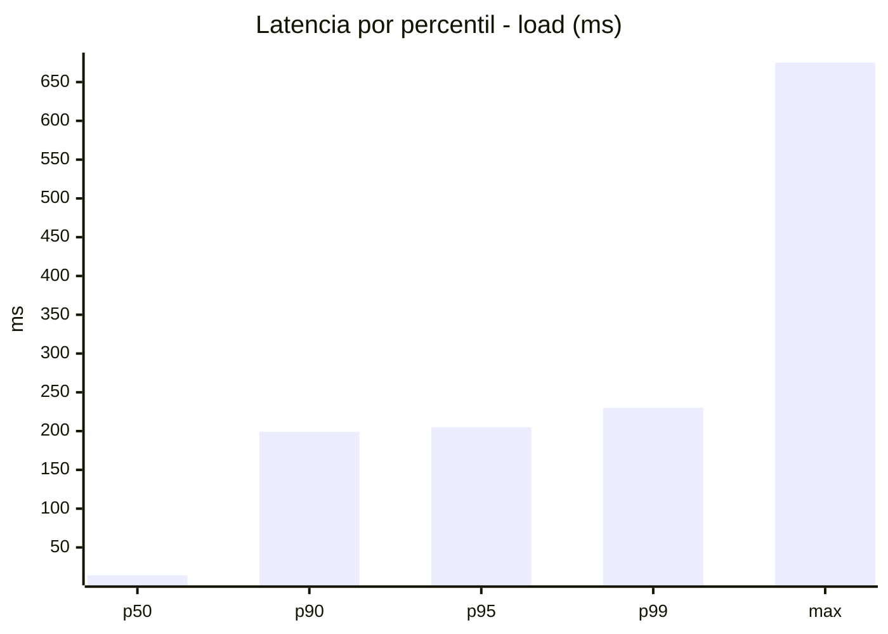
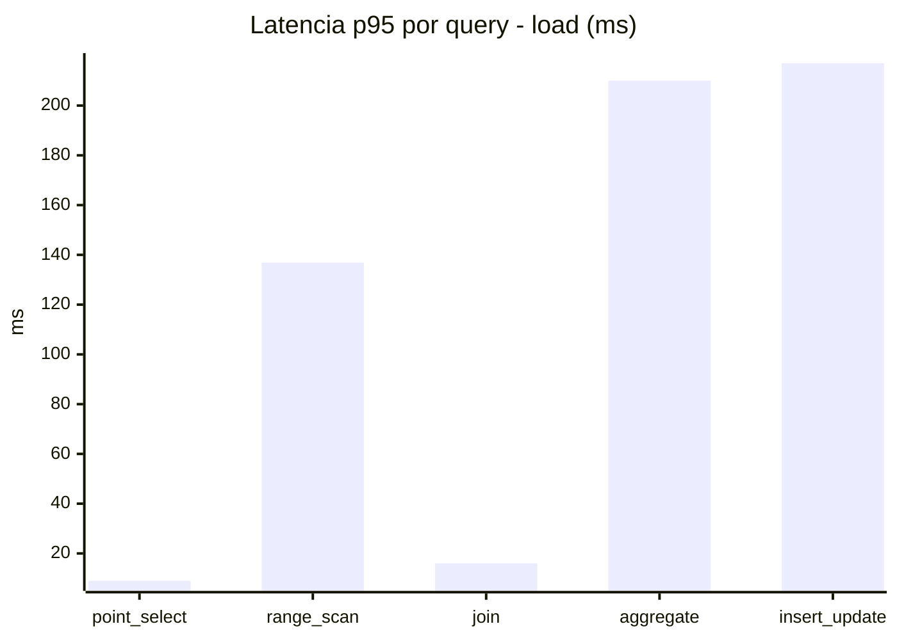
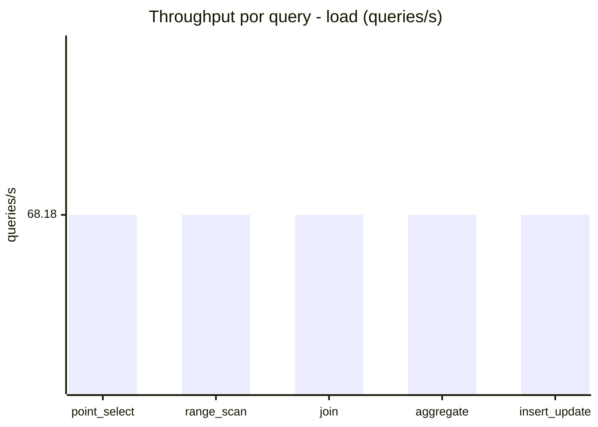
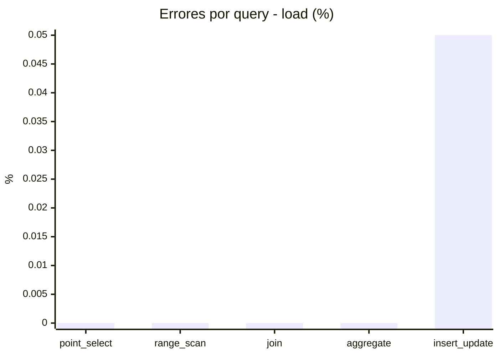
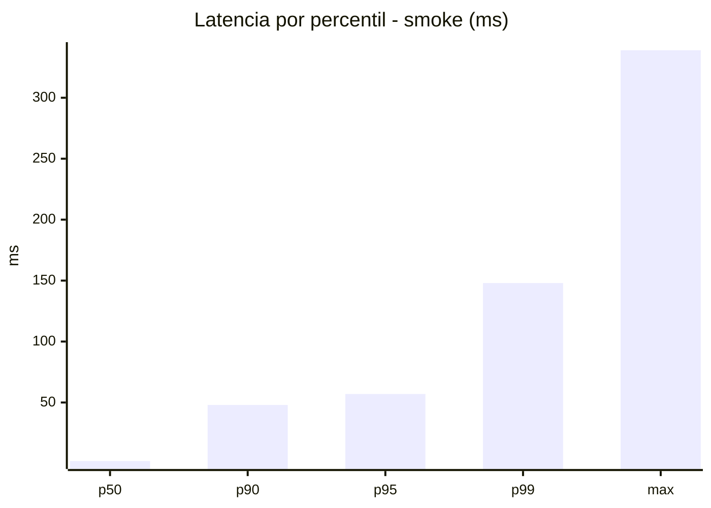
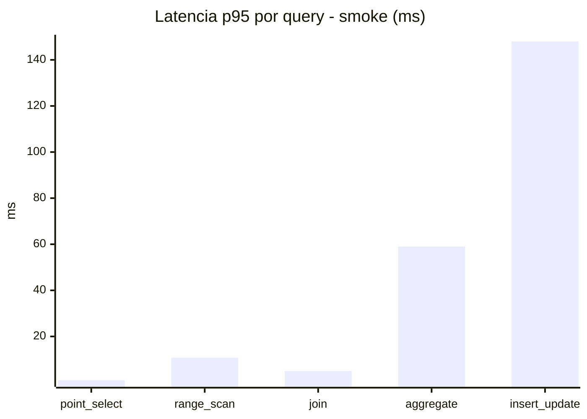
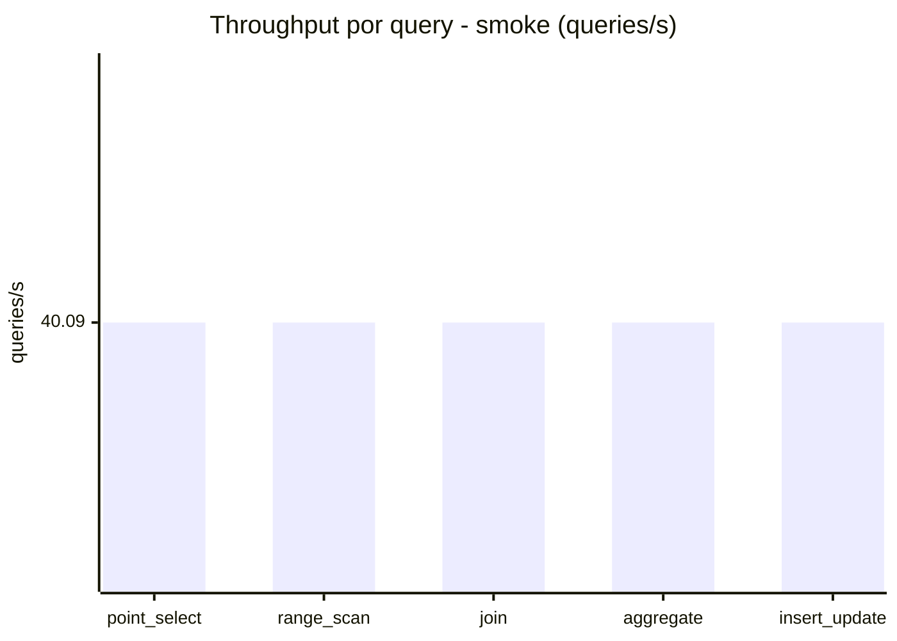
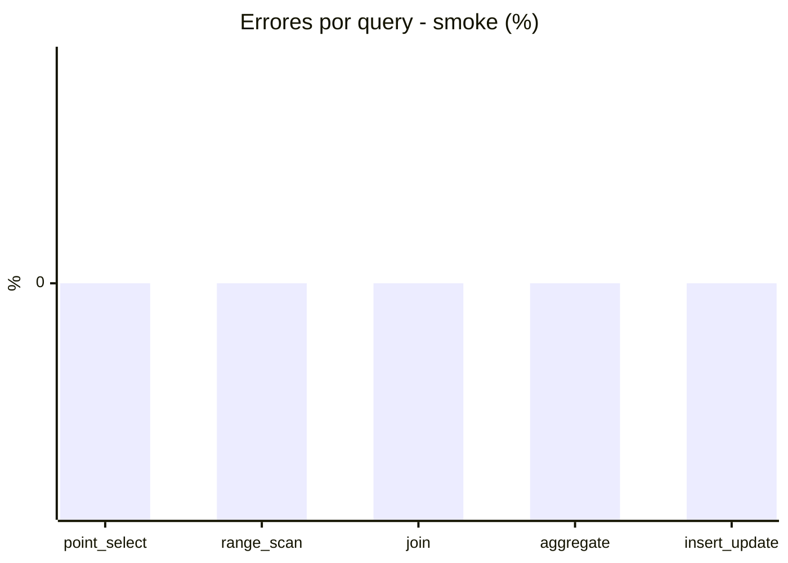

# Reporte de performance - SQL Server (k6)

**Fecha:** 2026-09-16 17:41 UTC  
**Veredicto (SLO):** `WARN`  
**Corrida:** [ver en GitHub Actions](https://github.com/lrbg/k6-sqlserver-lab/actions/runs/35129518056)  

## Analisis del agente de IA

WARN (fallback por umbrales)

- Error maximo: 0.01%
- p95 maximo: 205 ms

## Resultados

### Escenario: `load`

| Metrica | Valor |
| --- | --- |
| Queries ejecutadas | 20610 |
| Errores | 2 (0.01%) |
| Latencia media | 58.6 ms |
| p50 / p90 / p95 / p99 | 14 / 199 / 205 / 230 ms |
| Min / Max | 0 / 675 ms |
| Throughput | 340.88 queries/s |
| Duracion | 60.5 s |

Detalle por query

| Query | Ejecuciones | Error % | avg | p95 | p99 | q/s |
| --- | --- | --- | --- | --- | --- | --- |
| point_select | 4122 | 0% | 2.9 | 9 | 16 | 68.18 |
| range_scan | 4122 | 0% | 30.7 | 136.9 | 234.5 | 68.18 |
| join | 4122 | 0% | 6.4 | 16 | 18 | 68.18 |
| aggregate | 4122 | 0% | 183.3 | 210 | 217 | 68.18 |
| insert_update | 4122 | 0.05% | 69.8 | 217 | 387.4 | 68.18 |

### Escenario: `smoke`

| Metrica | Valor |
| --- | --- |
| Queries ejecutadas | 6020 |
| Errores | 0 (0%) |
| Latencia media | 14.9 ms |
| p50 / p90 / p95 / p99 | 2 / 48 / 57 / 148 ms |
| Min / Max | 0 / 339 ms |
| Throughput | 200.46 queries/s |
| Duracion | 30 s |

Detalle por query

| Query | Ejecuciones | Error % | avg | p95 | p99 | q/s |
| --- | --- | --- | --- | --- | --- | --- |
| point_select | 1204 | 0% | 0.6 | 1 | 4 | 40.09 |
| range_scan | 1204 | 0% | 4.2 | 10.8 | 32 | 40.09 |
| join | 1204 | 0% | 1.4 | 5 | 5 | 40.09 |
| aggregate | 1204 | 0% | 40 | 59 | 64 | 40.09 |
| insert_update | 1204 | 0% | 28.5 | 148 | 220.7 | 40.09 |

