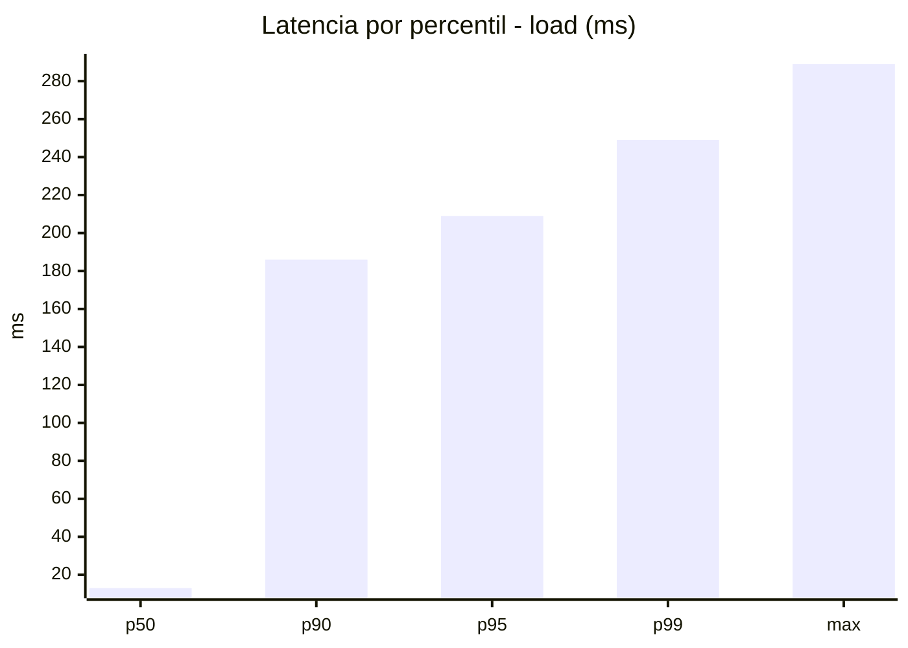
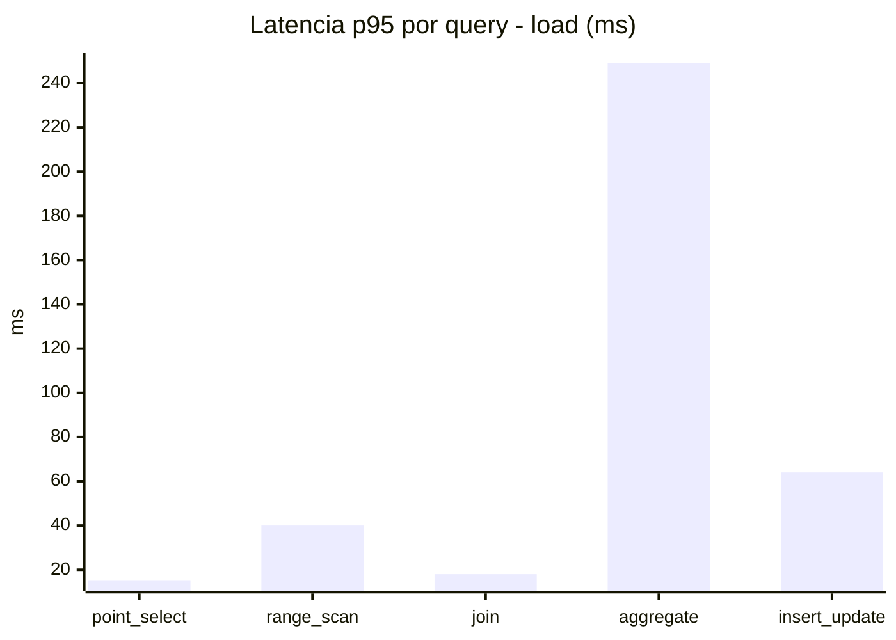
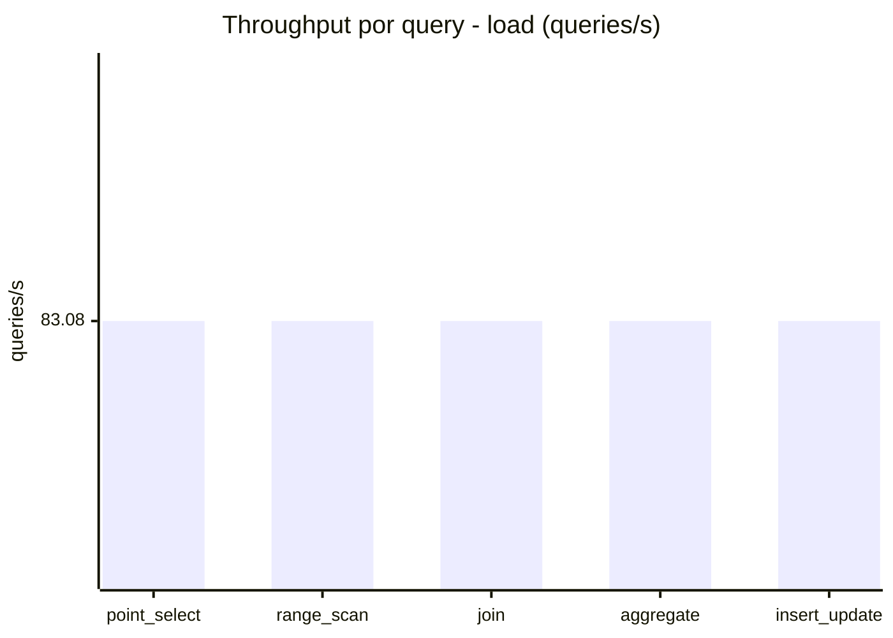
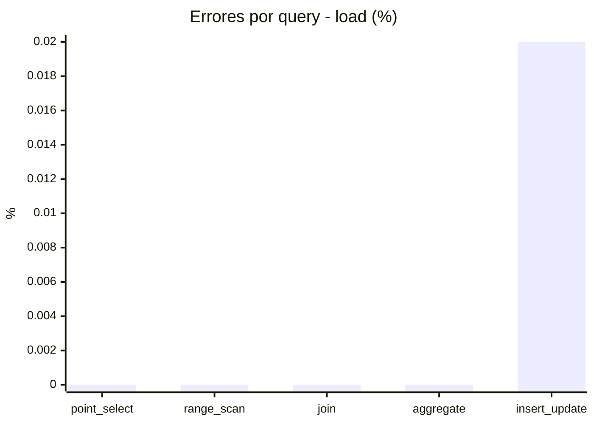
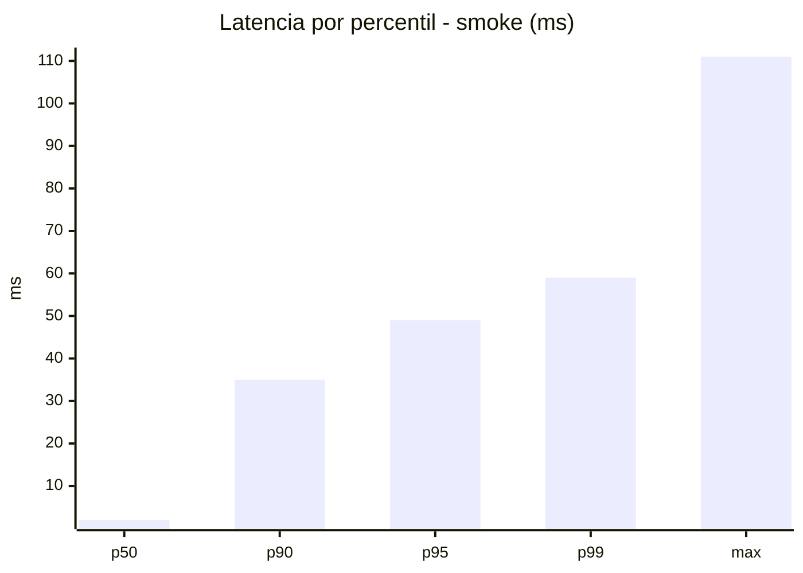
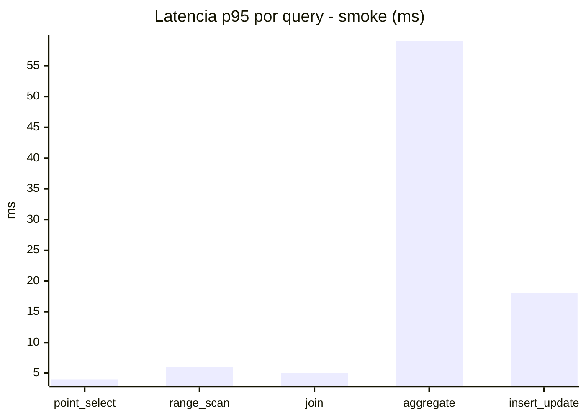
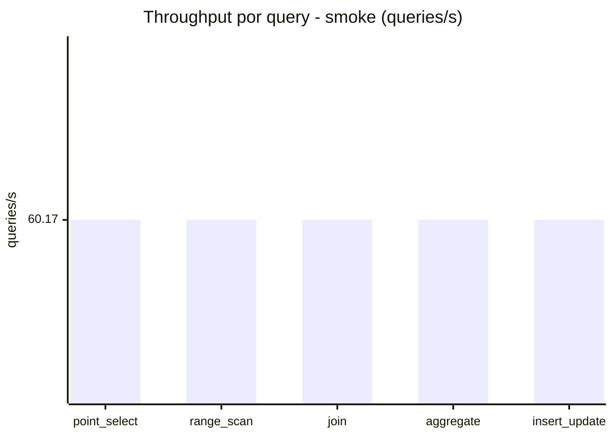
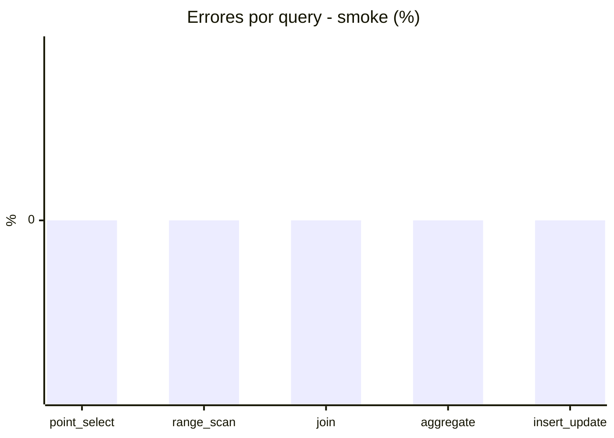

# Reporte de performance - SQL Server (k6)

**Fecha:** 2026-09-17 17:42 UTC  
**Veredicto (SLO):** `WARN`  
**Corrida:** [ver en GitHub Actions](https://github.com/lrbg/k6-sqlserver-lab/actions/runs/35254103024)  

## Analisis del agente de IA

WARN (fallback por umbrales)

- Error maximo: 0%
- p95 maximo: 209 ms

## Resultados

### Escenario: `load`

| Metrica | Valor |
| --- | --- |
| Queries ejecutadas | 25000 |
| Errores | 1 (0%) |
| Latencia media | 48.1 ms |
| p50 / p90 / p95 / p99 | 13 / 186 / 209 / 249 ms |
| Min / Max | 0 / 289 ms |
| Throughput | 415.41 queries/s |
| Duracion | 60.2 s |

Detalle por query

| Query | Ejecuciones | Error % | avg | p95 | p99 | q/s |
| --- | --- | --- | --- | --- | --- | --- |
| point_select | 5000 | 0% | 4.6 | 15 | 20 | 83.08 |
| range_scan | 5000 | 0% | 16.8 | 40 | 59 | 83.08 |
| join | 5000 | 0% | 7.6 | 18 | 21 | 83.08 |
| aggregate | 5000 | 0% | 184.7 | 249 | 263 | 83.08 |
| insert_update | 5000 | 0.02% | 26.8 | 64 | 82 | 83.08 |

### Escenario: `smoke`

| Metrica | Valor |
| --- | --- |
| Queries ejecutadas | 9035 |
| Errores | 0 (0%) |
| Latencia media | 9.9 ms |
| p50 / p90 / p95 / p99 | 2 / 35 / 49 / 59 ms |
| Min / Max | 0 / 111 ms |
| Throughput | 300.86 queries/s |
| Duracion | 30 s |

Detalle por query

| Query | Ejecuciones | Error % | avg | p95 | p99 | q/s |
| --- | --- | --- | --- | --- | --- | --- |
| point_select | 1807 | 0% | 0.7 | 4 | 5 | 60.17 |
| range_scan | 1807 | 0% | 2.7 | 6 | 10 | 60.17 |
| join | 1807 | 0% | 1.6 | 5 | 5 | 60.17 |
| aggregate | 1807 | 0% | 39.2 | 59 | 64 | 60.17 |
| insert_update | 1807 | 0% | 5.5 | 18 | 23 | 60.17 |

