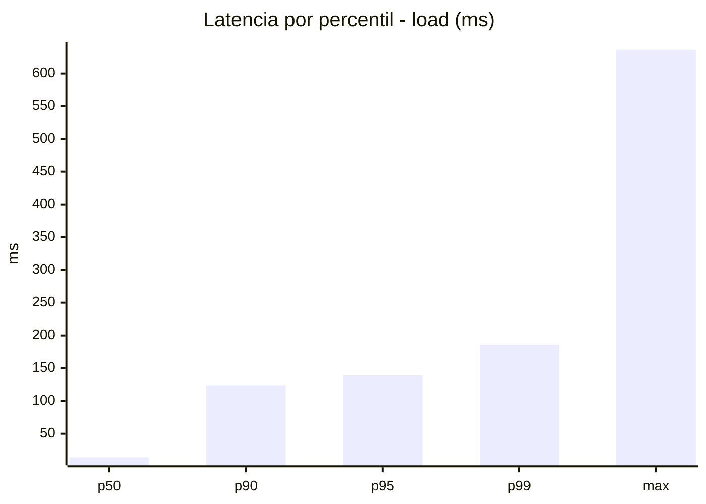
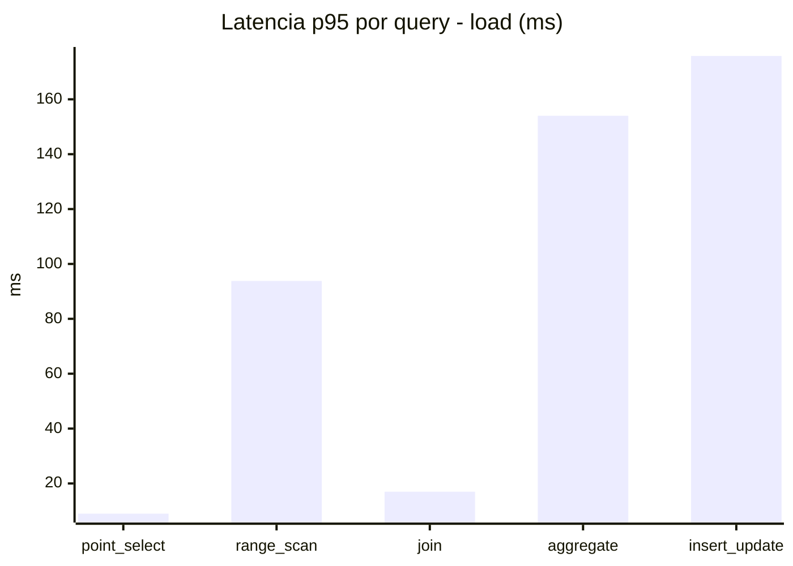
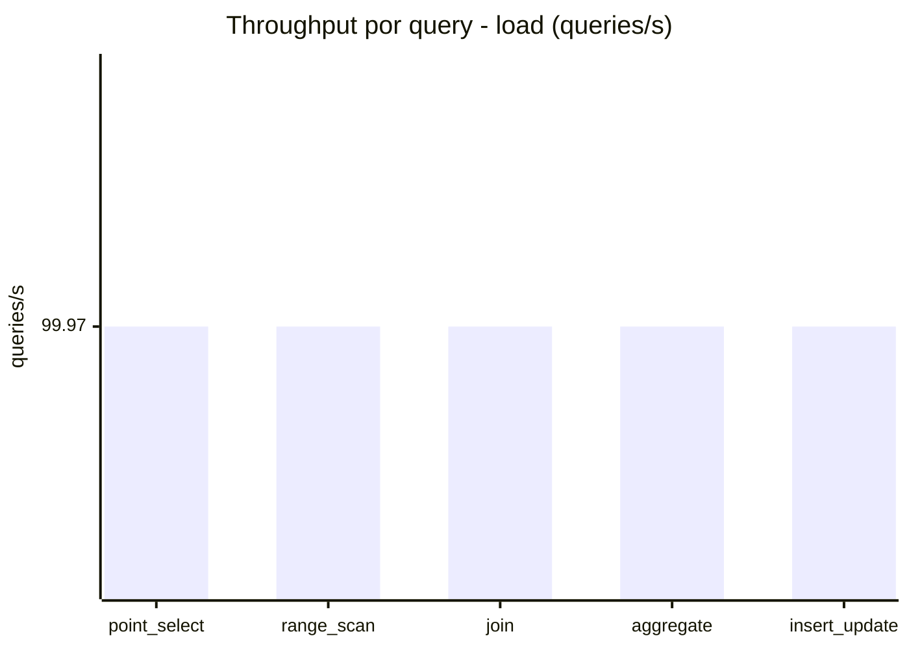
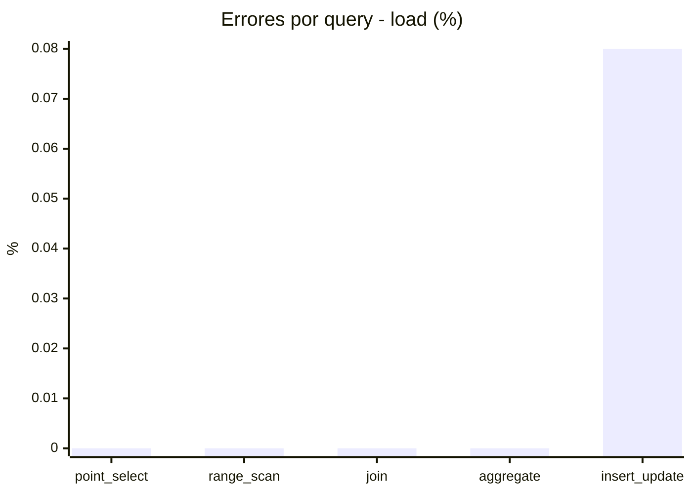
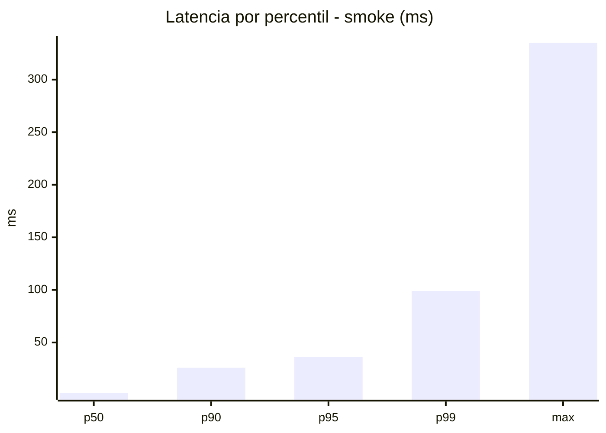
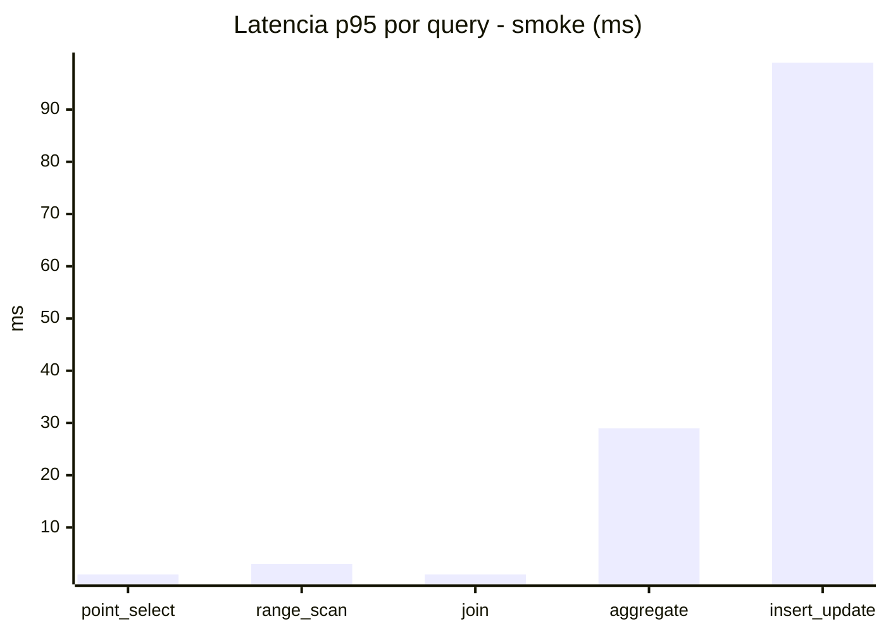
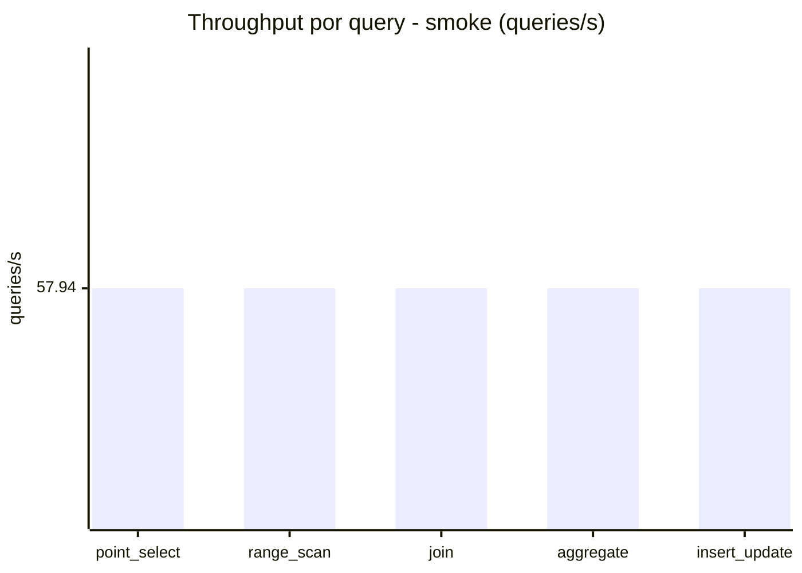
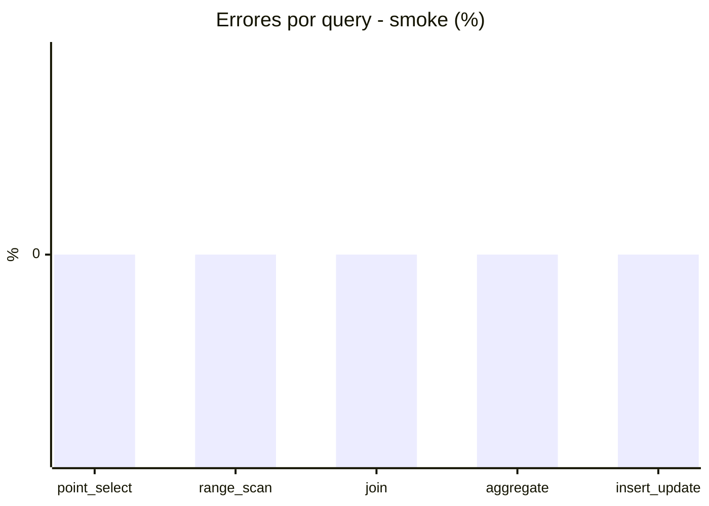

# Reporte de performance - SQL Server (k6)

**Fecha:** 2026-09-18 17:09 UTC  
**Veredicto (SLO):** `PASS`  
**Corrida:** [ver en GitHub Actions](https://github.com/lrbg/k6-sqlserver-lab/actions/runs/35372429527)  

## Analisis del agente de IA

PASS (fallback por umbrales)

- Error maximo: 0.02%
- p95 maximo: 139 ms

## Resultados

### Escenario: `load`

| Metrica | Valor |
| --- | --- |
| Queries ejecutadas | 30120 |
| Errores | 5 (0.02%) |
| Latencia media | 39.9 ms |
| p50 / p90 / p95 / p99 | 14 / 124 / 139 / 186 ms |
| Min / Max | 0 / 636 ms |
| Throughput | 499.84 queries/s |
| Duracion | 60.3 s |

Detalle por query

| Query | Ejecuciones | Error % | avg | p95 | p99 | q/s |
| --- | --- | --- | --- | --- | --- | --- |
| point_select | 6024 | 0% | 2.6 | 9 | 17 | 99.97 |
| range_scan | 6024 | 0% | 25.4 | 93.8 | 173 | 99.97 |
| join | 6024 | 0% | 5.9 | 17 | 21 | 99.97 |
| aggregate | 6024 | 0% | 109.7 | 154 | 172 | 99.97 |
| insert_update | 6024 | 0.08% | 56.1 | 175.8 | 310 | 99.97 |

### Escenario: `smoke`

| Metrica | Valor |
| --- | --- |
| Queries ejecutadas | 8695 |
| Errores | 0 (0%) |
| Latencia media | 10.3 ms |
| p50 / p90 / p95 / p99 | 2 / 26 / 36 / 99 ms |
| Min / Max | 0 / 335 ms |
| Throughput | 289.72 queries/s |
| Duracion | 30 s |

Detalle por query

| Query | Ejecuciones | Error % | avg | p95 | p99 | q/s |
| --- | --- | --- | --- | --- | --- | --- |
| point_select | 1739 | 0% | 0.4 | 1 | 1 | 57.94 |
| range_scan | 1739 | 0% | 2.7 | 3 | 35.2 | 57.94 |
| join | 1739 | 0% | 0.6 | 1 | 2 | 57.94 |
| aggregate | 1739 | 0% | 22.7 | 29 | 30 | 57.94 |
| insert_update | 1739 | 0% | 25.3 | 99 | 221.6 | 57.94 |

