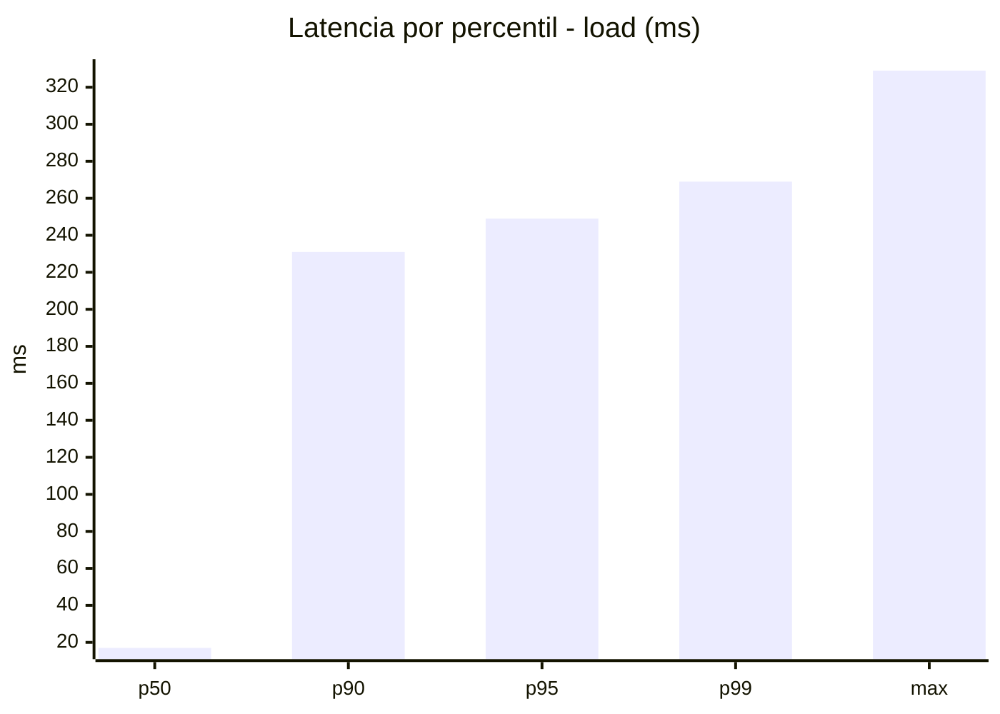
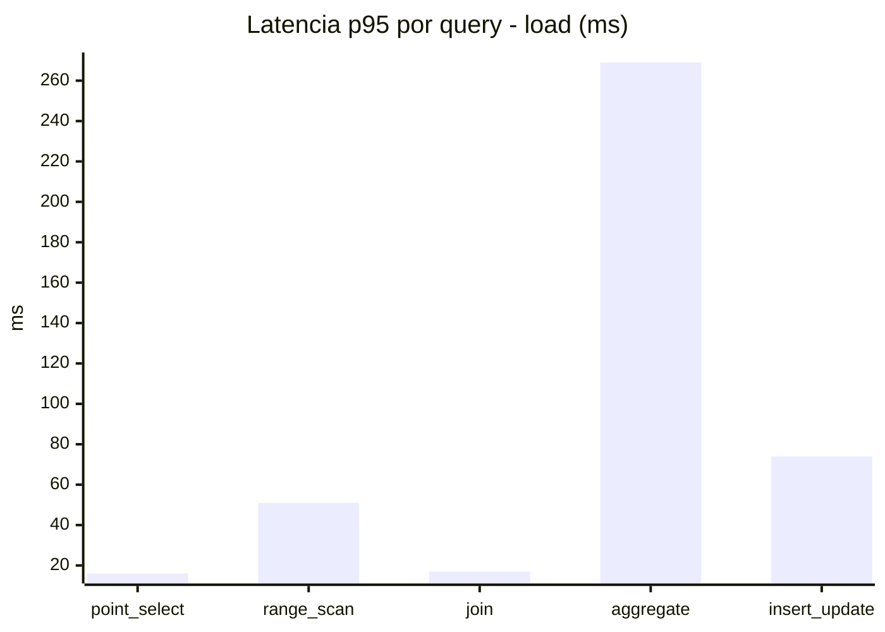
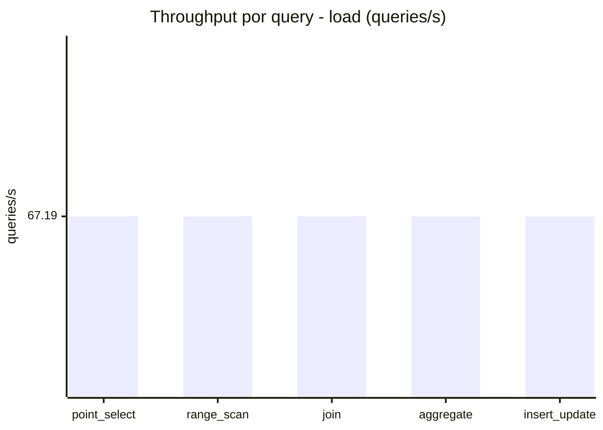
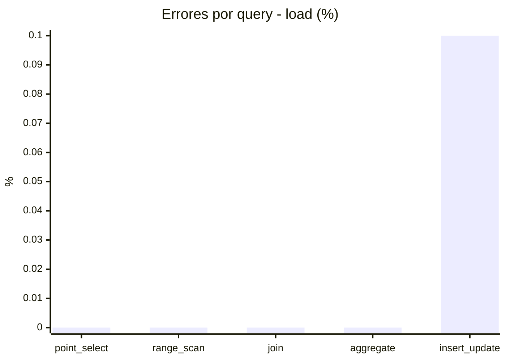
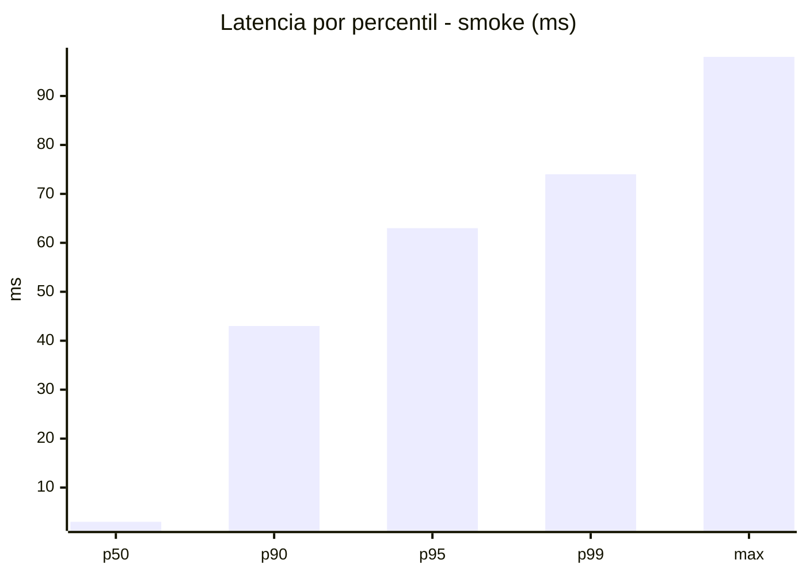
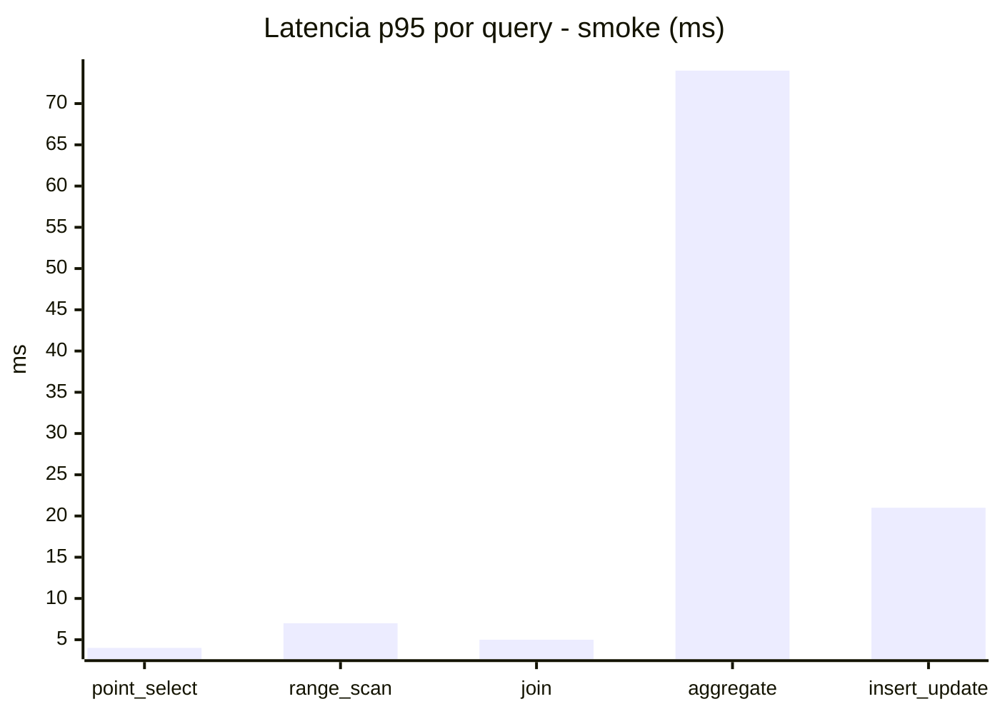
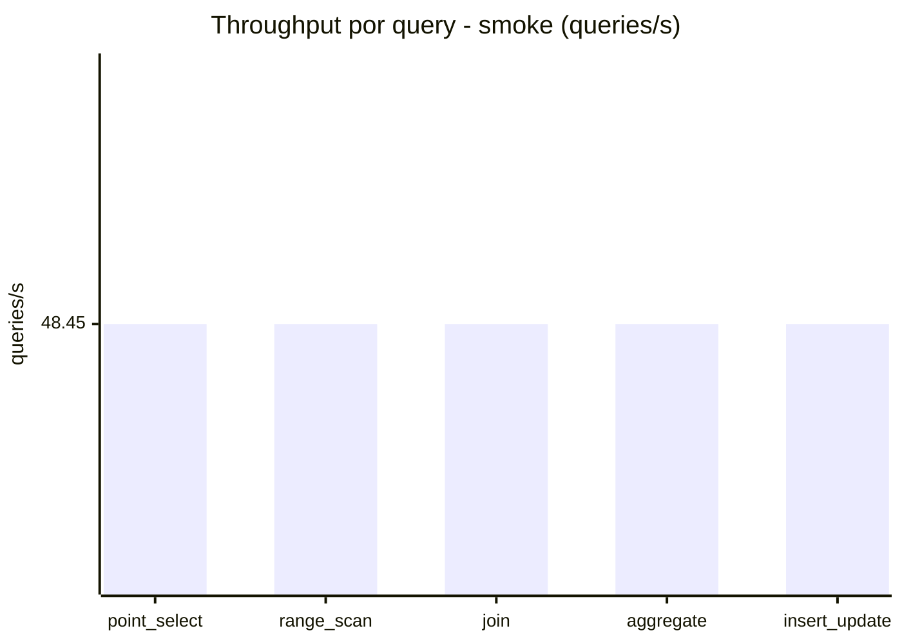
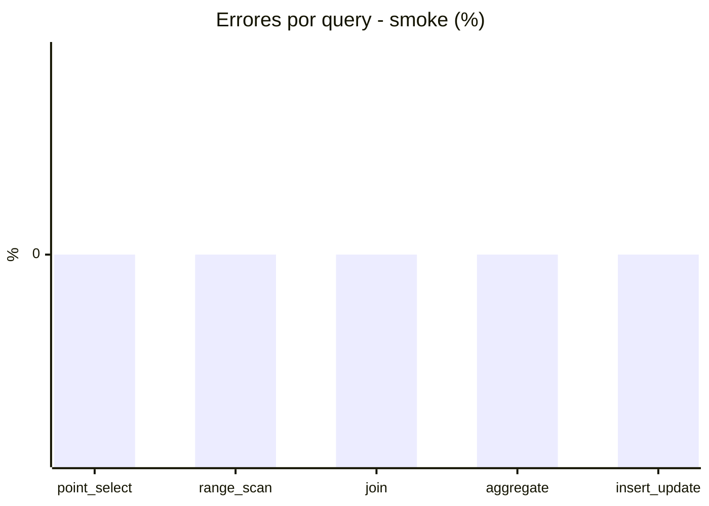

# Reporte de performance - SQL Server (k6)

**Fecha:** 2026-09-19 16:37 UTC  
**Veredicto (SLO):** `WARN`  
**Corrida:** [ver en GitHub Actions](https://github.com/lrbg/k6-sqlserver-lab/actions/runs/35455437184)  

## Analisis del agente de IA

WARN (fallback por umbrales)

- Error maximo: 0.02%
- p95 maximo: 249 ms

## Resultados

### Escenario: `load`

| Metrica | Valor |
| --- | --- |
| Queries ejecutadas | 20230 |
| Errores | 4 (0.02%) |
| Latencia media | 59.4 ms |
| p50 / p90 / p95 / p99 | 17 / 231 / 249 / 269 ms |
| Min / Max | 0 / 329 ms |
| Throughput | 335.95 queries/s |
| Duracion | 60.2 s |

Detalle por query

| Query | Ejecuciones | Error % | avg | p95 | p99 | q/s |
| --- | --- | --- | --- | --- | --- | --- |
| point_select | 4046 | 0% | 5.8 | 16 | 19 | 67.19 |
| range_scan | 4046 | 0% | 23.9 | 51 | 76 | 67.19 |
| join | 4046 | 0% | 8.6 | 17 | 19.6 | 67.19 |
| aggregate | 4046 | 0% | 223.5 | 269 | 289 | 67.19 |
| insert_update | 4046 | 0.1% | 35.3 | 74 | 93 | 67.19 |

### Escenario: `smoke`

| Metrica | Valor |
| --- | --- |
| Queries ejecutadas | 7275 |
| Errores | 0 (0%) |
| Latencia media | 12.3 ms |
| p50 / p90 / p95 / p99 | 3 / 43 / 63 / 74 ms |
| Min / Max | 0 / 98 ms |
| Throughput | 242.27 queries/s |
| Duracion | 30 s |

Detalle por query

| Query | Ejecuciones | Error % | avg | p95 | p99 | q/s |
| --- | --- | --- | --- | --- | --- | --- |
| point_select | 1455 | 0% | 1.1 | 4 | 5 | 48.45 |
| range_scan | 1455 | 0% | 3.5 | 7 | 12 | 48.45 |
| join | 1455 | 0% | 1.8 | 5 | 5 | 48.45 |
| aggregate | 1455 | 0% | 48.8 | 74 | 79 | 48.45 |
| insert_update | 1455 | 0% | 6.6 | 21 | 25 | 48.45 |

