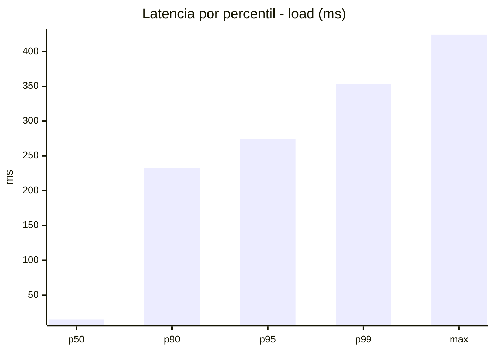
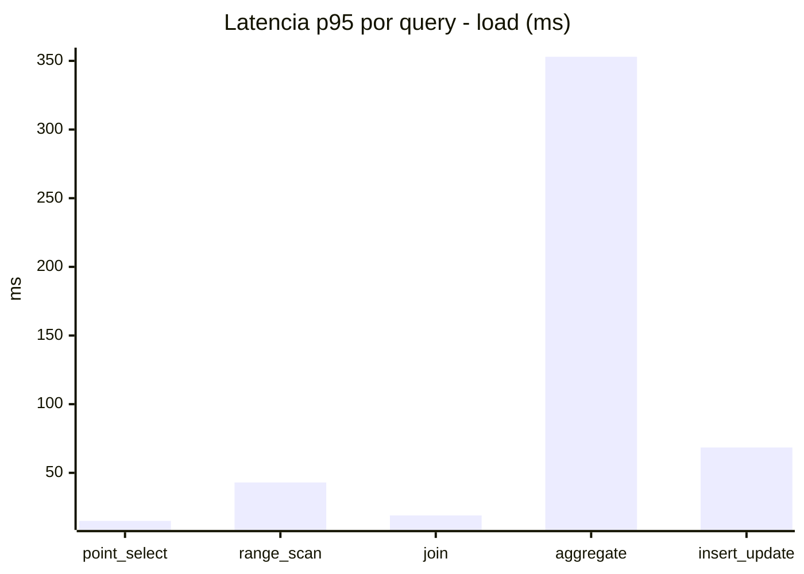
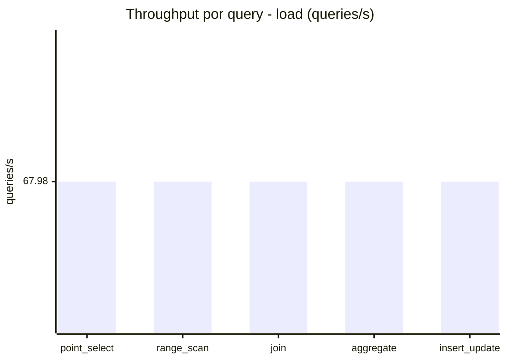
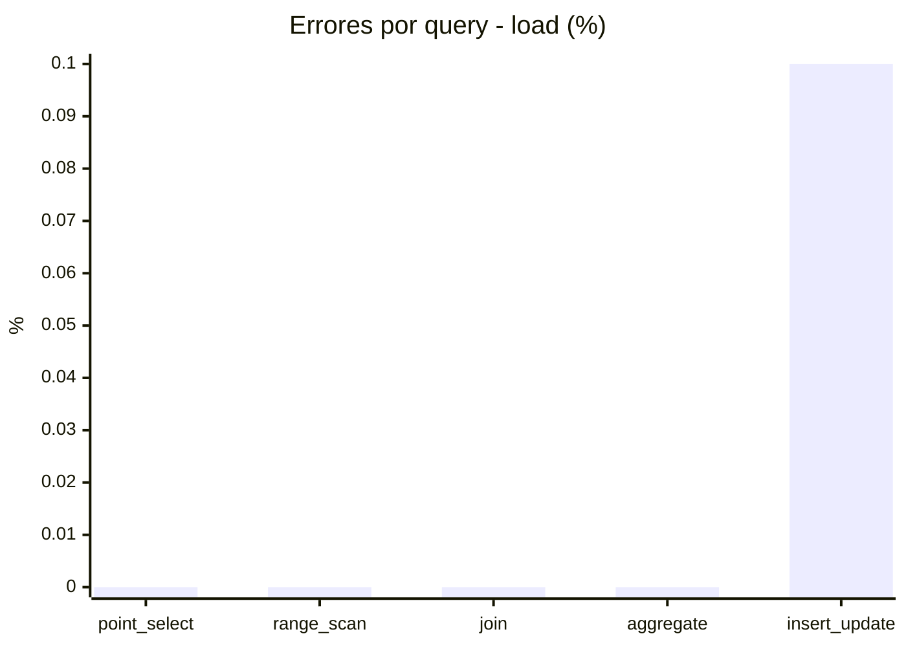
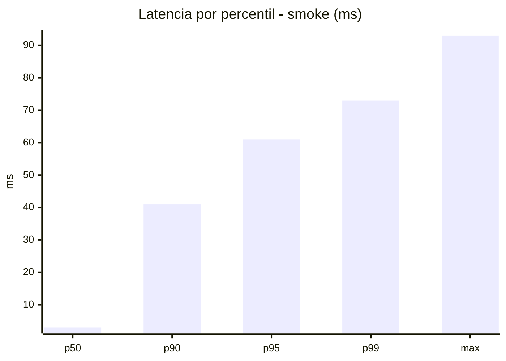
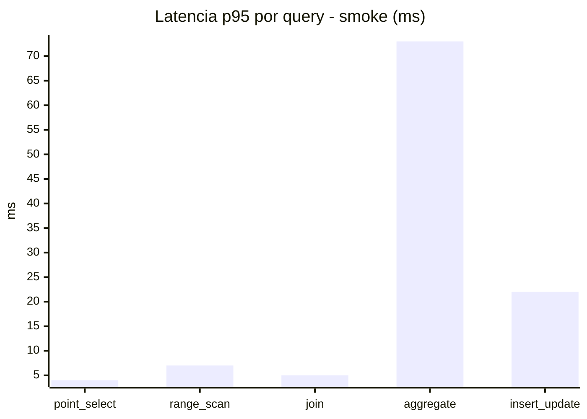
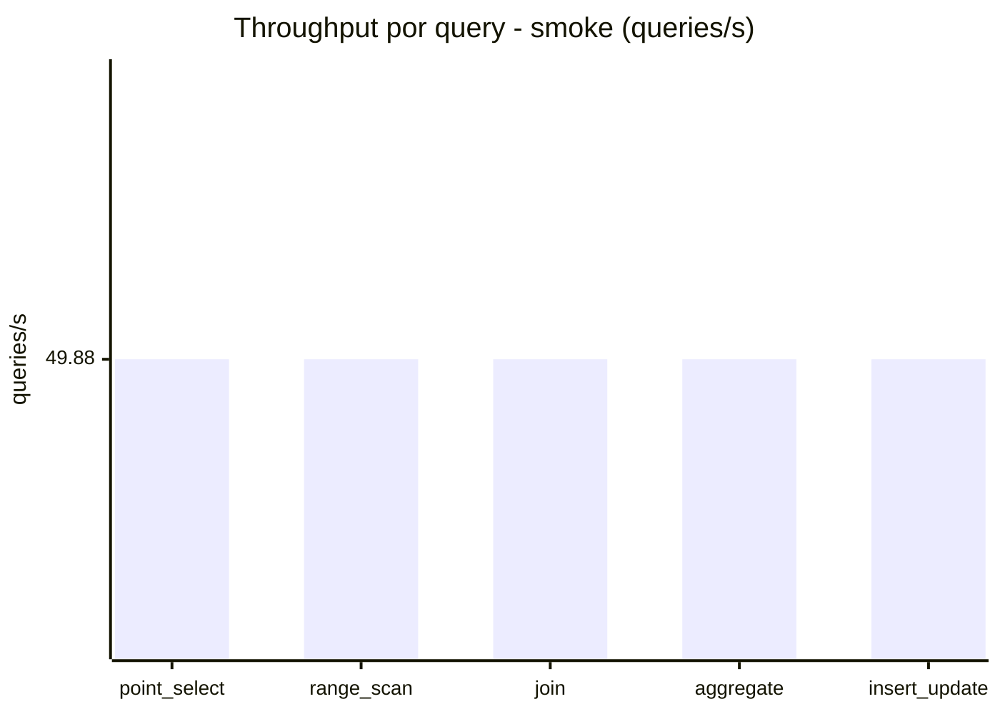
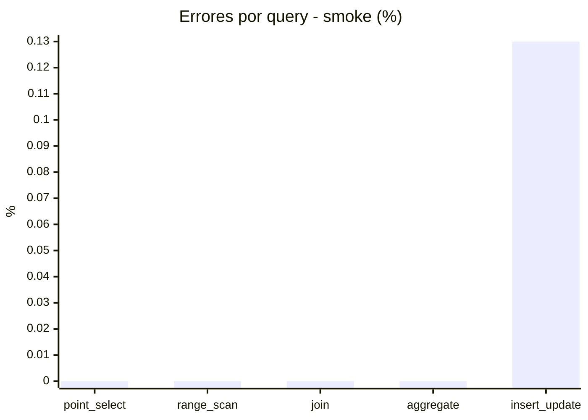

# Reporte de performance - SQL Server (k6)

**Fecha:** 2026-09-20 16:55 UTC  
**Veredicto (SLO):** `WARN`  
**Corrida:** [ver en GitHub Actions](https://github.com/lrbg/k6-sqlserver-lab/actions/runs/35524109175)  

## Analisis del agente de IA

WARN (fallback por umbrales)

- Error maximo: 0.03%
- p95 maximo: 274 ms

## Resultados

### Escenario: `load`

| Metrica | Valor |
| --- | --- |
| Queries ejecutadas | 20455 |
| Errores | 4 (0.02%) |
| Latencia media | 58.8 ms |
| p50 / p90 / p95 / p99 | 15 / 233 / 274 / 353 ms |
| Min / Max | 0 / 424 ms |
| Throughput | 339.88 queries/s |
| Duracion | 60.2 s |

Detalle por query

| Query | Ejecuciones | Error % | avg | p95 | p99 | q/s |
| --- | --- | --- | --- | --- | --- | --- |
| point_select | 4091 | 0% | 5.3 | 15 | 20 | 67.98 |
| range_scan | 4091 | 0% | 19.3 | 43 | 61 | 67.98 |
| join | 4091 | 0% | 8.5 | 19 | 25 | 67.98 |
| aggregate | 4091 | 0% | 230.4 | 353 | 370.1 | 67.98 |
| insert_update | 4091 | 0.1% | 30.3 | 68.5 | 86.1 | 67.98 |

### Escenario: `smoke`

| Metrica | Valor |
| --- | --- |
| Queries ejecutadas | 7490 |
| Errores | 2 (0.03%) |
| Latencia media | 12 ms |
| p50 / p90 / p95 / p99 | 3 / 41 / 61 / 73 ms |
| Min / Max | 0 / 93 ms |
| Throughput | 249.38 queries/s |
| Duracion | 30 s |

Detalle por query

| Query | Ejecuciones | Error % | avg | p95 | p99 | q/s |
| --- | --- | --- | --- | --- | --- | --- |
| point_select | 1498 | 0% | 1.1 | 4 | 5 | 49.88 |
| range_scan | 1498 | 0% | 3.2 | 7 | 10 | 49.88 |
| join | 1498 | 0% | 1.7 | 5 | 5 | 49.88 |
| aggregate | 1498 | 0% | 47.5 | 73 | 78 | 49.88 |
| insert_update | 1498 | 0.13% | 6.5 | 22 | 25 | 49.88 |

