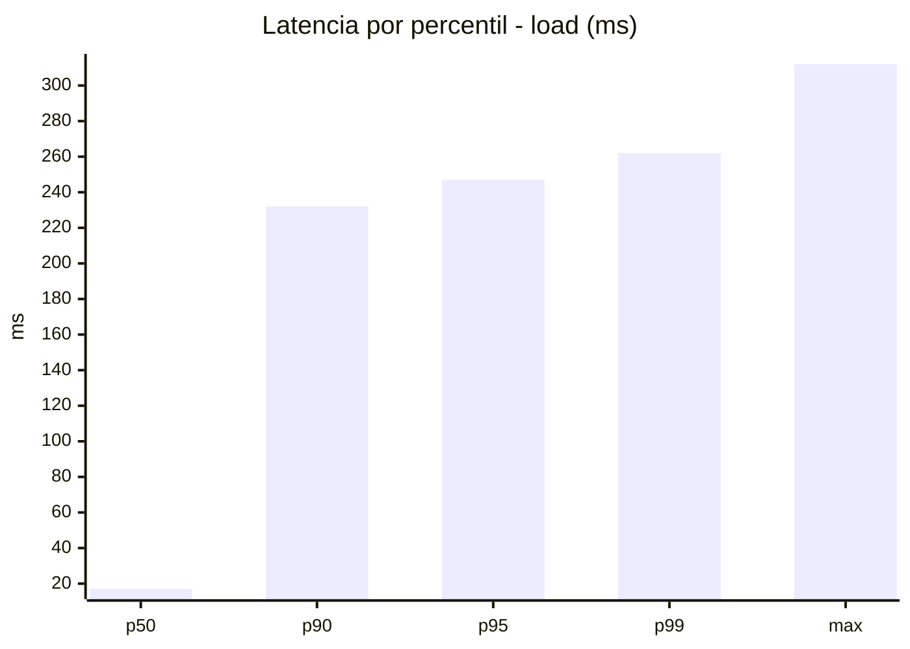
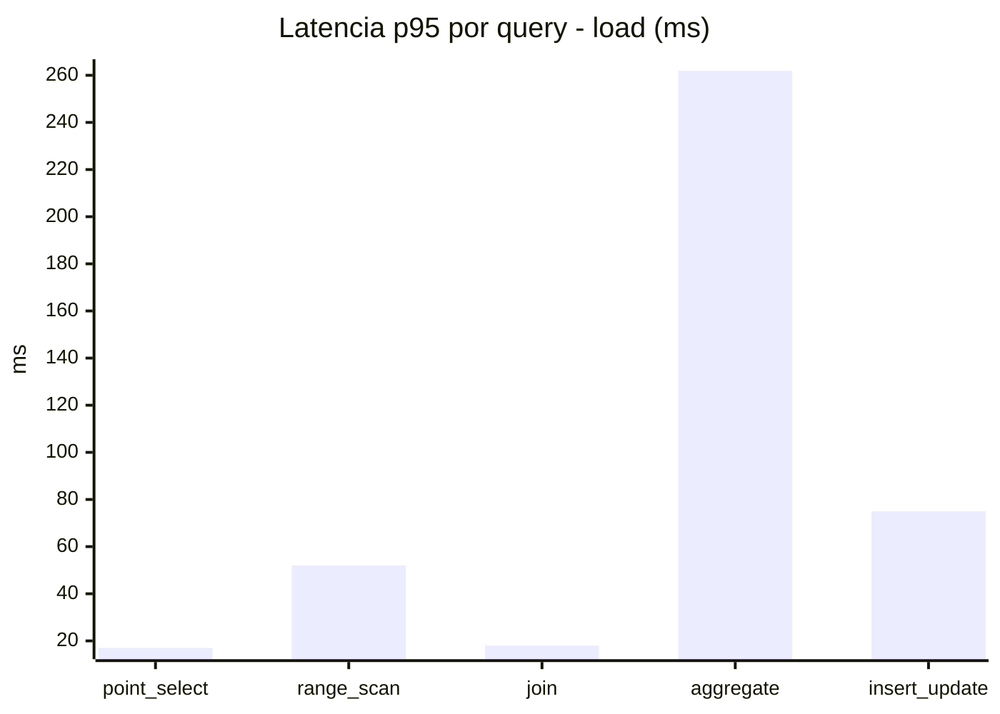
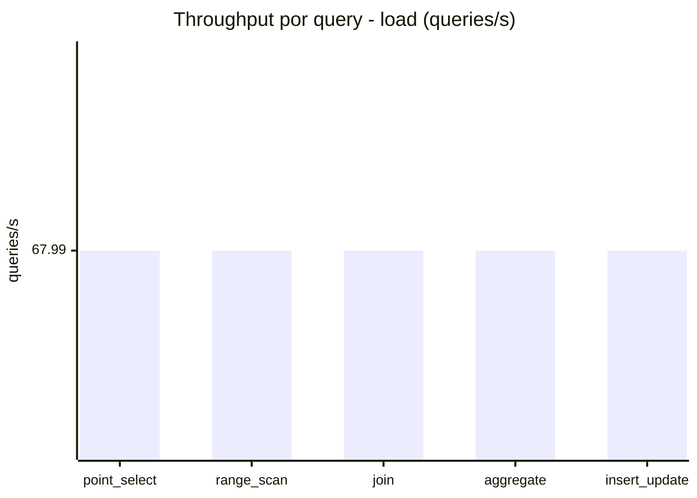
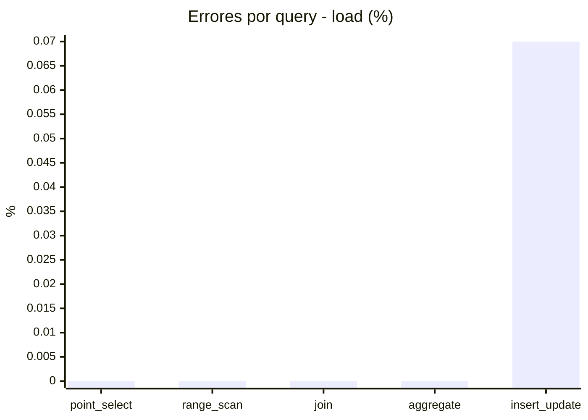
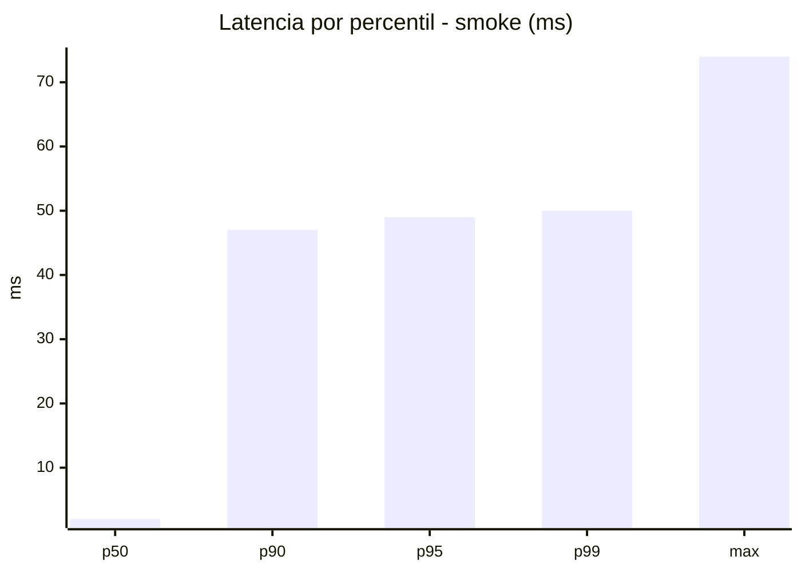
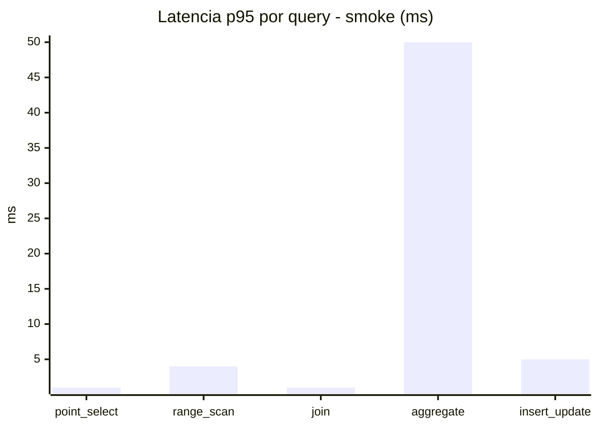
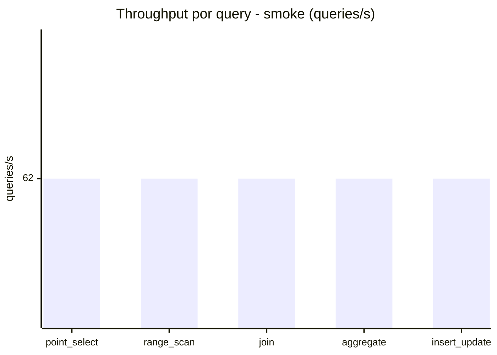
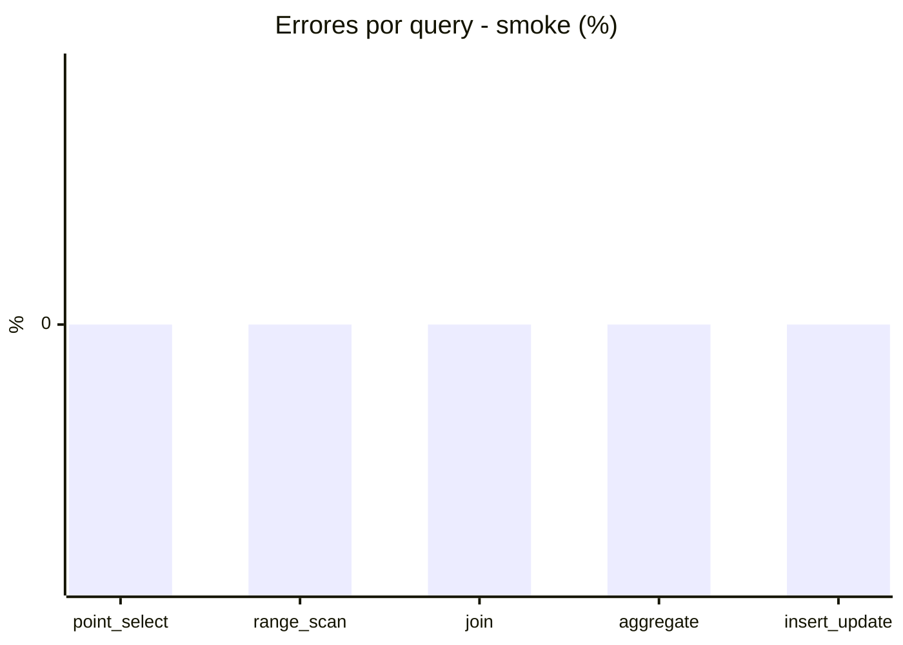

# Reporte de performance - SQL Server (k6)

**Fecha:** 2026-09-21 18:51 UTC  
**Veredicto (SLO):** `WARN`  
**Corrida:** [ver en GitHub Actions](https://github.com/lrbg/k6-sqlserver-lab/actions/runs/35640820944)  

## Analisis del agente de IA

WARN (fallback por umbrales)

- Error maximo: 0.01%
- p95 maximo: 247 ms

## Resultados

### Escenario: `load`

| Metrica | Valor |
| --- | --- |
| Queries ejecutadas | 20460 |
| Errores | 3 (0.01%) |
| Latencia media | 58.7 ms |
| p50 / p90 / p95 / p99 | 17 / 232 / 247 / 262 ms |
| Min / Max | 0 / 312 ms |
| Throughput | 339.97 queries/s |
| Duracion | 60.2 s |

Detalle por query

| Query | Ejecuciones | Error % | avg | p95 | p99 | q/s |
| --- | --- | --- | --- | --- | --- | --- |
| point_select | 4092 | 0% | 5.3 | 17 | 18 | 67.99 |
| range_scan | 4092 | 0% | 23.3 | 52 | 69.1 | 67.99 |
| join | 4092 | 0% | 8.4 | 18 | 19 | 67.99 |
| aggregate | 4092 | 0% | 224.1 | 262 | 281 | 67.99 |
| insert_update | 4092 | 0.07% | 32.5 | 75 | 84.1 | 67.99 |

### Escenario: `smoke`

| Metrica | Valor |
| --- | --- |
| Queries ejecutadas | 9305 |
| Errores | 0 (0%) |
| Latencia media | 9.6 ms |
| p50 / p90 / p95 / p99 | 2 / 47 / 49 / 50 ms |
| Min / Max | 0 / 74 ms |
| Throughput | 309.99 queries/s |
| Duracion | 30 s |

Detalle por query

| Query | Ejecuciones | Error % | avg | p95 | p99 | q/s |
| --- | --- | --- | --- | --- | --- | --- |
| point_select | 1861 | 0% | 0.5 | 1 | 2 | 62 |
| range_scan | 1861 | 0% | 2.7 | 4 | 5 | 62 |
| join | 1861 | 0% | 0.9 | 1 | 3 | 62 |
| aggregate | 1861 | 0% | 41.1 | 50 | 52 | 62 |
| insert_update | 1861 | 0% | 3 | 5 | 12 | 62 |

