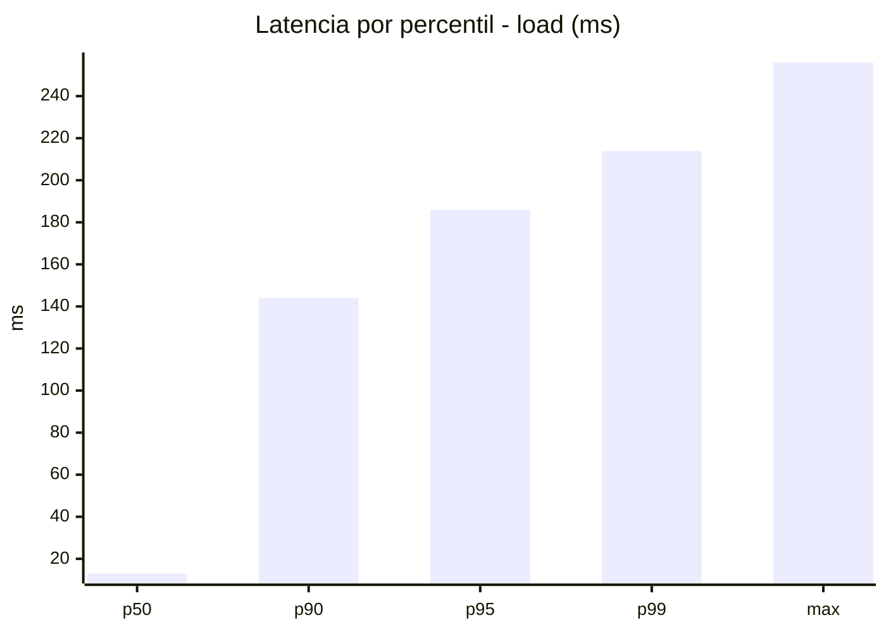
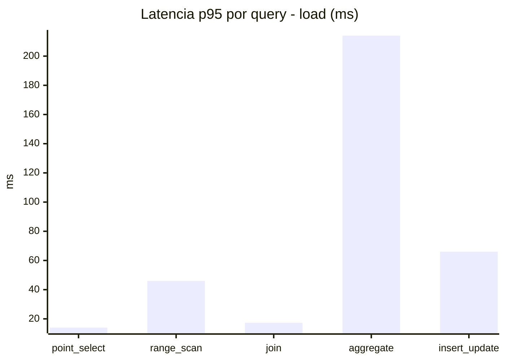
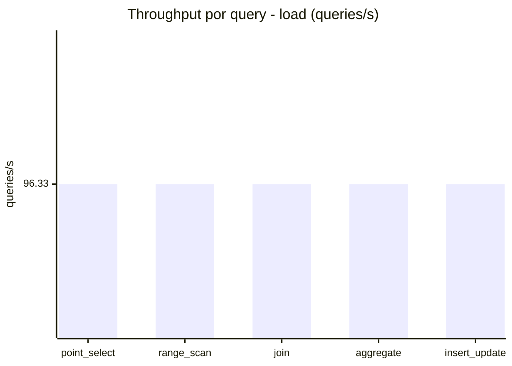
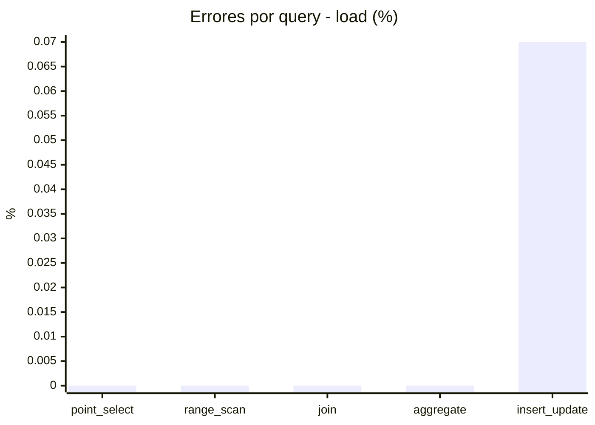
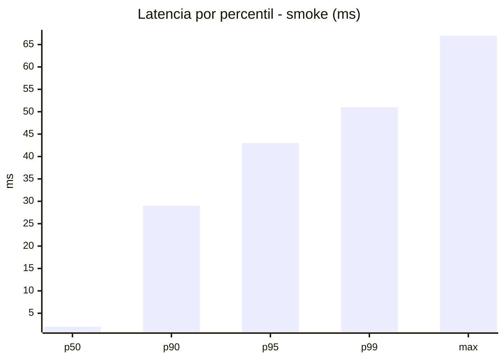
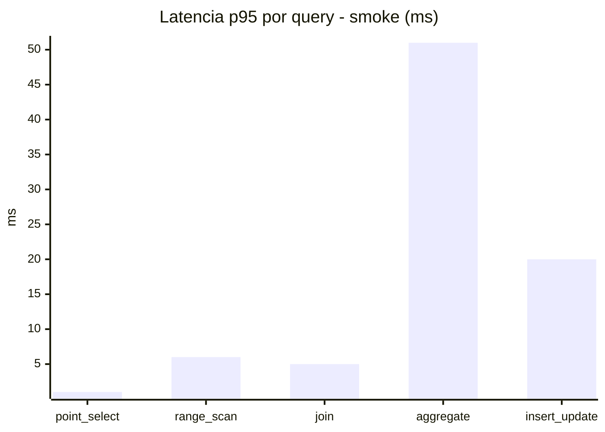
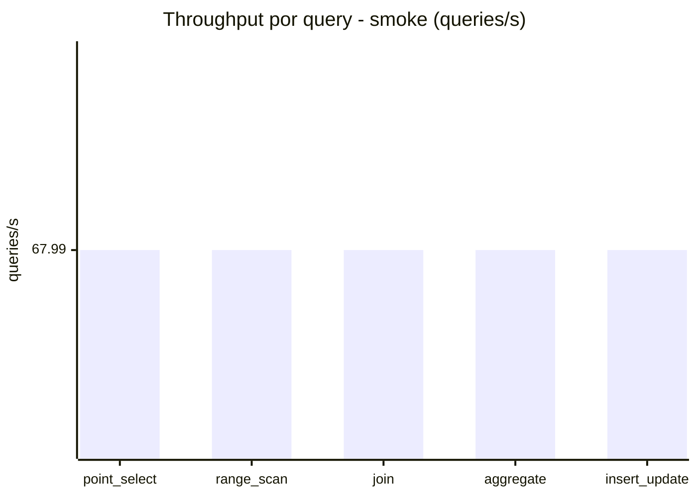
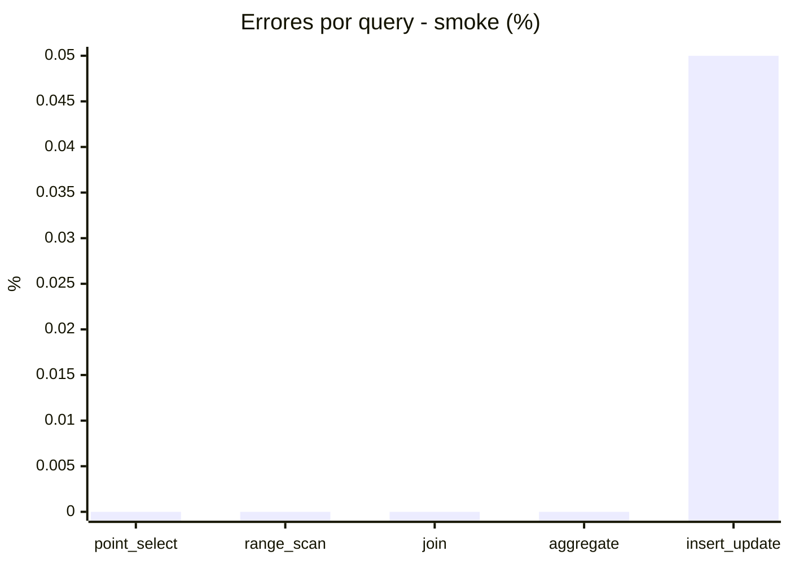

# Reporte de performance - SQL Server (k6)

**Fecha:** 2026-09-22 17:42 UTC  
**Veredicto (SLO):** `PASS`  
**Corrida:** [ver en GitHub Actions](https://github.com/lrbg/k6-sqlserver-lab/actions/runs/35762191065)  

## Analisis del agente de IA

PASS (fallback por umbrales)

- Error maximo: 0.01%
- p95 maximo: 186 ms

## Resultados

### Escenario: `load`

| Metrica | Valor |
| --- | --- |
| Queries ejecutadas | 28970 |
| Errores | 4 (0.01%) |
| Latencia media | 41.5 ms |
| p50 / p90 / p95 / p99 | 13 / 144 / 186 / 214 ms |
| Min / Max | 0 / 256 ms |
| Throughput | 481.66 queries/s |
| Duracion | 60.1 s |

Detalle por query

| Query | Ejecuciones | Error % | avg | p95 | p99 | q/s |
| --- | --- | --- | --- | --- | --- | --- |
| point_select | 5794 | 0% | 4.3 | 14 | 20 | 96.33 |
| range_scan | 5794 | 0% | 18.8 | 46 | 66 | 96.33 |
| join | 5794 | 0% | 6.7 | 17.3 | 21 | 96.33 |
| aggregate | 5794 | 0% | 149.6 | 214 | 226 | 96.33 |
| insert_update | 5794 | 0.07% | 27.9 | 66 | 89 | 96.33 |

### Escenario: `smoke`

| Metrica | Valor |
| --- | --- |
| Queries ejecutadas | 10205 |
| Errores | 1 (0.01%) |
| Latencia media | 8.8 ms |
| p50 / p90 / p95 / p99 | 2 / 29 / 43 / 51 ms |
| Min / Max | 0 / 67 ms |
| Throughput | 339.93 queries/s |
| Duracion | 30 s |

Detalle por query

| Query | Ejecuciones | Error % | avg | p95 | p99 | q/s |
| --- | --- | --- | --- | --- | --- | --- |
| point_select | 2041 | 0% | 0.5 | 1 | 4 | 67.99 |
| range_scan | 2041 | 0% | 2.5 | 6 | 12 | 67.99 |
| join | 2041 | 0% | 1.3 | 5 | 5 | 67.99 |
| aggregate | 2041 | 0% | 33.5 | 51 | 55.6 | 67.99 |
| insert_update | 2041 | 0.05% | 6.1 | 20 | 25 | 67.99 |

