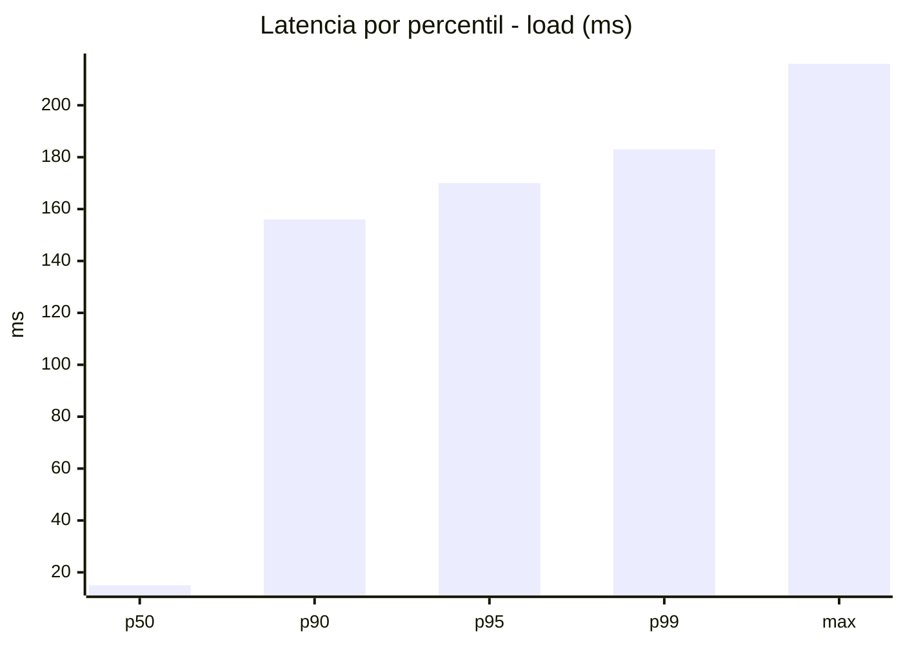
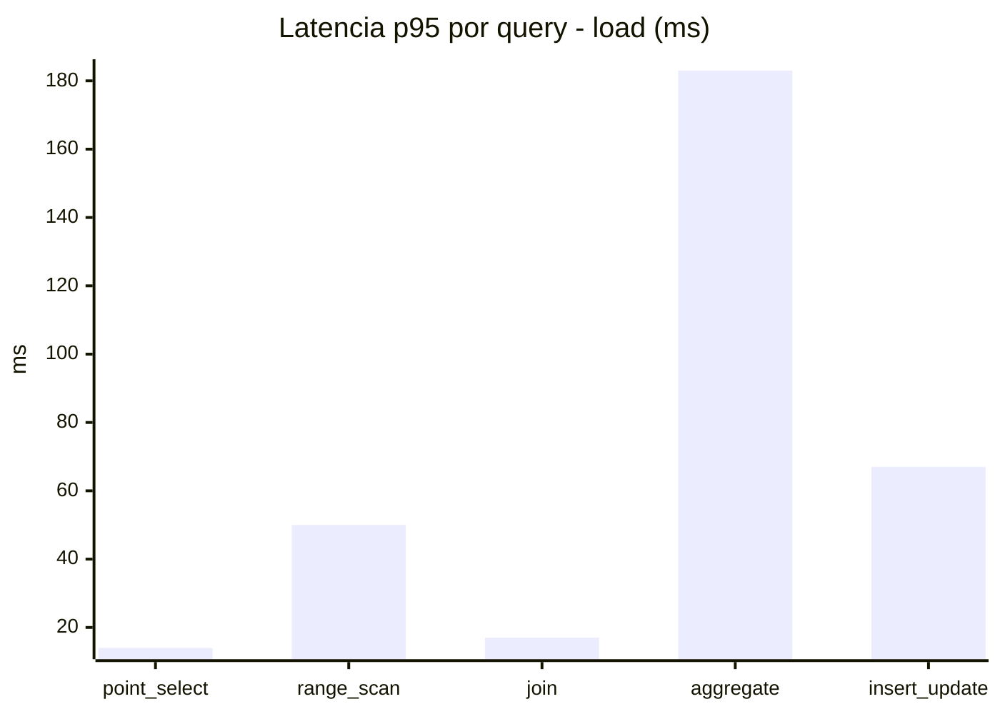
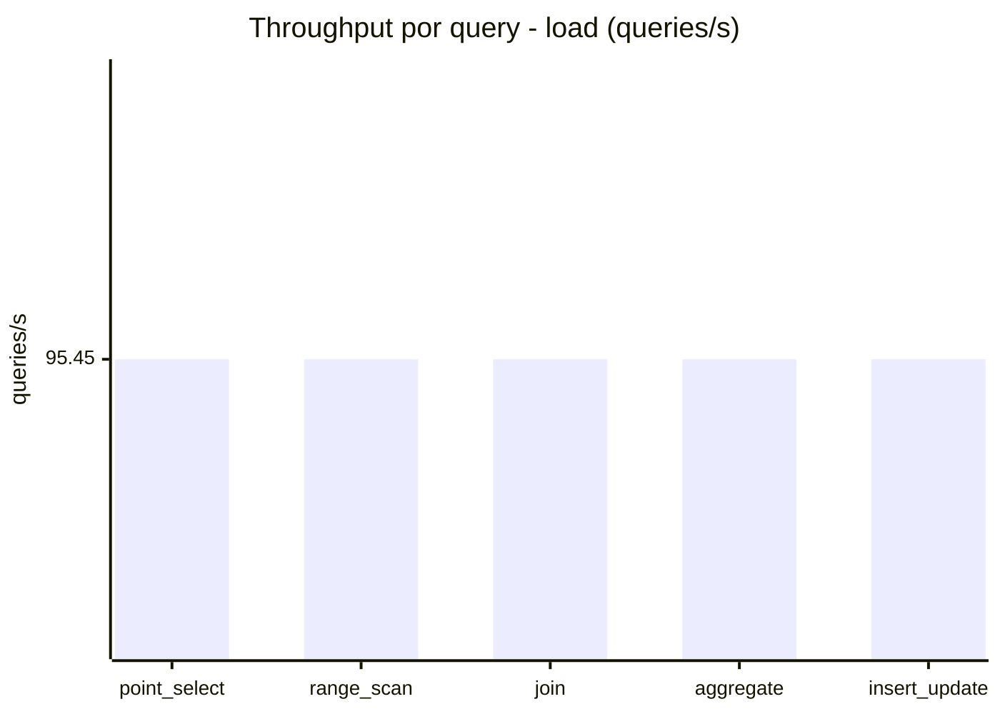
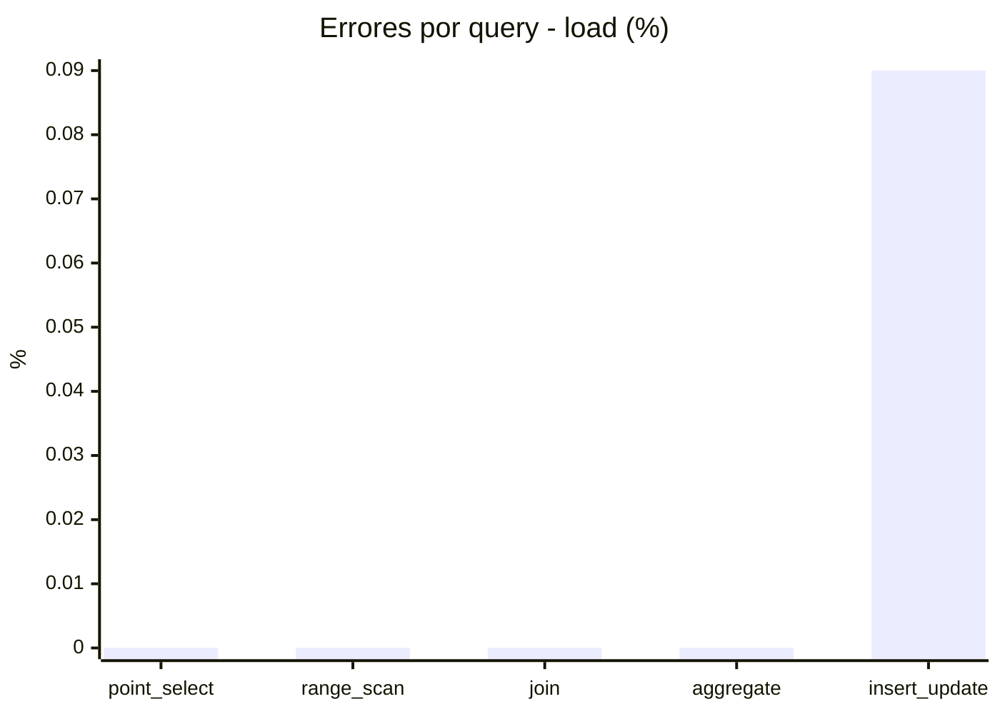
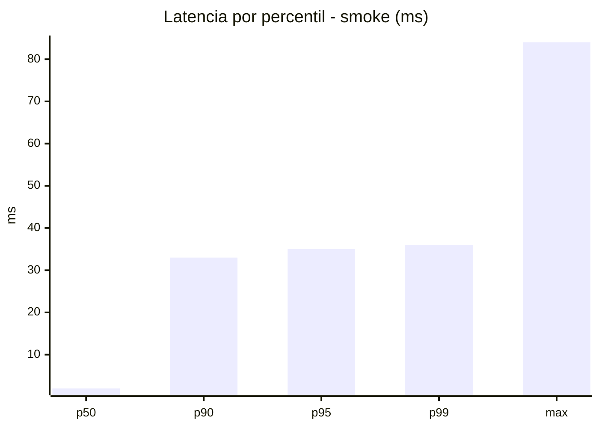
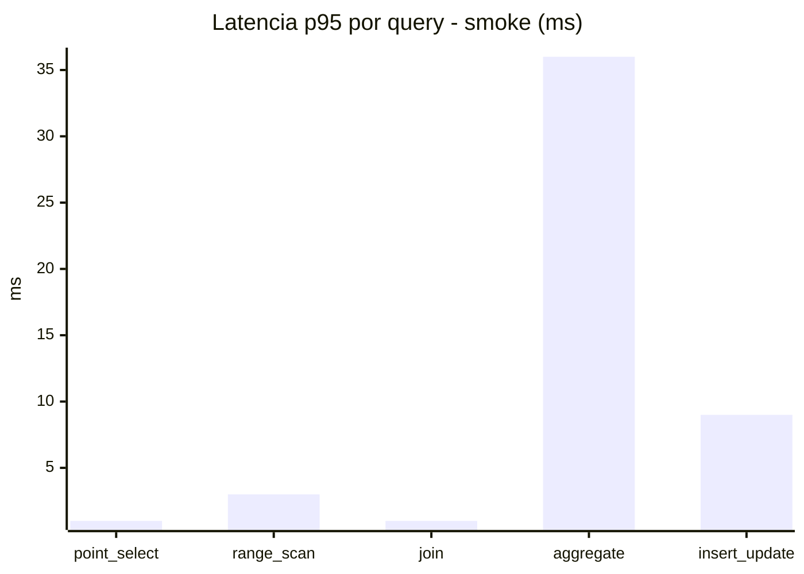
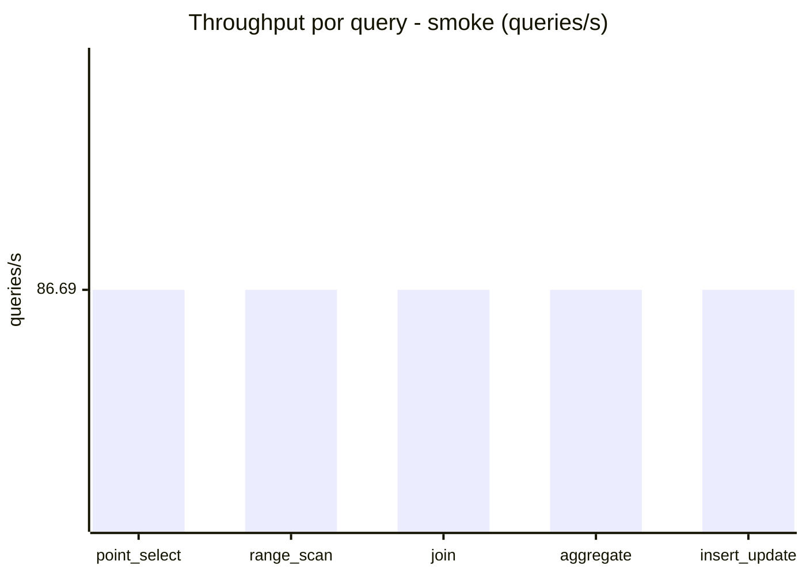
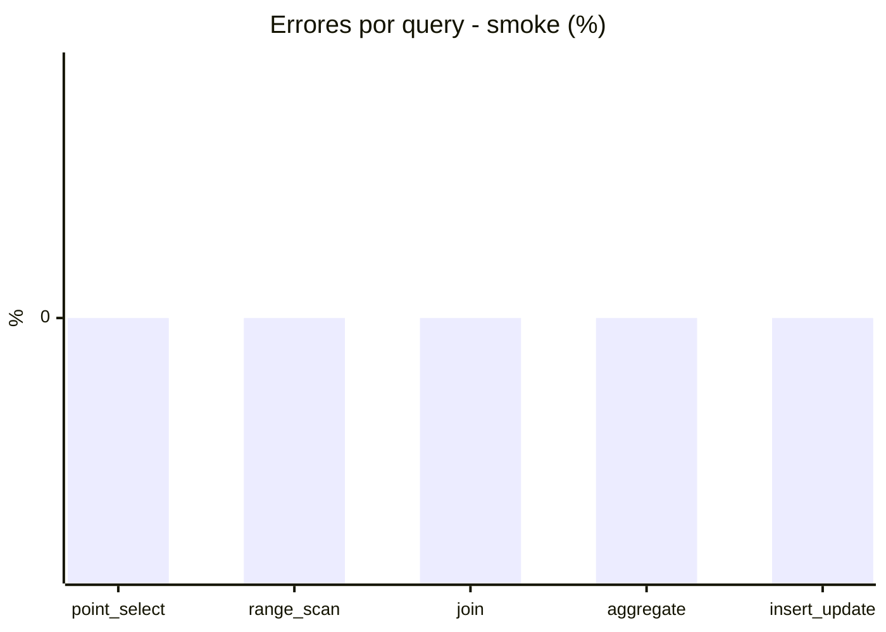

# Reporte de performance - SQL Server (k6)

**Fecha:** 2026-09-23 17:55 UTC  
**Veredicto (SLO):** `PASS`  
**Corrida:** [ver en GitHub Actions](https://github.com/lrbg/k6-sqlserver-lab/actions/runs/35898632508)  

## Analisis del agente de IA

PASS (fallback por umbrales)

- Error maximo: 0.02%
- p95 maximo: 170 ms

## Resultados

### Escenario: `load`

| Metrica | Valor |
| --- | --- |
| Queries ejecutadas | 28675 |
| Errores | 5 (0.02%) |
| Latencia media | 41.8 ms |
| p50 / p90 / p95 / p99 | 15 / 156 / 170 / 183 ms |
| Min / Max | 0 / 216 ms |
| Throughput | 477.27 queries/s |
| Duracion | 60.1 s |

Detalle por query

| Query | Ejecuciones | Error % | avg | p95 | p99 | q/s |
| --- | --- | --- | --- | --- | --- | --- |
| point_select | 5735 | 0% | 3.9 | 14 | 17 | 95.45 |
| range_scan | 5735 | 0% | 21.4 | 50 | 71 | 95.45 |
| join | 5735 | 0% | 6.6 | 17 | 18 | 95.45 |
| aggregate | 5735 | 0% | 148.3 | 183 | 191 | 95.45 |
| insert_update | 5735 | 0.09% | 29 | 67 | 83 | 95.45 |

### Escenario: `smoke`

| Metrica | Valor |
| --- | --- |
| Queries ejecutadas | 13015 |
| Errores | 0 (0%) |
| Latencia media | 6.9 ms |
| p50 / p90 / p95 / p99 | 2 / 33 / 35 / 36 ms |
| Min / Max | 0 / 84 ms |
| Throughput | 433.45 queries/s |
| Duracion | 30 s |

Detalle por query

| Query | Ejecuciones | Error % | avg | p95 | p99 | q/s |
| --- | --- | --- | --- | --- | --- | --- |
| point_select | 2603 | 0% | 0.5 | 1 | 1 | 86.69 |
| range_scan | 2603 | 0% | 1.9 | 3 | 4 | 86.69 |
| join | 2603 | 0% | 0.6 | 1 | 2 | 86.69 |
| aggregate | 2603 | 0% | 28.7 | 36 | 37 | 86.69 |
| insert_update | 2603 | 0% | 2.8 | 9 | 19 | 86.69 |

