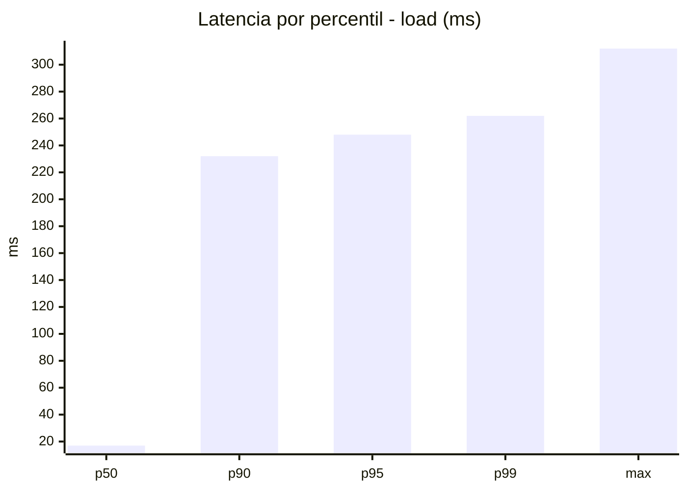
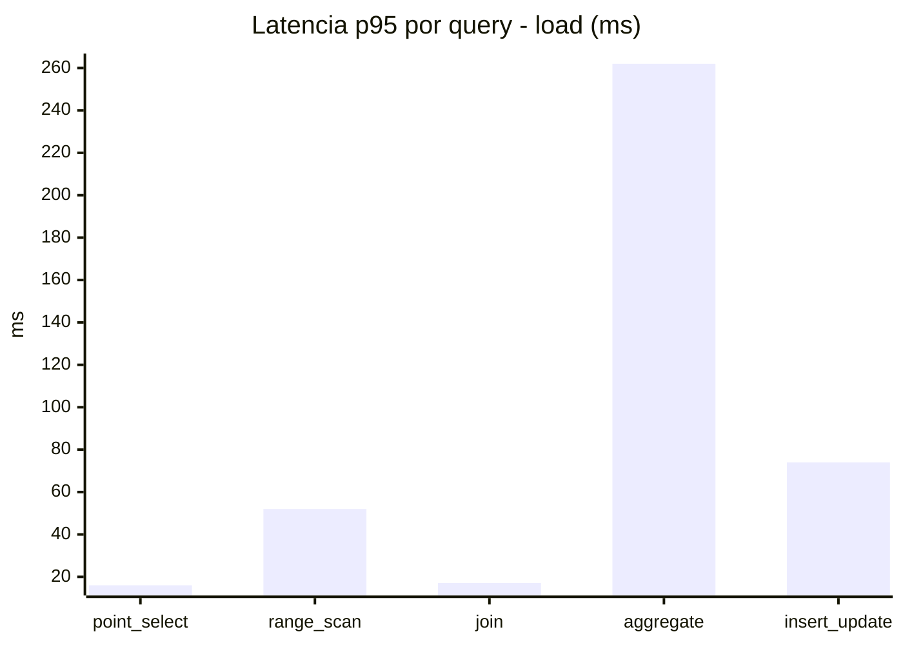
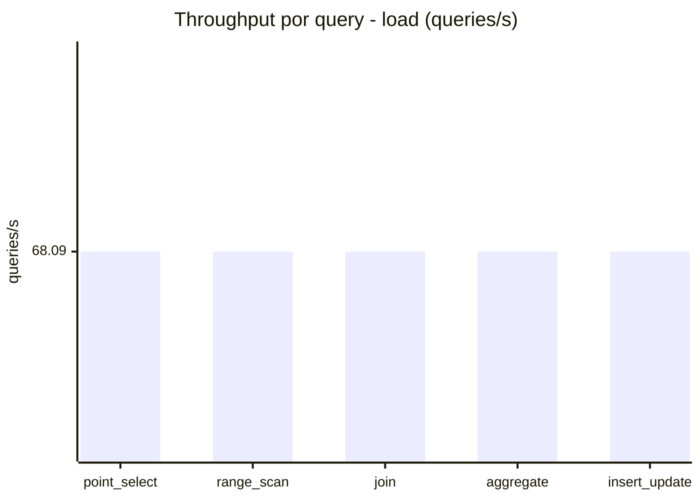
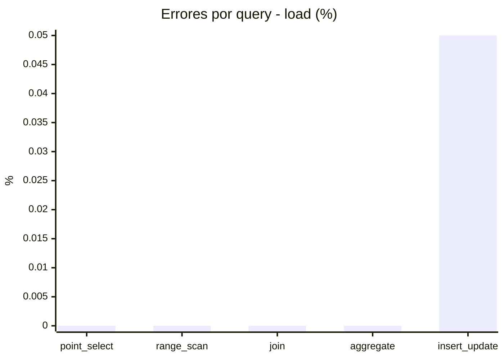
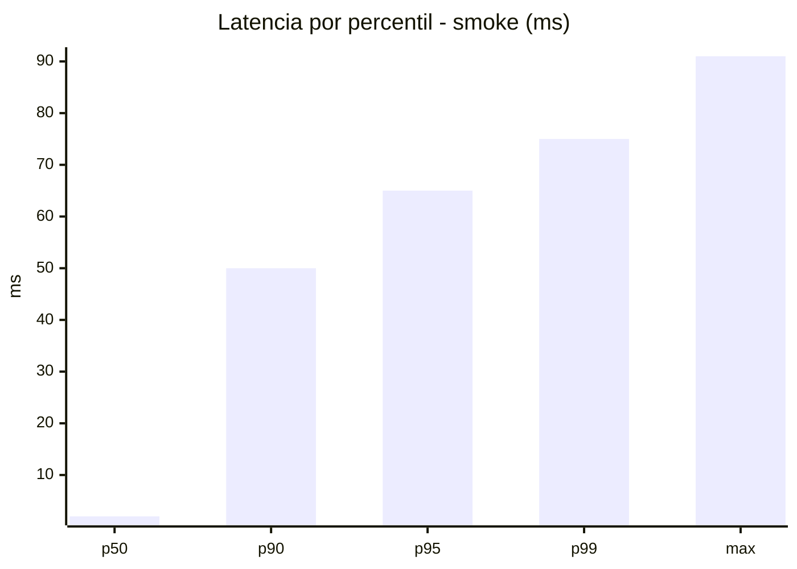
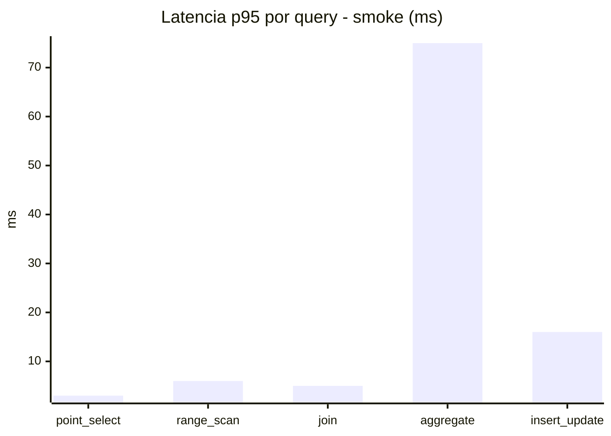
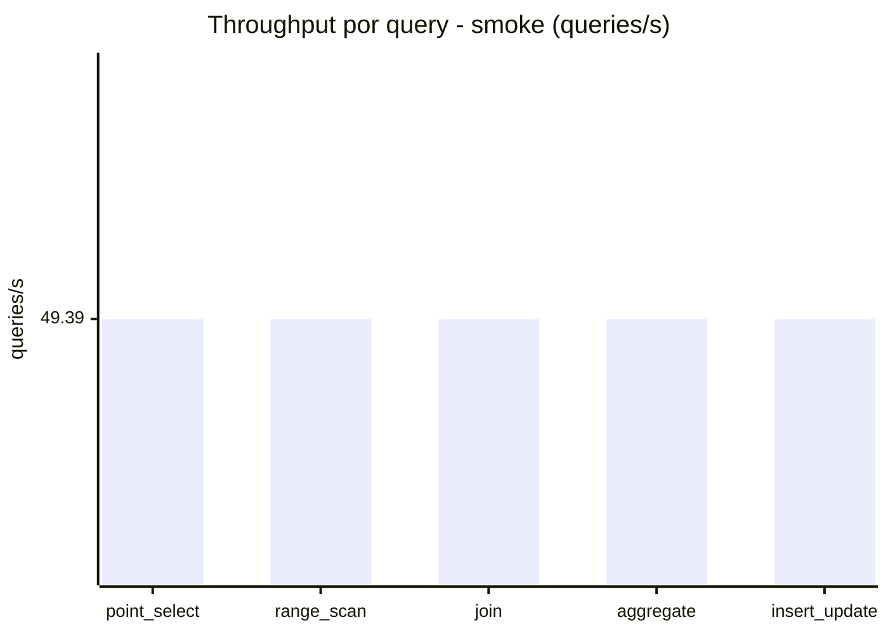
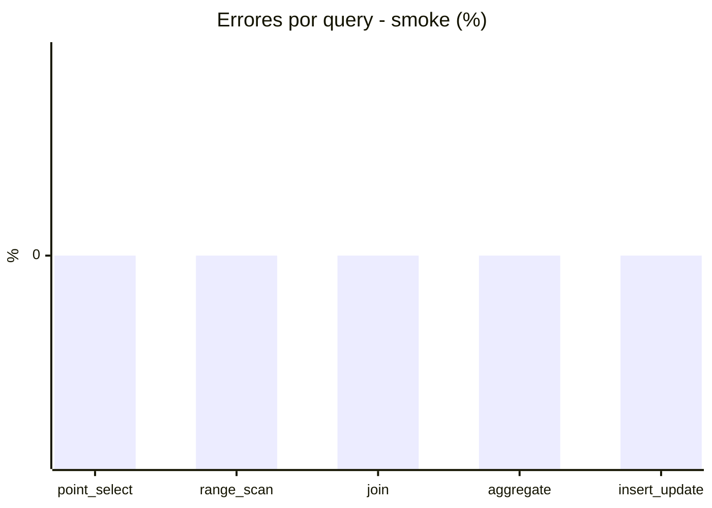

# Reporte de performance - SQL Server (k6)

**Fecha:** 2026-09-24 17:55 UTC  
**Veredicto (SLO):** `WARN`  
**Corrida:** [ver en GitHub Actions](https://github.com/lrbg/k6-sqlserver-lab/actions/runs/36037398108)  

## Analisis del agente de IA

WARN (fallback por umbrales)

- Error maximo: 0.01%
- p95 maximo: 248 ms

## Resultados

### Escenario: `load`

| Metrica | Valor |
| --- | --- |
| Queries ejecutadas | 20495 |
| Errores | 2 (0.01%) |
| Latencia media | 58.6 ms |
| p50 / p90 / p95 / p99 | 17 / 232 / 248 / 262 ms |
| Min / Max | 0 / 312 ms |
| Throughput | 340.47 queries/s |
| Duracion | 60.2 s |

Detalle por query

| Query | Ejecuciones | Error % | avg | p95 | p99 | q/s |
| --- | --- | --- | --- | --- | --- | --- |
| point_select | 4099 | 0% | 5.7 | 16 | 17 | 68.09 |
| range_scan | 4099 | 0% | 22.3 | 52 | 72 | 68.09 |
| join | 4099 | 0% | 8.7 | 17.1 | 19 | 68.09 |
| aggregate | 4099 | 0% | 222.4 | 262 | 275 | 68.09 |
| insert_update | 4099 | 0.05% | 33.8 | 74 | 90 | 68.09 |

### Escenario: `smoke`

| Metrica | Valor |
| --- | --- |
| Queries ejecutadas | 7415 |
| Errores | 0 (0%) |
| Latencia media | 12.1 ms |
| p50 / p90 / p95 / p99 | 2 / 50 / 65 / 75 ms |
| Min / Max | 0 / 91 ms |
| Throughput | 246.97 queries/s |
| Duracion | 30 s |

Detalle por query

| Query | Ejecuciones | Error % | avg | p95 | p99 | q/s |
| --- | --- | --- | --- | --- | --- | --- |
| point_select | 1483 | 0% | 0.8 | 3 | 5 | 49.39 |
| range_scan | 1483 | 0% | 3.1 | 6 | 11 | 49.39 |
| join | 1483 | 0% | 1.7 | 5 | 5 | 49.39 |
| aggregate | 1483 | 0% | 50.2 | 75 | 81 | 49.39 |
| insert_update | 1483 | 0% | 4.8 | 16 | 22 | 49.39 |

