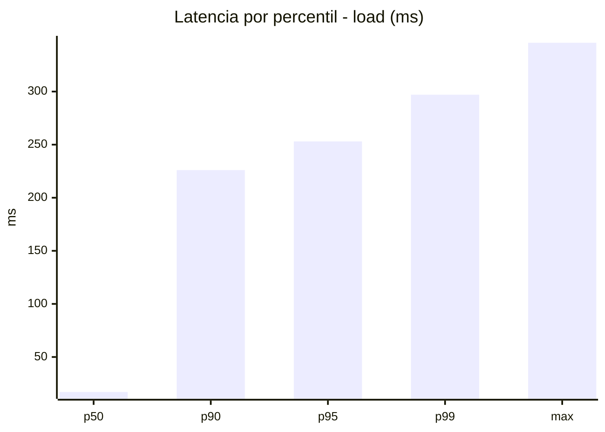
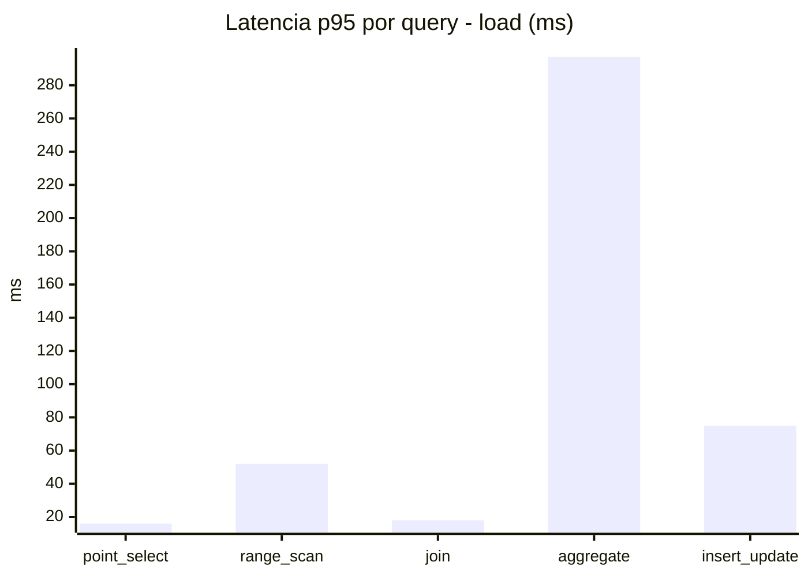
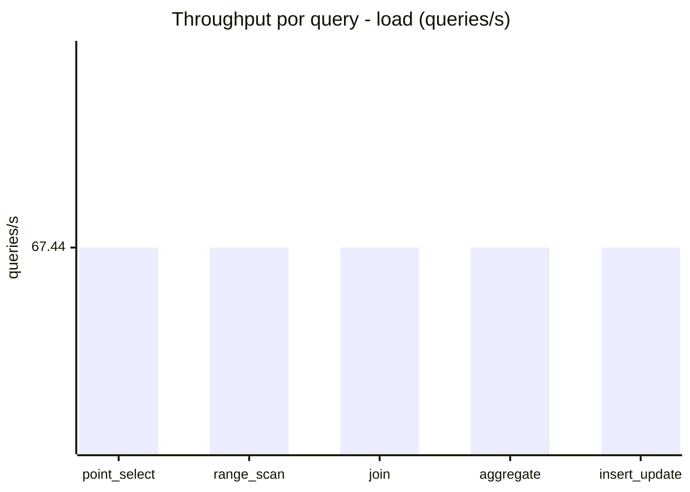
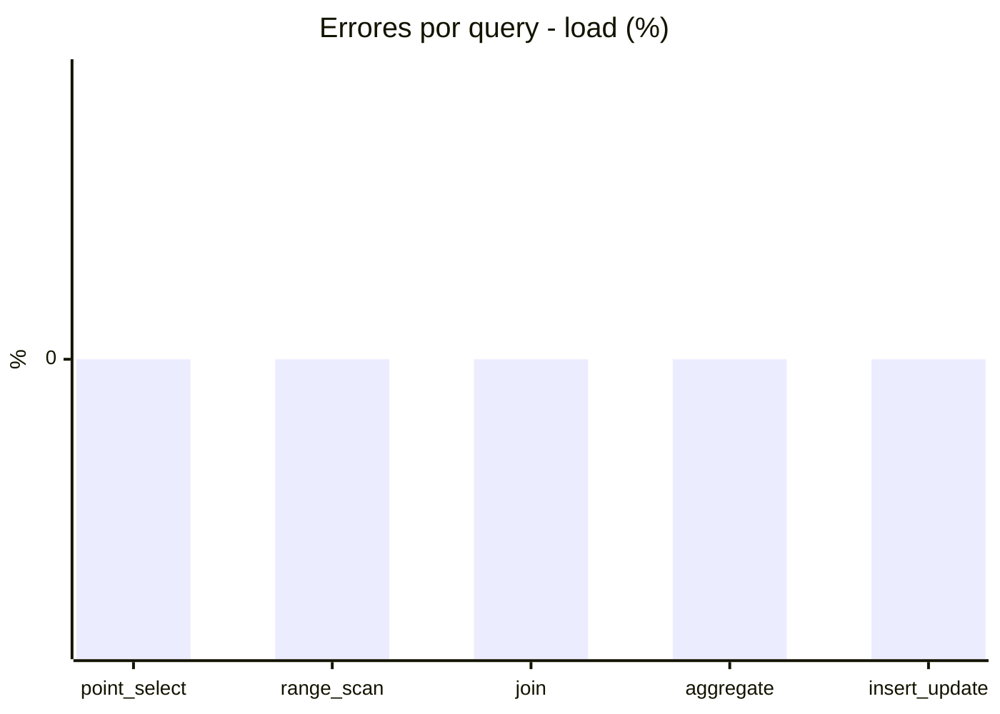
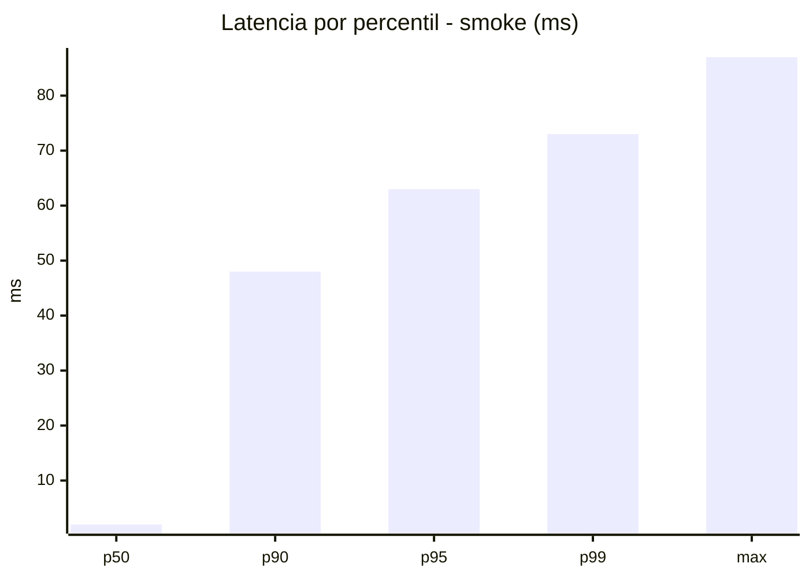
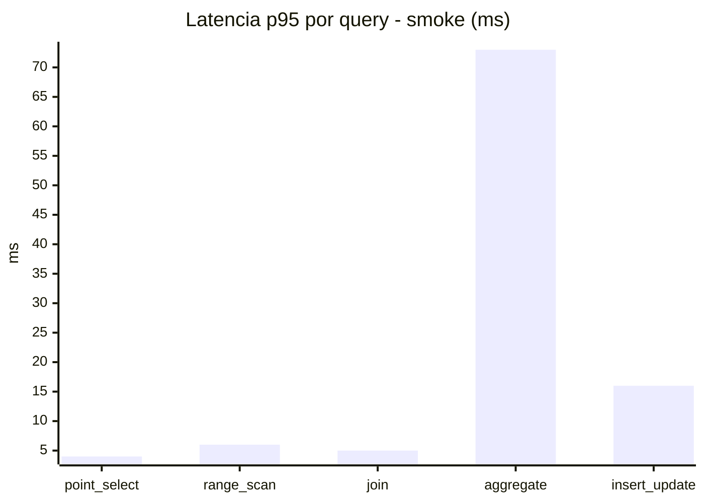
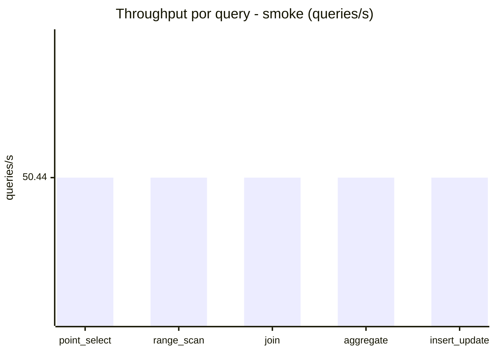
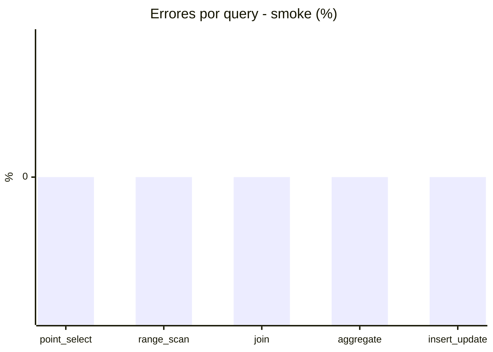

# Reporte de performance - SQL Server (k6)

**Fecha:** 2026-09-25 18:01 UTC  
**Veredicto (SLO):** `WARN`  
**Corrida:** [ver en GitHub Actions](https://github.com/lrbg/k6-sqlserver-lab/actions/runs/36170564947)  

## Analisis del agente de IA

WARN (fallback por umbrales)

- Error maximo: 0%
- p95 maximo: 253 ms

## Resultados

### Escenario: `load`

| Metrica | Valor |
| --- | --- |
| Queries ejecutadas | 20310 |
| Errores | 0 (0%) |
| Latencia media | 59.2 ms |
| p50 / p90 / p95 / p99 | 17 / 226 / 253 / 297 ms |
| Min / Max | 0 / 346 ms |
| Throughput | 337.21 queries/s |
| Duracion | 60.2 s |

Detalle por query

| Query | Ejecuciones | Error % | avg | p95 | p99 | q/s |
| --- | --- | --- | --- | --- | --- | --- |
| point_select | 4062 | 0% | 6 | 16 | 20 | 67.44 |
| range_scan | 4062 | 0% | 23.5 | 52 | 72 | 67.44 |
| join | 4062 | 0% | 8.8 | 18 | 21 | 67.44 |
| aggregate | 4062 | 0% | 221.9 | 297 | 314.4 | 67.44 |
| insert_update | 4062 | 0% | 35.6 | 75 | 92 | 67.44 |

### Escenario: `smoke`

| Metrica | Valor |
| --- | --- |
| Queries ejecutadas | 7580 |
| Errores | 0 (0%) |
| Latencia media | 11.9 ms |
| p50 / p90 / p95 / p99 | 2 / 48 / 63 / 73 ms |
| Min / Max | 0 / 87 ms |
| Throughput | 252.19 queries/s |
| Duracion | 30.1 s |

Detalle por query

| Query | Ejecuciones | Error % | avg | p95 | p99 | q/s |
| --- | --- | --- | --- | --- | --- | --- |
| point_select | 1516 | 0% | 0.9 | 4 | 5 | 50.44 |
| range_scan | 1516 | 0% | 2.9 | 6 | 7 | 50.44 |
| join | 1516 | 0% | 1.7 | 5 | 5 | 50.44 |
| aggregate | 1516 | 0% | 49 | 73 | 79 | 50.44 |
| insert_update | 1516 | 0% | 4.8 | 16 | 23.7 | 50.44 |

