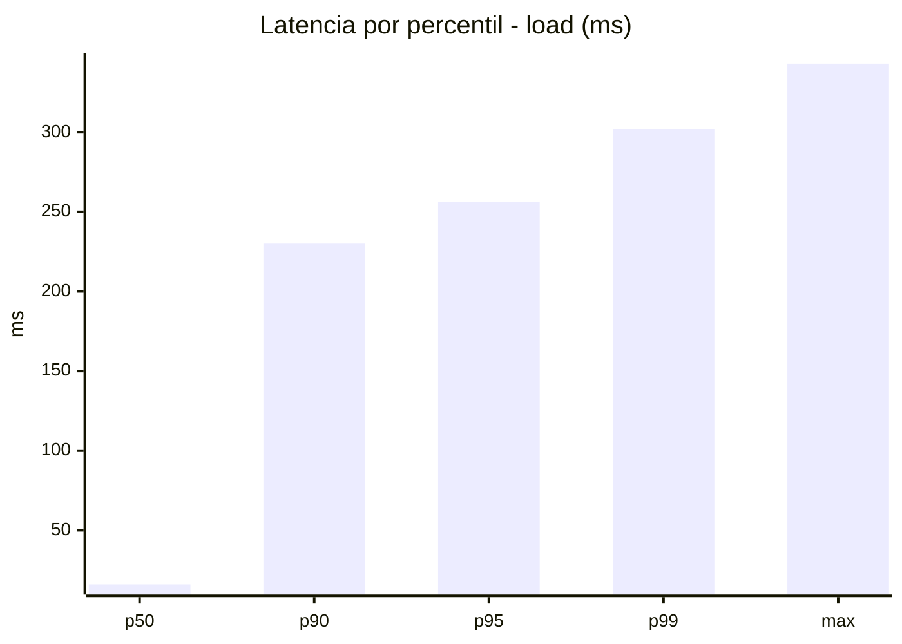
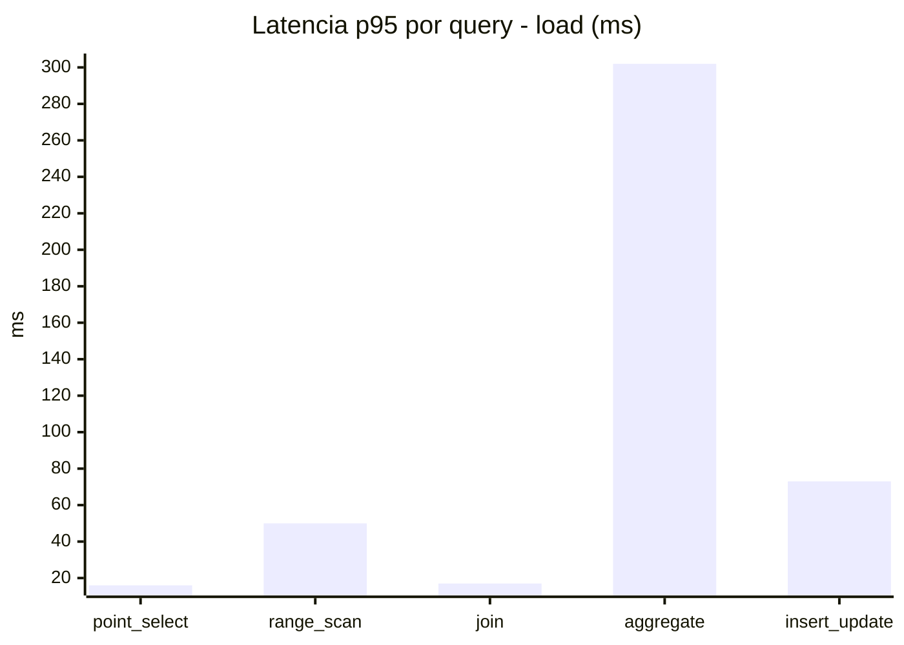
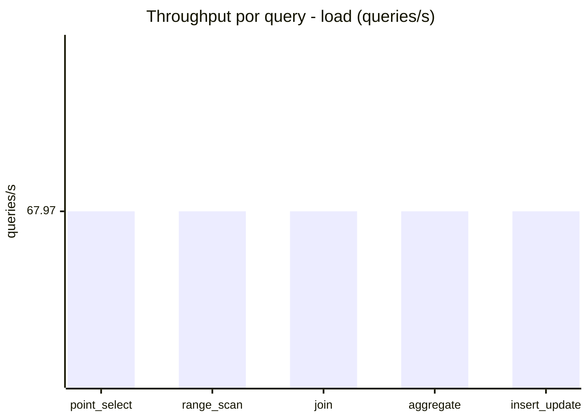
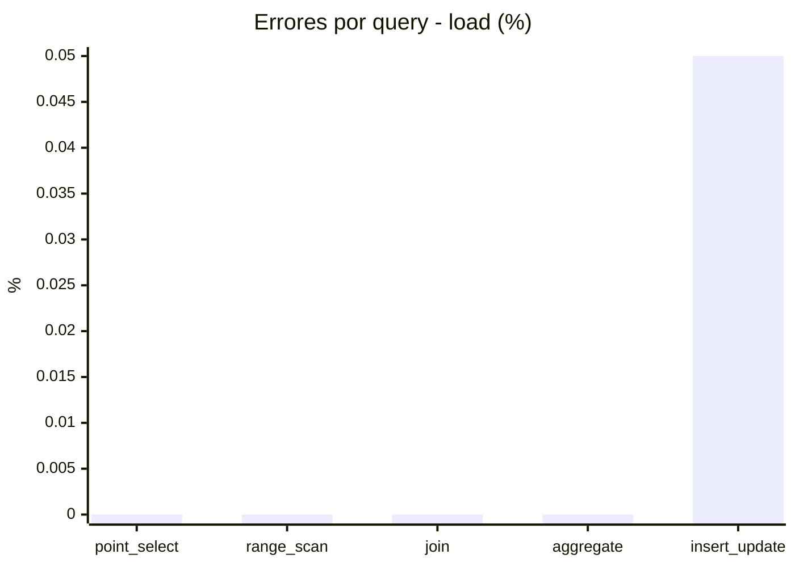
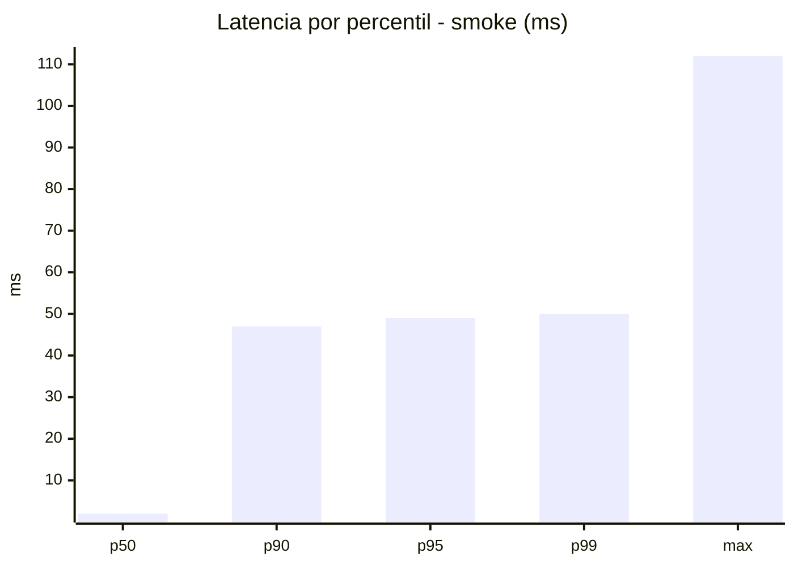
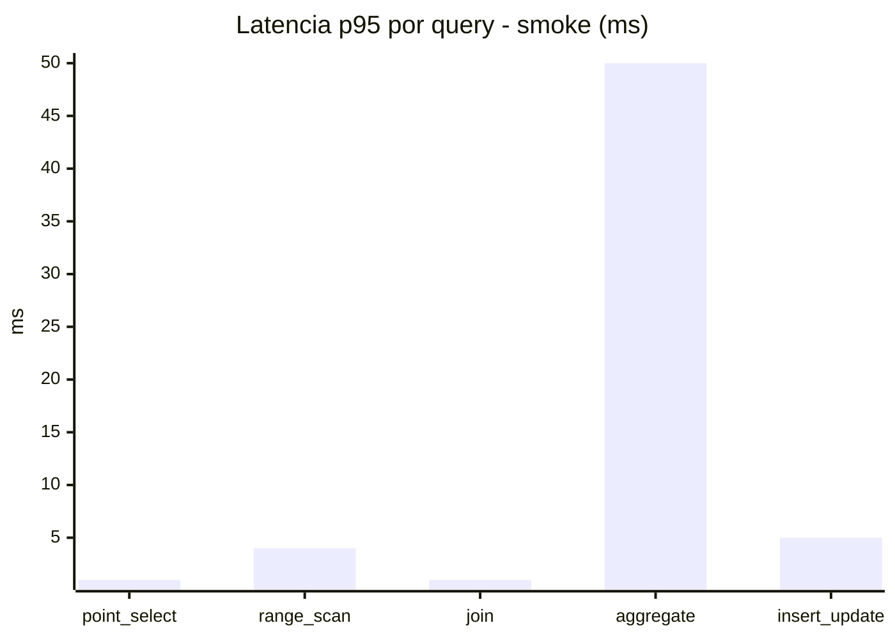
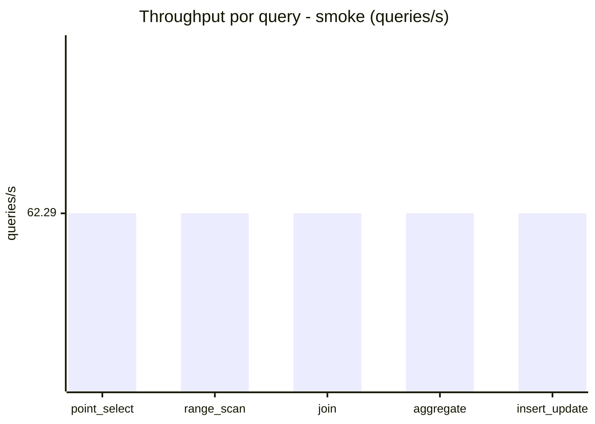
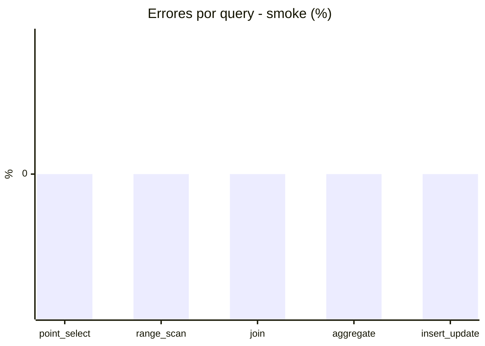

# Reporte de performance - SQL Server (k6)

**Fecha:** 2026-09-26 17:19 UTC  
**Veredicto (SLO):** `WARN`  
**Corrida:** [ver en GitHub Actions](https://github.com/lrbg/k6-sqlserver-lab/actions/runs/36258494612)  

## Analisis del agente de IA

WARN (fallback por umbrales)

- Error maximo: 0.01%
- p95 maximo: 256 ms

## Resultados

### Escenario: `load`

| Metrica | Valor |
| --- | --- |
| Queries ejecutadas | 20465 |
| Errores | 2 (0.01%) |
| Latencia media | 58.7 ms |
| p50 / p90 / p95 / p99 | 16 / 230 / 256 / 302 ms |
| Min / Max | 0 / 343 ms |
| Throughput | 339.87 queries/s |
| Duracion | 60.2 s |

Detalle por query

| Query | Ejecuciones | Error % | avg | p95 | p99 | q/s |
| --- | --- | --- | --- | --- | --- | --- |
| point_select | 4093 | 0% | 5.9 | 16 | 20 | 67.97 |
| range_scan | 4093 | 0% | 22 | 50 | 70 | 67.97 |
| join | 4093 | 0% | 8.6 | 17 | 21 | 67.97 |
| aggregate | 4093 | 0% | 224.3 | 302 | 319 | 67.97 |
| insert_update | 4093 | 0.05% | 32.8 | 73 | 91.1 | 67.97 |

### Escenario: `smoke`

| Metrica | Valor |
| --- | --- |
| Queries ejecutadas | 9355 |
| Errores | 0 (0%) |
| Latencia media | 9.6 ms |
| p50 / p90 / p95 / p99 | 2 / 47 / 49 / 50 ms |
| Min / Max | 0 / 112 ms |
| Throughput | 311.46 queries/s |
| Duracion | 30 s |

Detalle por query

| Query | Ejecuciones | Error % | avg | p95 | p99 | q/s |
| --- | --- | --- | --- | --- | --- | --- |
| point_select | 1871 | 0% | 0.5 | 1 | 1.3 | 62.29 |
| range_scan | 1871 | 0% | 2.7 | 4 | 9 | 62.29 |
| join | 1871 | 0% | 0.9 | 1 | 3 | 62.29 |
| aggregate | 1871 | 0% | 41.2 | 50 | 52 | 62.29 |
| insert_update | 1871 | 0% | 2.7 | 5 | 12 | 62.29 |

