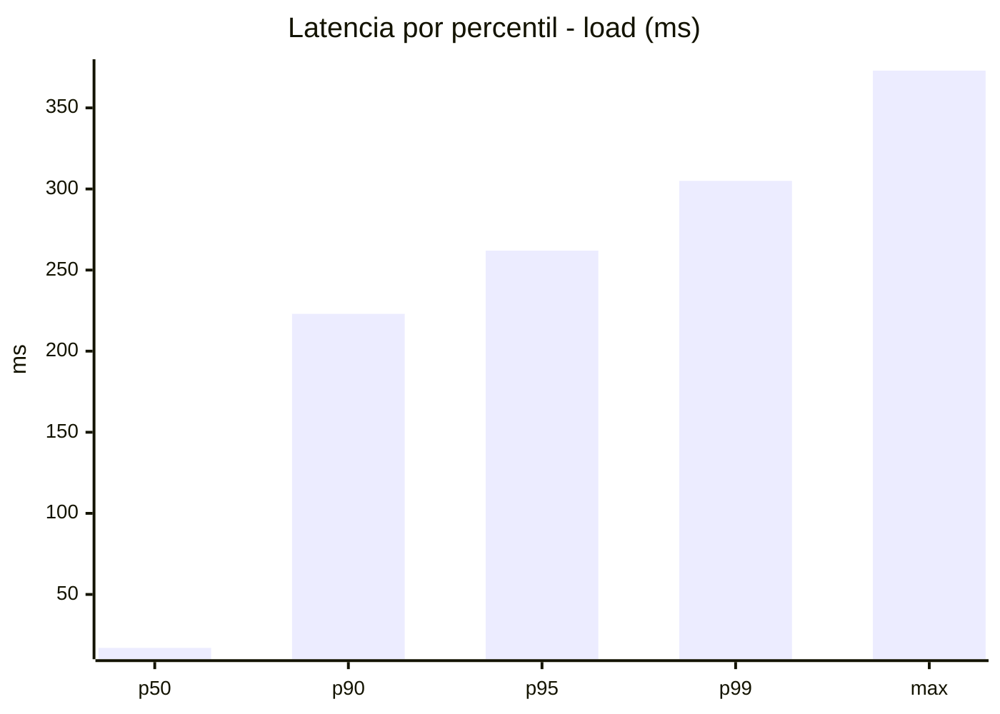
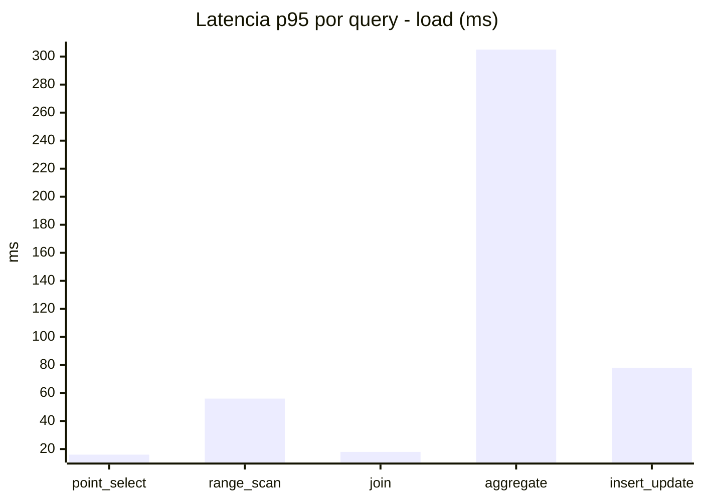
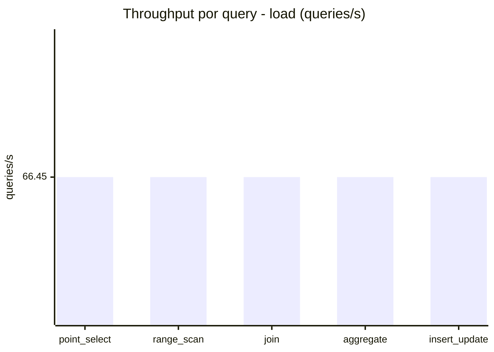
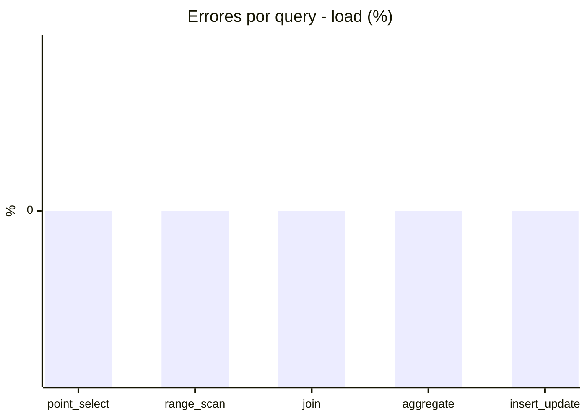
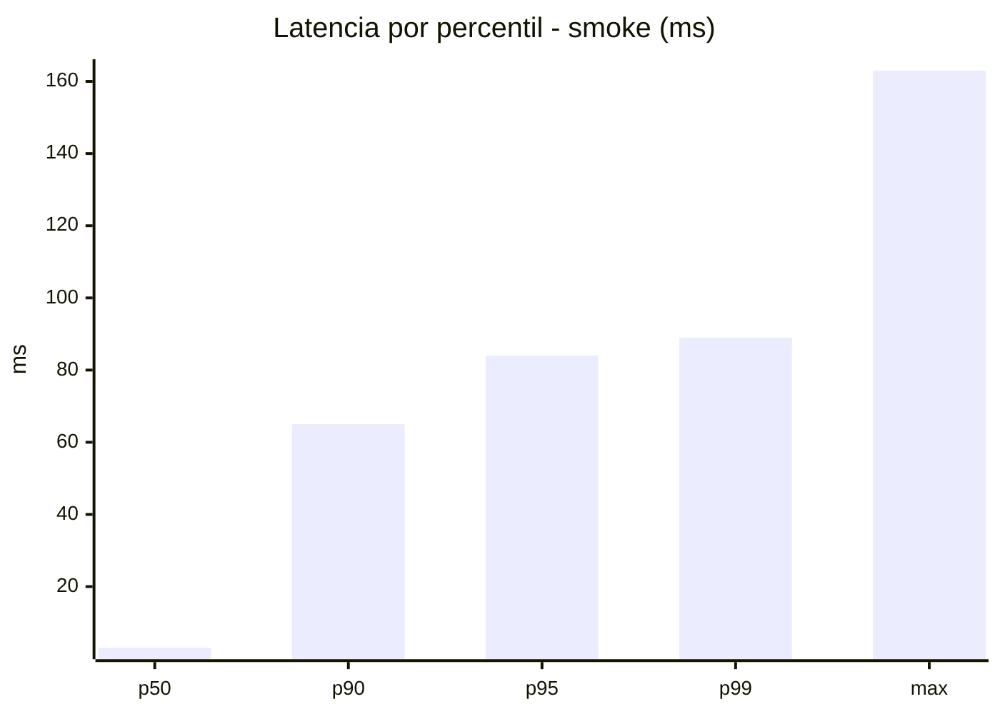
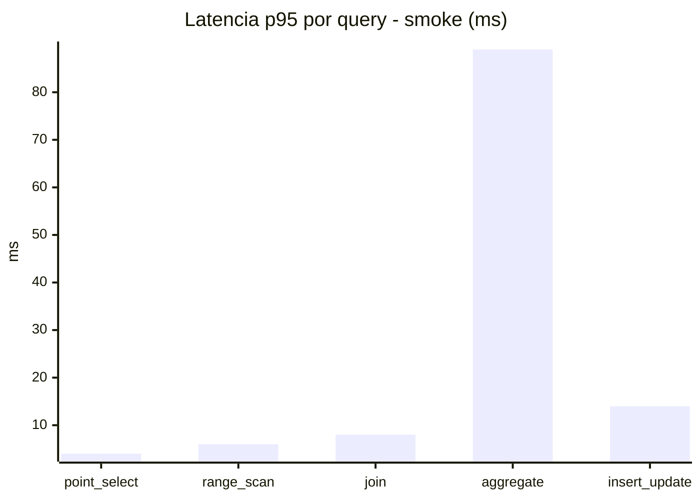
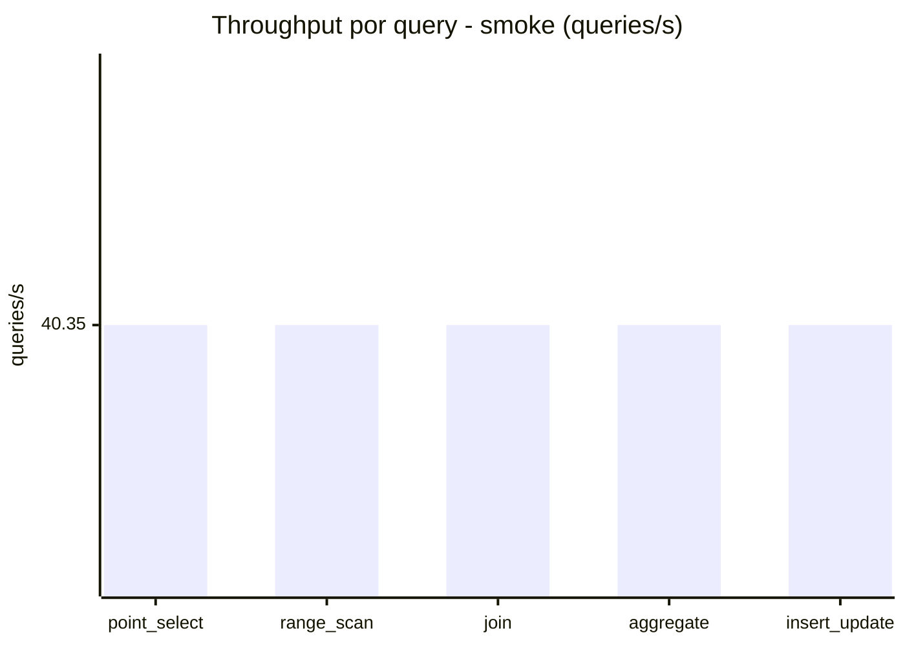
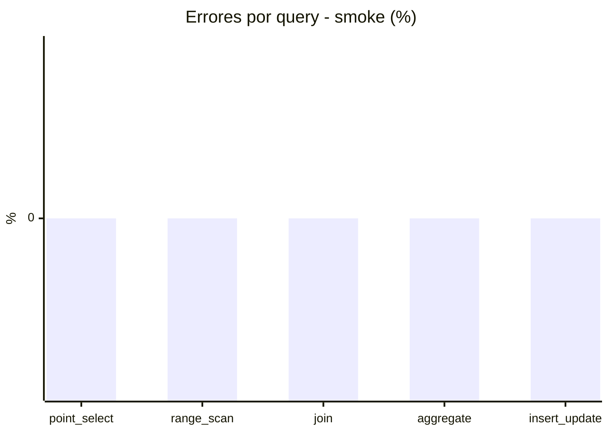

# Reporte de performance - SQL Server (k6)

**Fecha:** 2026-09-27 17:52 UTC  
**Veredicto (SLO):** `WARN`  
**Corrida:** [ver en GitHub Actions](https://github.com/lrbg/k6-sqlserver-lab/actions/runs/36338423587)  

## Analisis del agente de IA

WARN (fallback por umbrales)

- Error maximo: 0%
- p95 maximo: 262 ms

## Resultados

### Escenario: `load`

| Metrica | Valor |
| --- | --- |
| Queries ejecutadas | 19995 |
| Errores | 0 (0%) |
| Latencia media | 60.1 ms |
| p50 / p90 / p95 / p99 | 17 / 223 / 262 / 305 ms |
| Min / Max | 0 / 373 ms |
| Throughput | 332.23 queries/s |
| Duracion | 60.2 s |

Detalle por query

| Query | Ejecuciones | Error % | avg | p95 | p99 | q/s |
| --- | --- | --- | --- | --- | --- | --- |
| point_select | 3999 | 0% | 6 | 16 | 20 | 66.45 |
| range_scan | 3999 | 0% | 25.1 | 56 | 80 | 66.45 |
| join | 3999 | 0% | 8.6 | 18 | 21 | 66.45 |
| aggregate | 3999 | 0% | 222.8 | 305 | 326 | 66.45 |
| insert_update | 3999 | 0% | 38.1 | 78 | 97 | 66.45 |

### Escenario: `smoke`

| Metrica | Valor |
| --- | --- |
| Queries ejecutadas | 6065 |
| Errores | 0 (0%) |
| Latencia media | 14.8 ms |
| p50 / p90 / p95 / p99 | 3 / 65 / 84 / 89 ms |
| Min / Max | 0 / 163 ms |
| Throughput | 201.74 queries/s |
| Duracion | 30.1 s |

Detalle por query

| Query | Ejecuciones | Error % | avg | p95 | p99 | q/s |
| --- | --- | --- | --- | --- | --- | --- |
| point_select | 1213 | 0% | 1 | 4 | 5 | 40.35 |
| range_scan | 1213 | 0% | 3.3 | 6 | 11 | 40.35 |
| join | 1213 | 0% | 2.3 | 8 | 9 | 40.35 |
| aggregate | 1213 | 0% | 62.5 | 89 | 91 | 40.35 |
| insert_update | 1213 | 0% | 5.1 | 14 | 21 | 40.35 |

