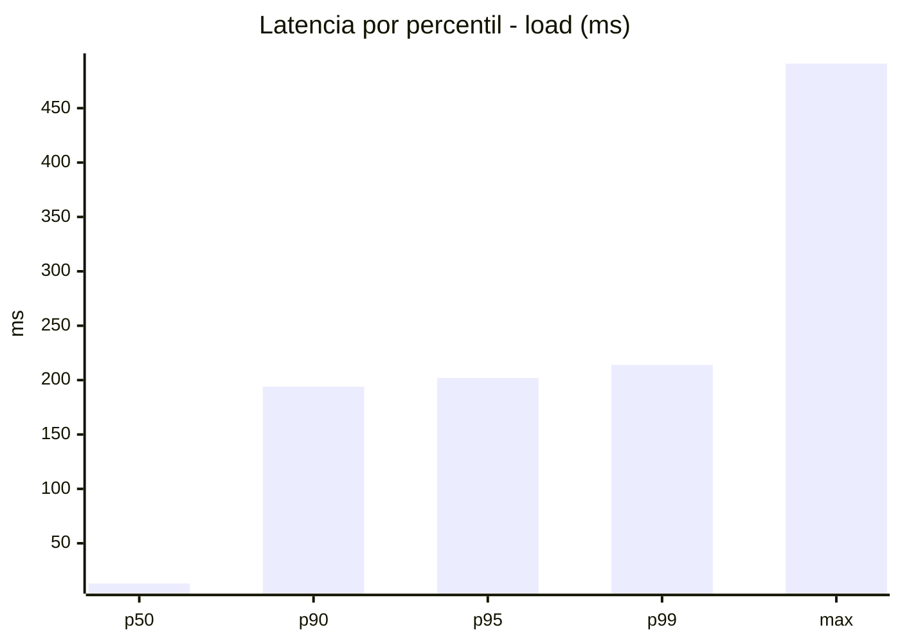
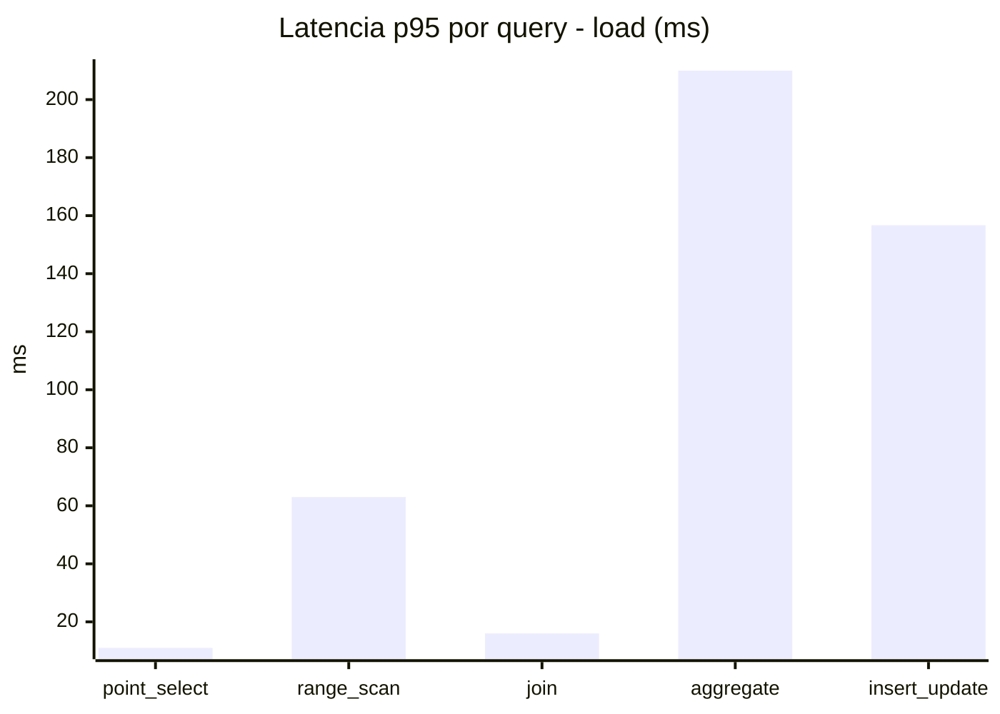
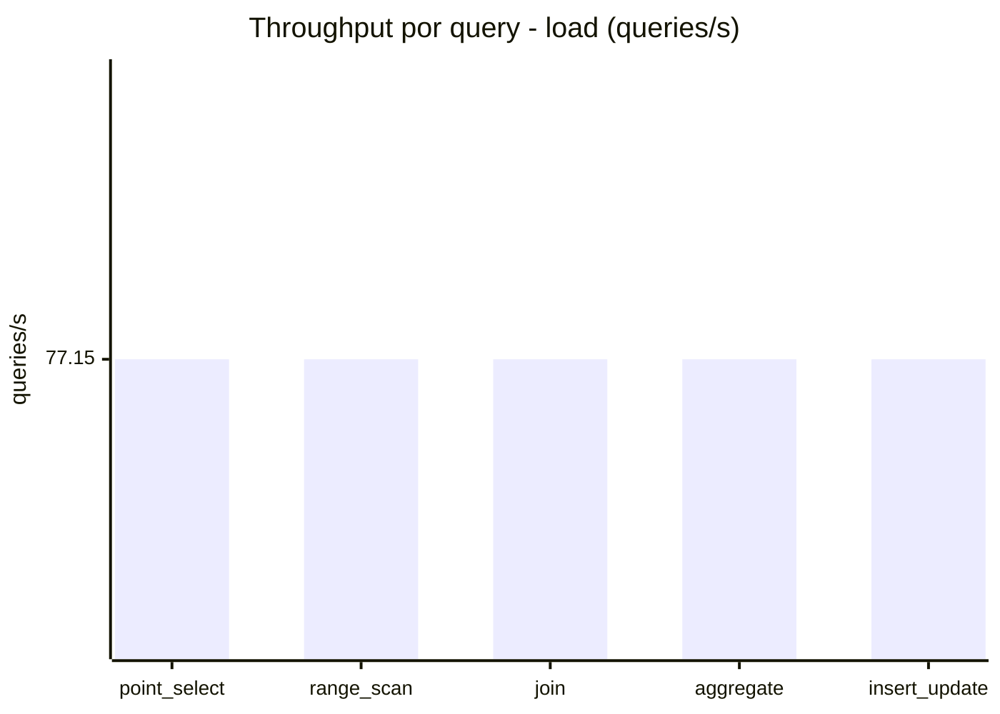
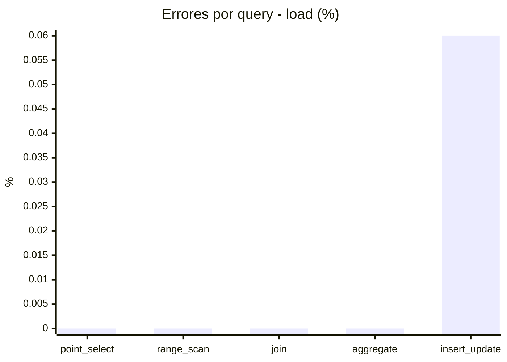
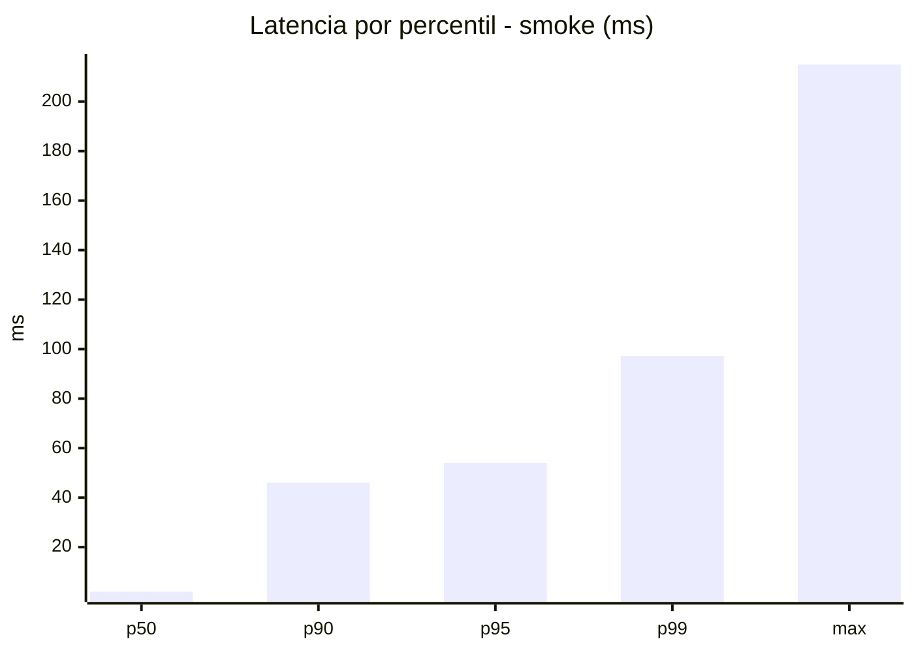
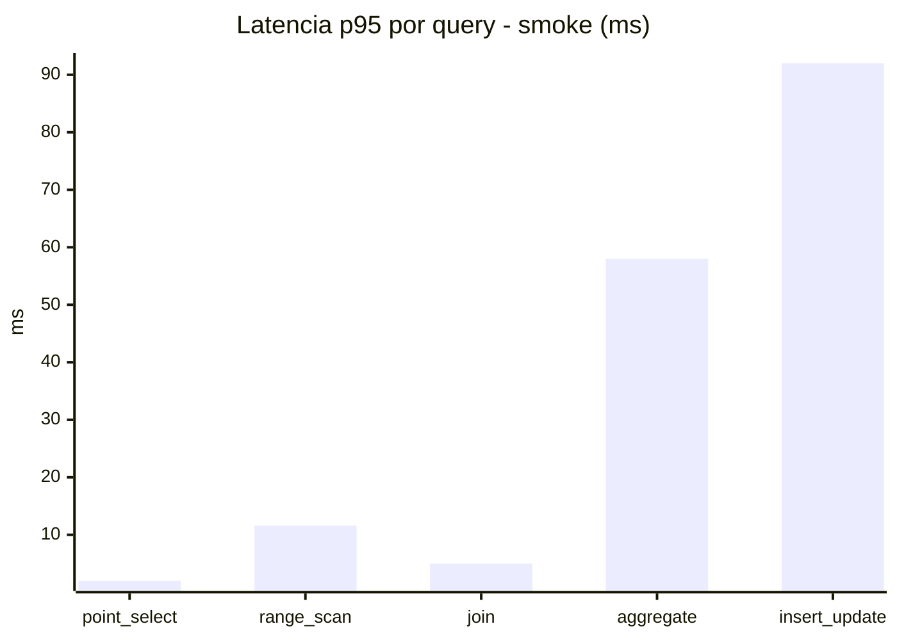
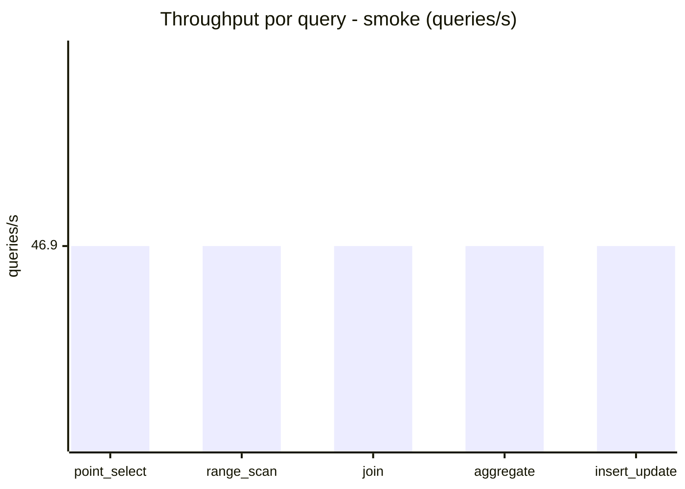
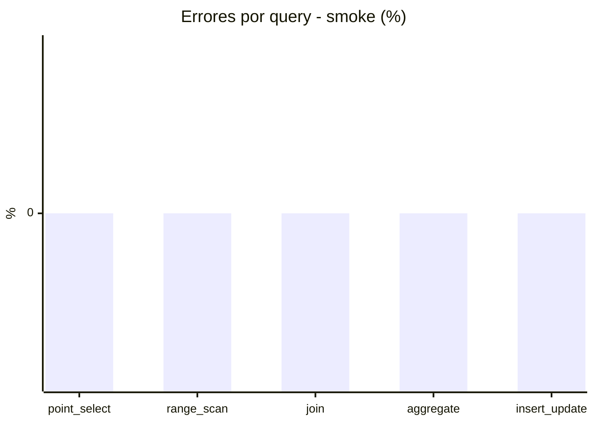

# Reporte de performance - SQL Server (k6)

**Fecha:** 2026-09-28 20:11 UTC  
**Veredicto (SLO):** `WARN`  
**Corrida:** [ver en GitHub Actions](https://github.com/lrbg/k6-sqlserver-lab/actions/runs/36477214646)  

## Analisis del agente de IA

WARN (fallback por umbrales)

- Error maximo: 0.01%
- p95 maximo: 202 ms

## Resultados

### Escenario: `load`

| Metrica | Valor |
| --- | --- |
| Queries ejecutadas | 23170 |
| Errores | 3 (0.01%) |
| Latencia media | 51.8 ms |
| p50 / p90 / p95 / p99 | 13 / 194 / 202 / 214 ms |
| Min / Max | 0 / 491 ms |
| Throughput | 385.75 queries/s |
| Duracion | 60.1 s |

Detalle por query

| Query | Ejecuciones | Error % | avg | p95 | p99 | q/s |
| --- | --- | --- | --- | --- | --- | --- |
| point_select | 4634 | 0% | 3.1 | 11 | 16 | 77.15 |
| range_scan | 4634 | 0% | 22.6 | 63 | 184.7 | 77.15 |
| join | 4634 | 0% | 6.9 | 16 | 18 | 77.15 |
| aggregate | 4634 | 0% | 182.2 | 210 | 220 | 77.15 |
| insert_update | 4634 | 0.06% | 44.3 | 156.7 | 252.3 | 77.15 |

### Escenario: `smoke`

| Metrica | Valor |
| --- | --- |
| Queries ejecutadas | 7040 |
| Errores | 0 (0%) |
| Latencia media | 12.8 ms |
| p50 / p90 / p95 / p99 | 2 / 46 / 54 / 97.2 ms |
| Min / Max | 0 / 215 ms |
| Throughput | 234.51 queries/s |
| Duracion | 30 s |

Detalle por query

| Query | Ejecuciones | Error % | avg | p95 | p99 | q/s |
| --- | --- | --- | --- | --- | --- | --- |
| point_select | 1408 | 0% | 0.6 | 2 | 4 | 46.9 |
| range_scan | 1408 | 0% | 4.4 | 11.6 | 49.9 | 46.9 |
| join | 1408 | 0% | 1.4 | 5 | 5 | 46.9 |
| aggregate | 1408 | 0% | 38.9 | 58 | 62.9 | 46.9 |
| insert_update | 1408 | 0% | 18.4 | 92 | 154.9 | 46.9 |

