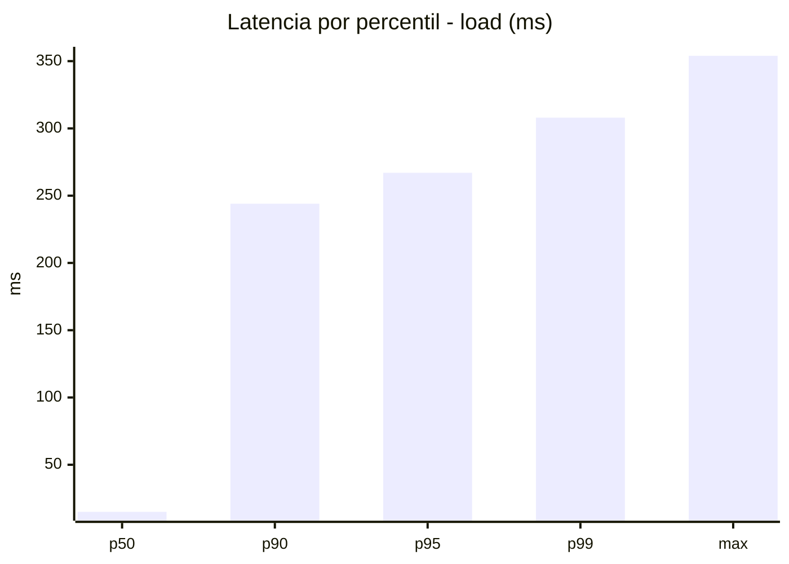
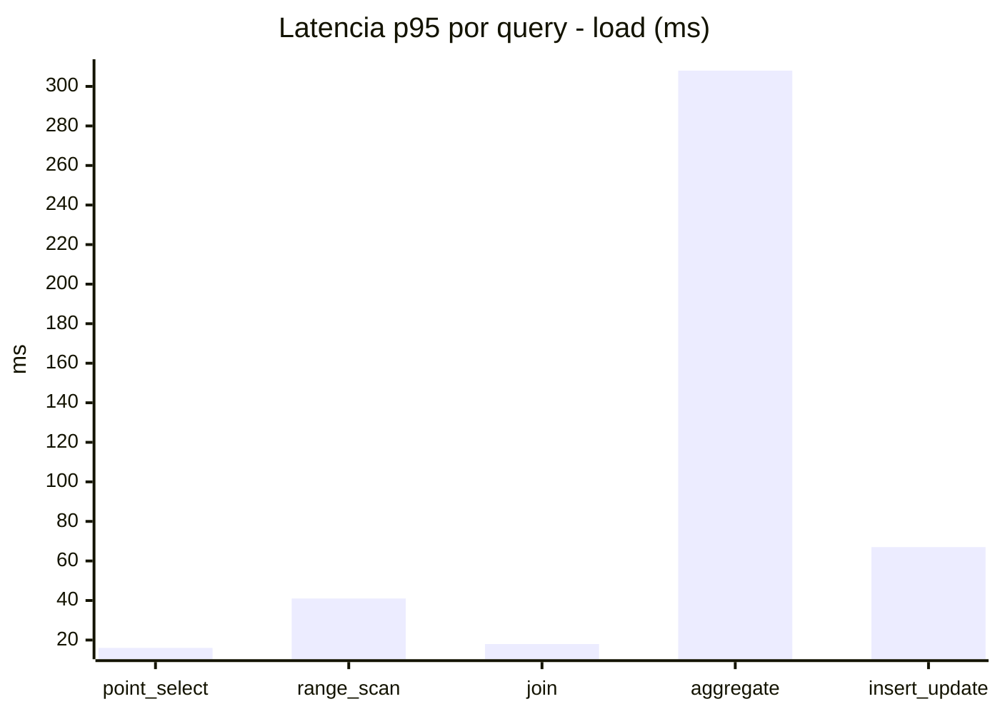
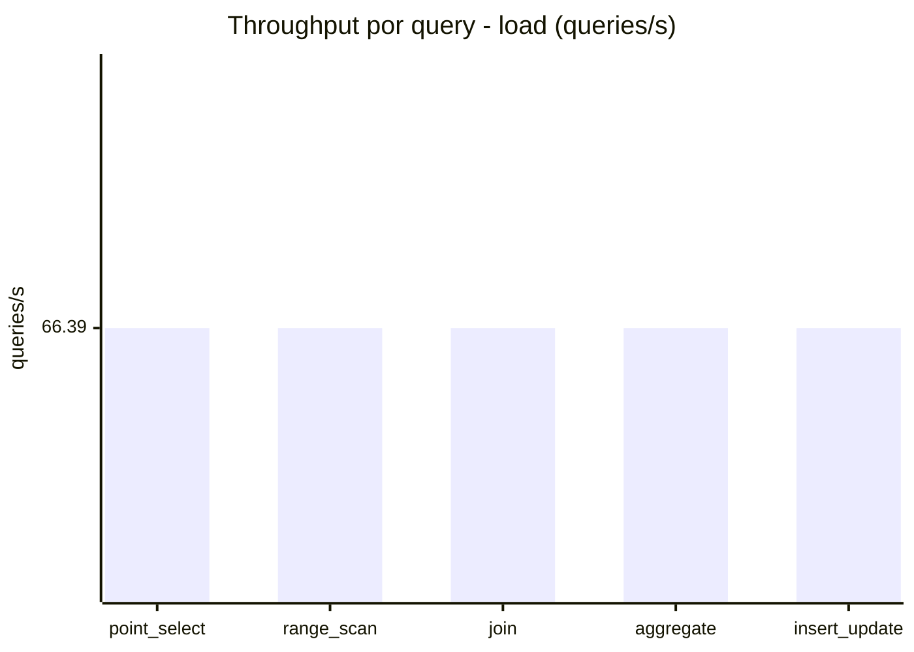
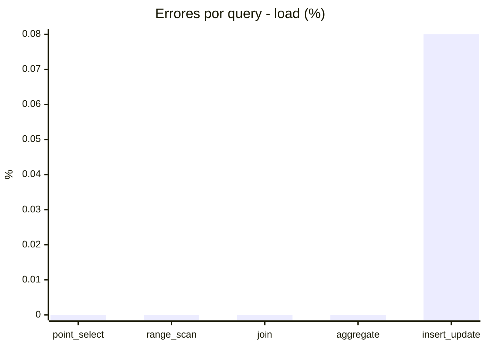
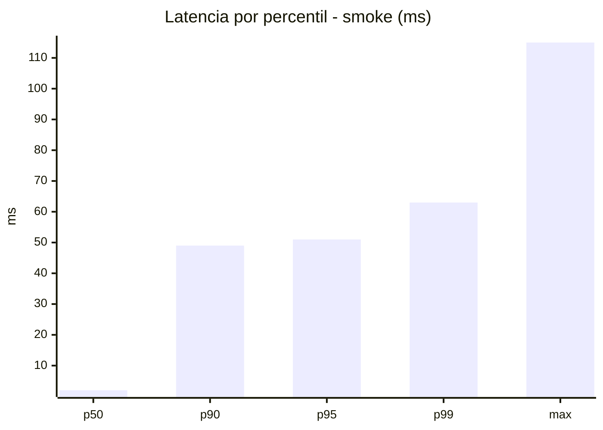
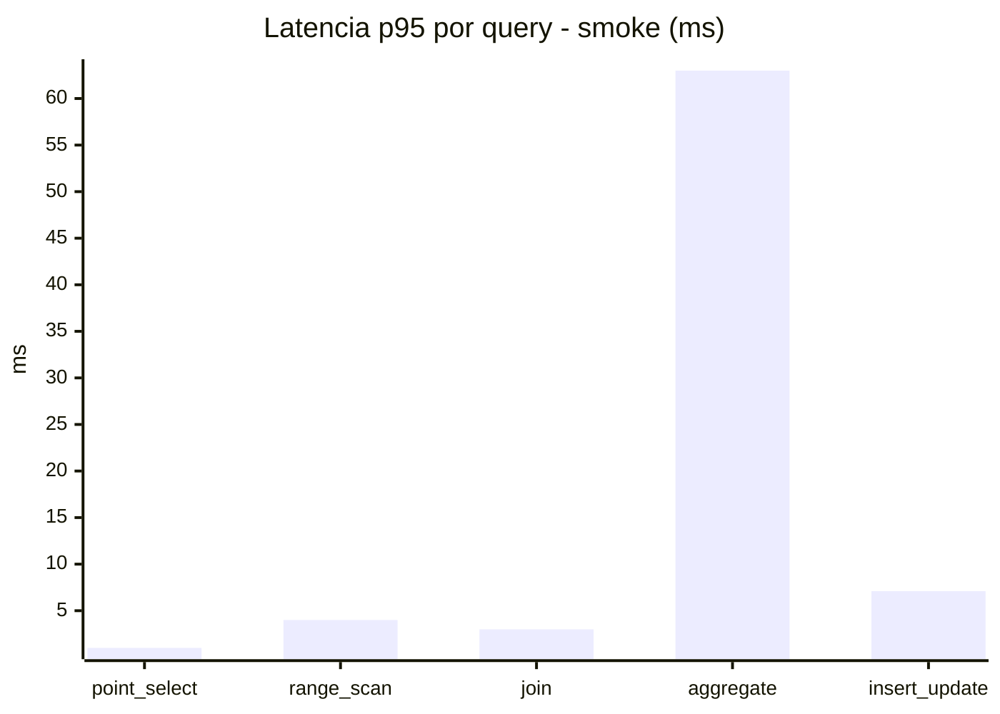
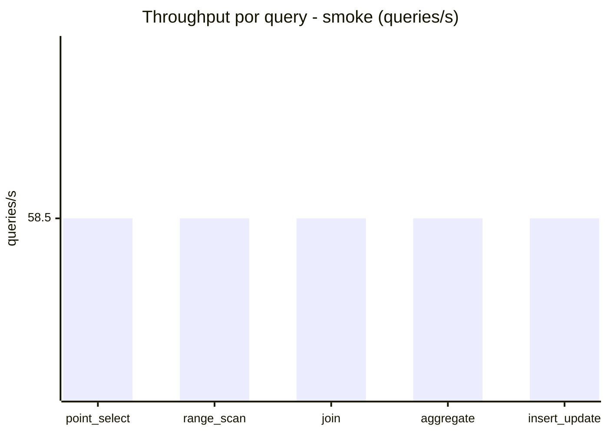
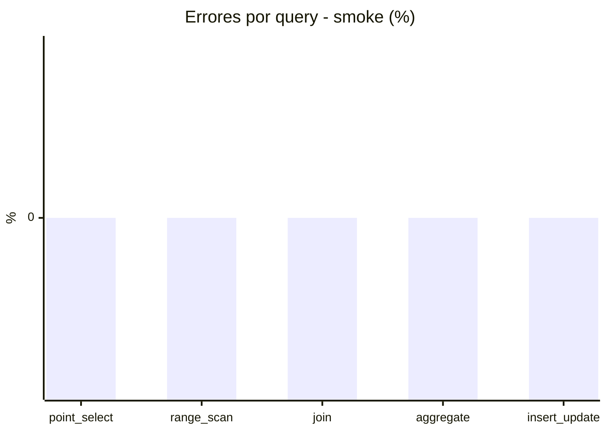

# Reporte de performance - SQL Server (k6)

**Fecha:** 2026-09-29 18:45 UTC  
**Veredicto (SLO):** `WARN`  
**Corrida:** [ver en GitHub Actions](https://github.com/lrbg/k6-sqlserver-lab/actions/runs/36614050123)  

## Analisis del agente de IA

WARN (fallback por umbrales)

- Error maximo: 0.02%
- p95 maximo: 267 ms

## Resultados

### Escenario: `load`

| Metrica | Valor |
| --- | --- |
| Queries ejecutadas | 19955 |
| Errores | 3 (0.02%) |
| Latencia media | 60.2 ms |
| p50 / p90 / p95 / p99 | 15 / 244 / 267 / 308 ms |
| Min / Max | 0 / 354 ms |
| Throughput | 331.95 queries/s |
| Duracion | 60.1 s |

Detalle por query

| Query | Ejecuciones | Error % | avg | p95 | p99 | q/s |
| --- | --- | --- | --- | --- | --- | --- |
| point_select | 3991 | 0% | 5.4 | 16 | 20 | 66.39 |
| range_scan | 3991 | 0% | 18.5 | 41 | 61 | 66.39 |
| join | 3991 | 0% | 8.6 | 18 | 21 | 66.39 |
| aggregate | 3991 | 0% | 239.2 | 308 | 324 | 66.39 |
| insert_update | 3991 | 0.08% | 29.2 | 67 | 86 | 66.39 |

### Escenario: `smoke`

| Metrica | Valor |
| --- | --- |
| Queries ejecutadas | 8795 |
| Errores | 0 (0%) |
| Latencia media | 10.2 ms |
| p50 / p90 / p95 / p99 | 2 / 49 / 51 / 63 ms |
| Min / Max | 0 / 115 ms |
| Throughput | 292.51 queries/s |
| Duracion | 30.1 s |

Detalle por query

| Query | Ejecuciones | Error % | avg | p95 | p99 | q/s |
| --- | --- | --- | --- | --- | --- | --- |
| point_select | 1759 | 0% | 0.6 | 1 | 4 | 58.5 |
| range_scan | 1759 | 0% | 2.8 | 4 | 8 | 58.5 |
| join | 1759 | 0% | 1 | 3 | 5 | 58.5 |
| aggregate | 1759 | 0% | 43.7 | 63 | 73 | 58.5 |
| insert_update | 1759 | 0% | 2.9 | 7.1 | 17.4 | 58.5 |

