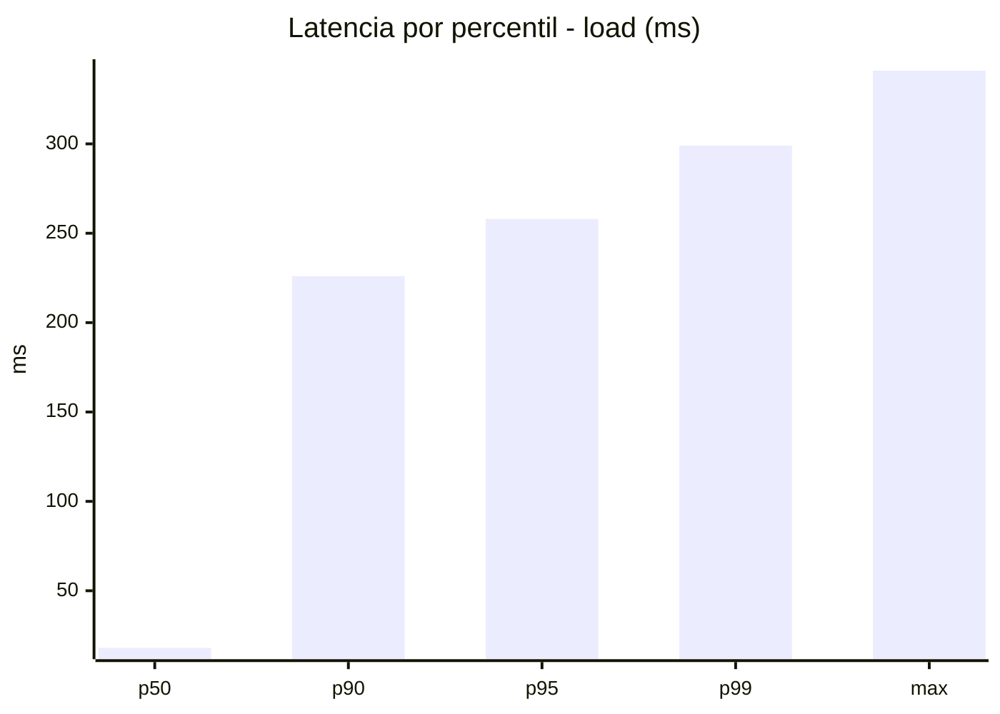
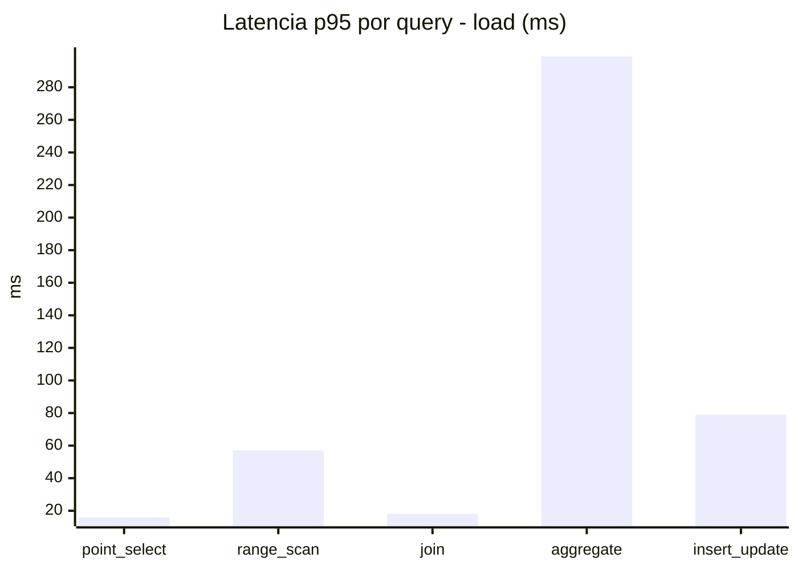
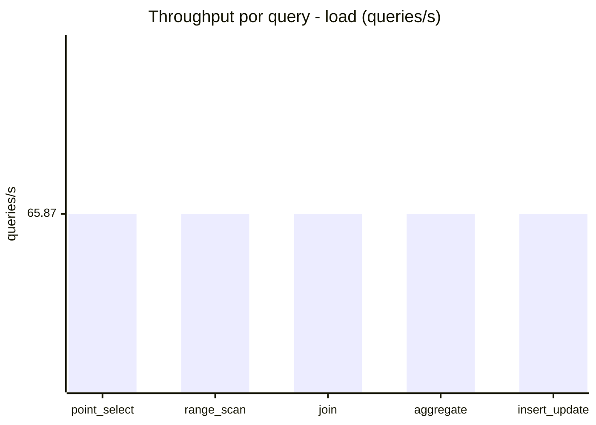
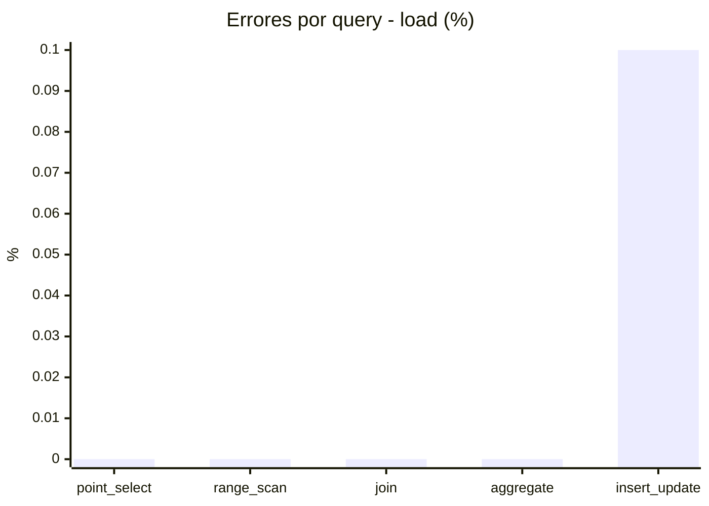
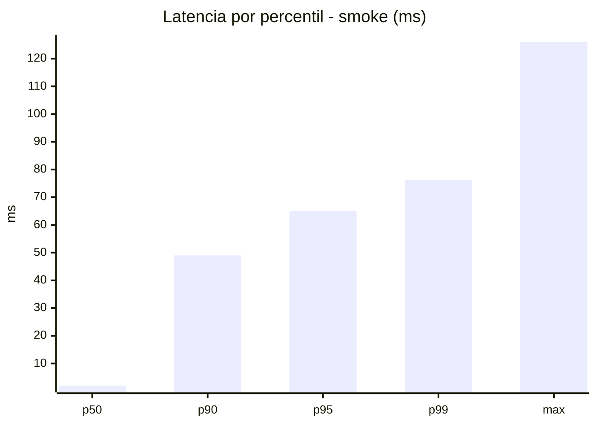
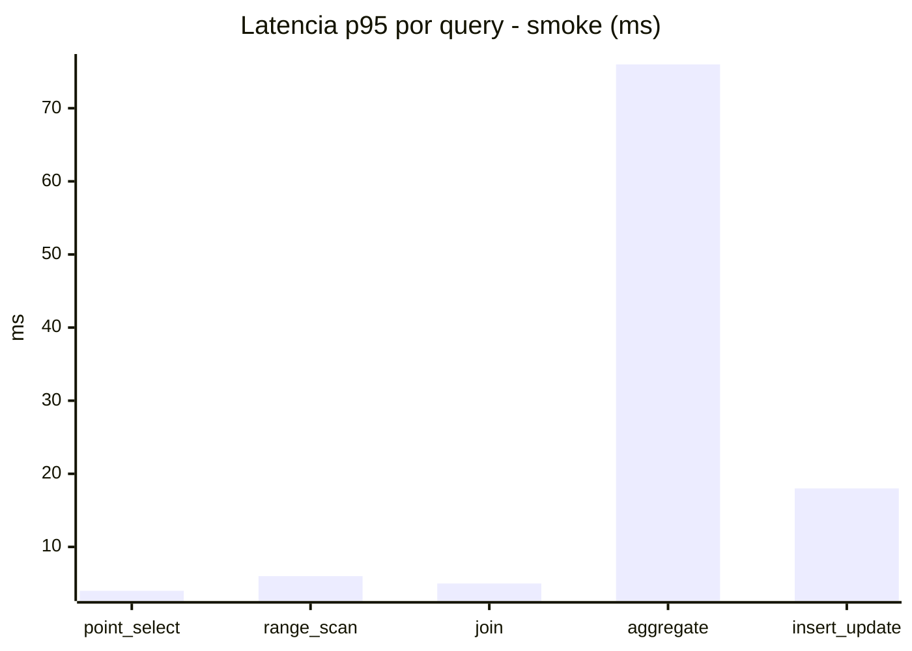
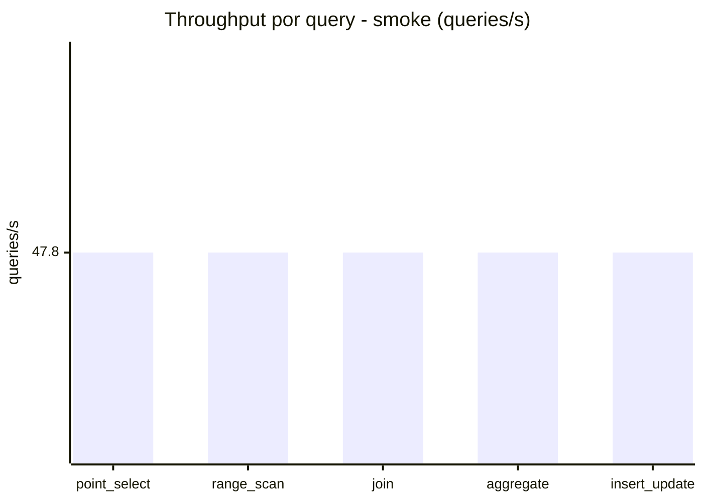
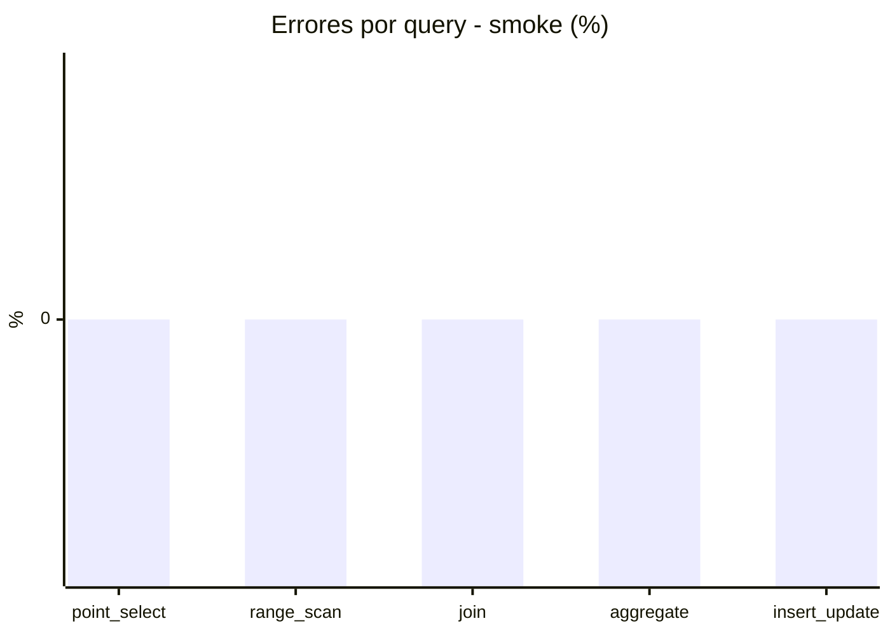

# Reporte de performance - SQL Server (k6)

**Fecha:** 2026-09-30 18:30 UTC  
**Veredicto (SLO):** `WARN`  
**Corrida:** [ver en GitHub Actions](https://github.com/lrbg/k6-sqlserver-lab/actions/runs/36758856679)  

## Analisis del agente de IA

WARN (fallback por umbrales)

- Error maximo: 0.02%
- p95 maximo: 258 ms

## Resultados

### Escenario: `load`

| Metrica | Valor |
| --- | --- |
| Queries ejecutadas | 19800 |
| Errores | 4 (0.02%) |
| Latencia media | 60.6 ms |
| p50 / p90 / p95 / p99 | 18 / 226 / 258 / 299 ms |
| Min / Max | 0 / 341 ms |
| Throughput | 329.36 queries/s |
| Duracion | 60.1 s |

Detalle por query

| Query | Ejecuciones | Error % | avg | p95 | p99 | q/s |
| --- | --- | --- | --- | --- | --- | --- |
| point_select | 3960 | 0% | 6.6 | 16 | 20 | 65.87 |
| range_scan | 3960 | 0% | 25.7 | 57 | 76 | 65.87 |
| join | 3960 | 0% | 8.9 | 18 | 21 | 65.87 |
| aggregate | 3960 | 0% | 223.3 | 299 | 322.4 | 65.87 |
| insert_update | 3960 | 0.1% | 38.6 | 79 | 97 | 65.87 |

### Escenario: `smoke`

| Metrica | Valor |
| --- | --- |
| Queries ejecutadas | 7180 |
| Errores | 0 (0%) |
| Latencia media | 12.5 ms |
| p50 / p90 / p95 / p99 | 2 / 49 / 65 / 76.2 ms |
| Min / Max | 0 / 126 ms |
| Throughput | 239 queries/s |
| Duracion | 30 s |

Detalle por query

| Query | Ejecuciones | Error % | avg | p95 | p99 | q/s |
| --- | --- | --- | --- | --- | --- | --- |
| point_select | 1436 | 0% | 0.9 | 4 | 5 | 47.8 |
| range_scan | 1436 | 0% | 3.2 | 6 | 10 | 47.8 |
| join | 1436 | 0% | 1.8 | 5 | 5 | 47.8 |
| aggregate | 1436 | 0% | 51.4 | 76 | 84 | 47.8 |
| insert_update | 1436 | 0% | 5.3 | 18 | 25 | 47.8 |

