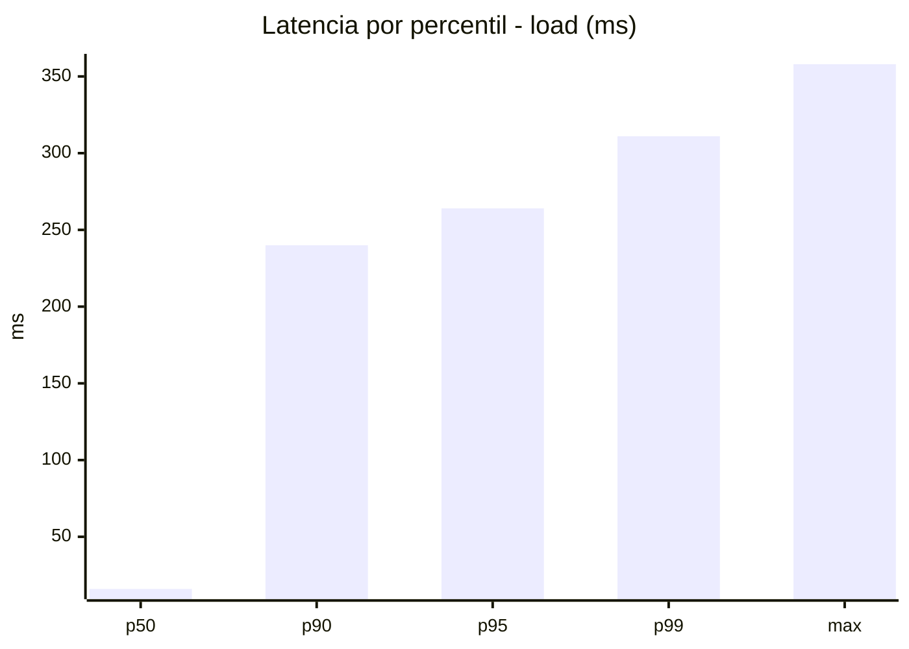
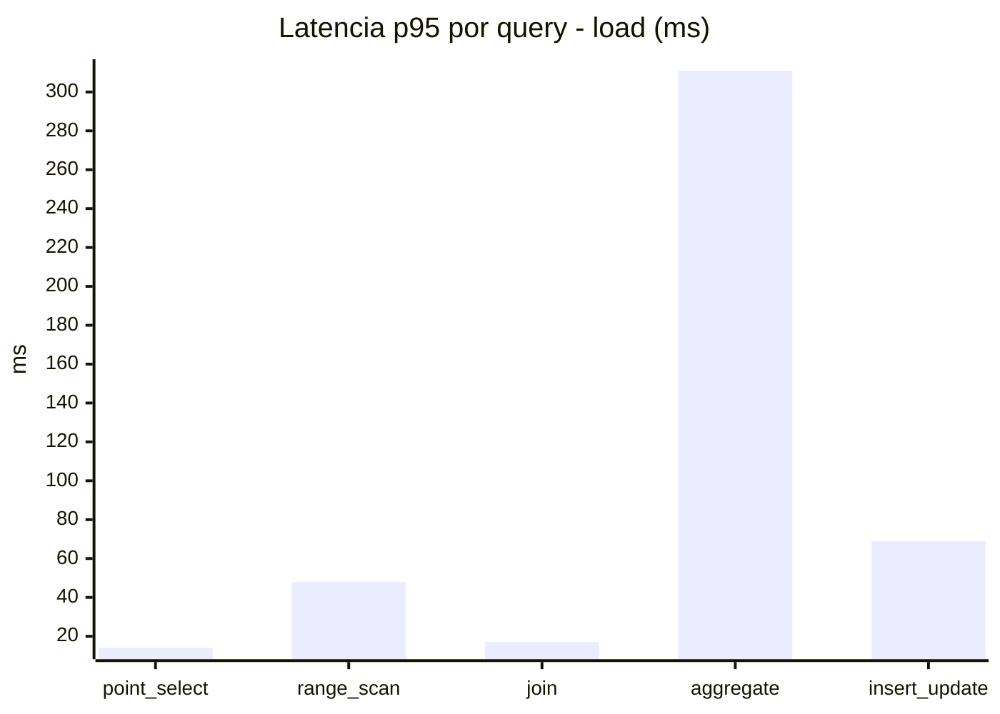
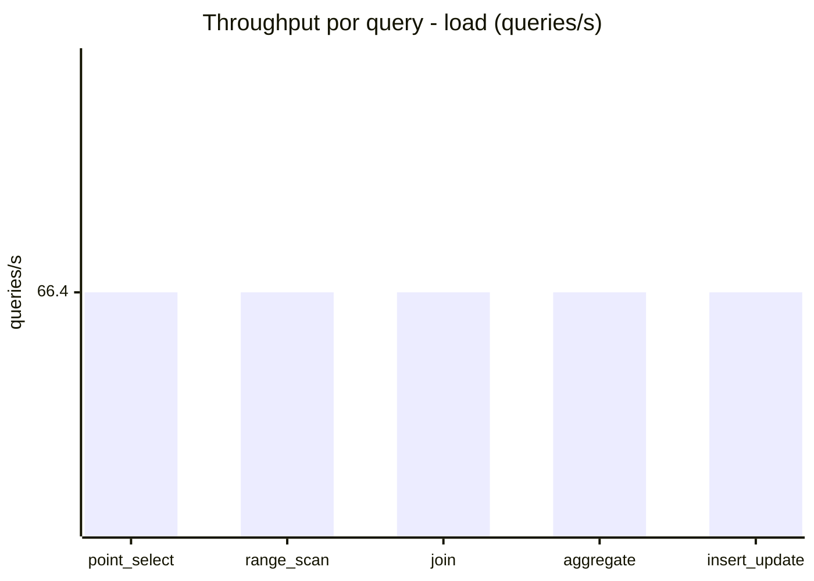
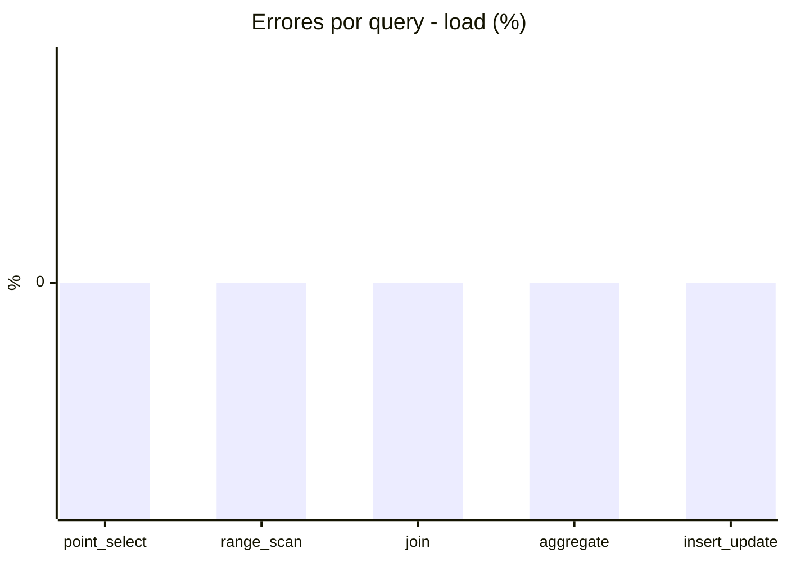
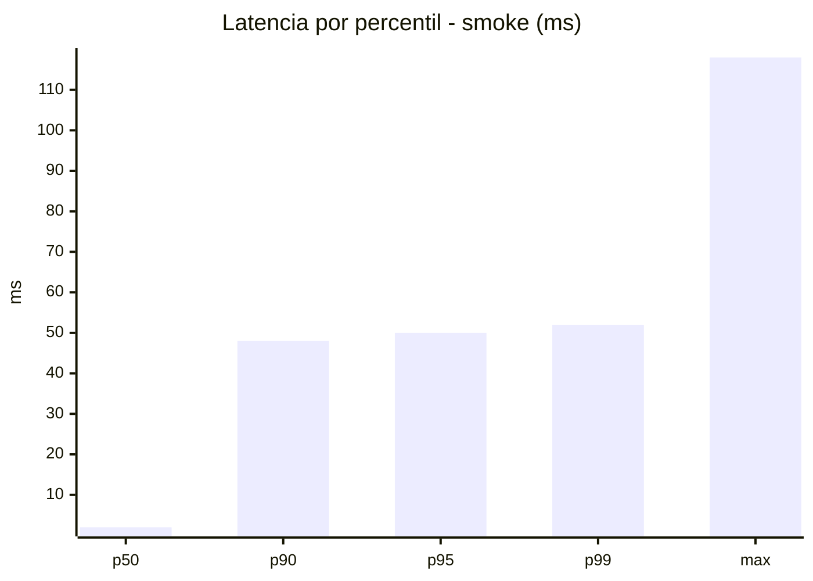
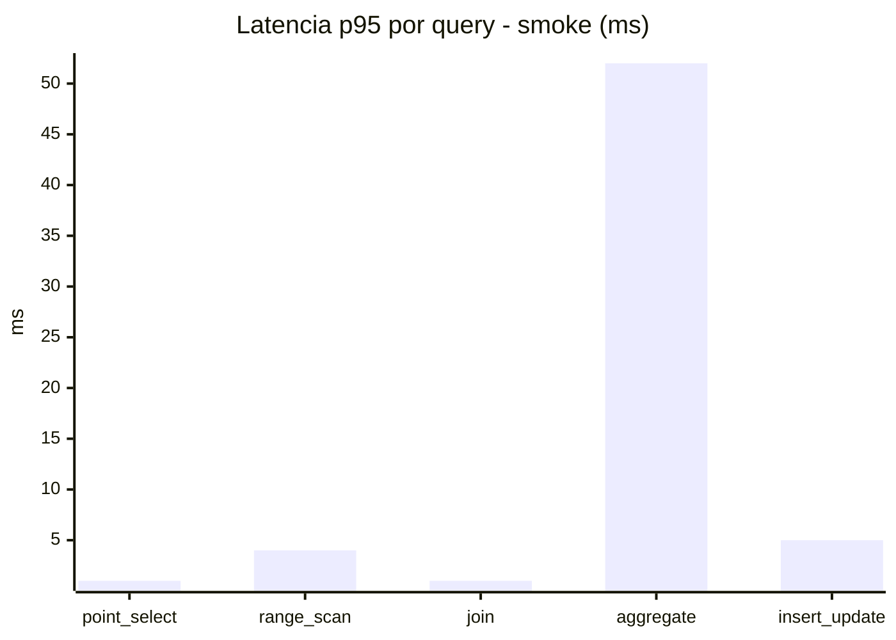
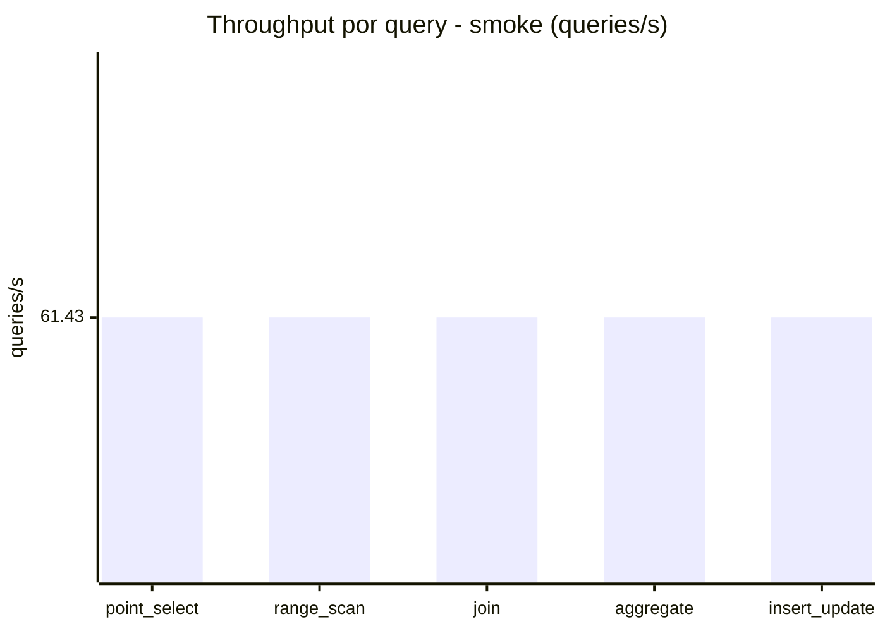
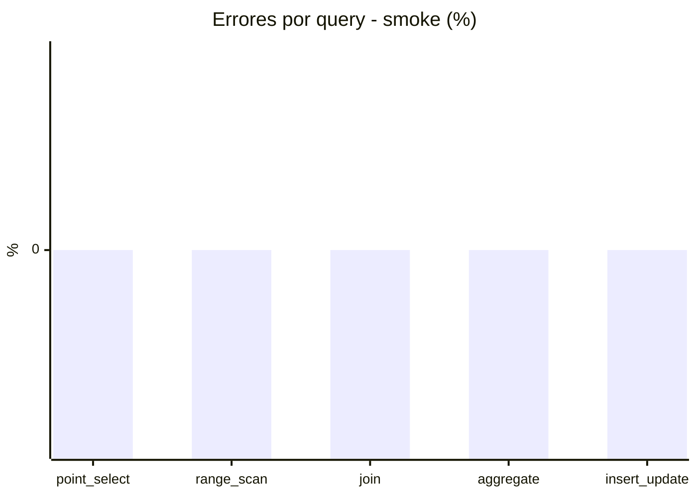

# Reporte de performance - SQL Server (k6)

**Fecha:** 2026-10-01 18:58 UTC  
**Veredicto (SLO):** `WARN`  
**Corrida:** [ver en GitHub Actions](https://github.com/lrbg/k6-sqlserver-lab/actions/runs/36910590525)  

## Analisis del agente de IA

WARN (fallback por umbrales)

- Error maximo: 0%
- p95 maximo: 264 ms

## Resultados

### Escenario: `load`

| Metrica | Valor |
| --- | --- |
| Queries ejecutadas | 19975 |
| Errores | 0 (0%) |
| Latencia media | 60.1 ms |
| p50 / p90 / p95 / p99 | 16 / 240 / 264 / 311 ms |
| Min / Max | 0 / 358 ms |
| Throughput | 332.02 queries/s |
| Duracion | 60.2 s |

Detalle por query

| Query | Ejecuciones | Error % | avg | p95 | p99 | q/s |
| --- | --- | --- | --- | --- | --- | --- |
| point_select | 3995 | 0% | 5 | 14 | 20 | 66.4 |
| range_scan | 3995 | 0% | 21.2 | 48 | 67.1 | 66.4 |
| join | 3995 | 0% | 8.3 | 17 | 21 | 66.4 |
| aggregate | 3995 | 0% | 233.9 | 311 | 325 | 66.4 |
| insert_update | 3995 | 0% | 32.2 | 69 | 88.1 | 66.4 |

### Escenario: `smoke`

| Metrica | Valor |
| --- | --- |
| Queries ejecutadas | 9225 |
| Errores | 0 (0%) |
| Latencia media | 9.7 ms |
| p50 / p90 / p95 / p99 | 2 / 48 / 50 / 52 ms |
| Min / Max | 0 / 118 ms |
| Throughput | 307.15 queries/s |
| Duracion | 30 s |

Detalle por query

| Query | Ejecuciones | Error % | avg | p95 | p99 | q/s |
| --- | --- | --- | --- | --- | --- | --- |
| point_select | 1845 | 0% | 0.6 | 1 | 2 | 61.43 |
| range_scan | 1845 | 0% | 2.7 | 4 | 5 | 61.43 |
| join | 1845 | 0% | 0.9 | 1 | 3 | 61.43 |
| aggregate | 1845 | 0% | 42 | 52 | 53 | 61.43 |
| insert_update | 1845 | 0% | 2.5 | 5 | 7 | 61.43 |

