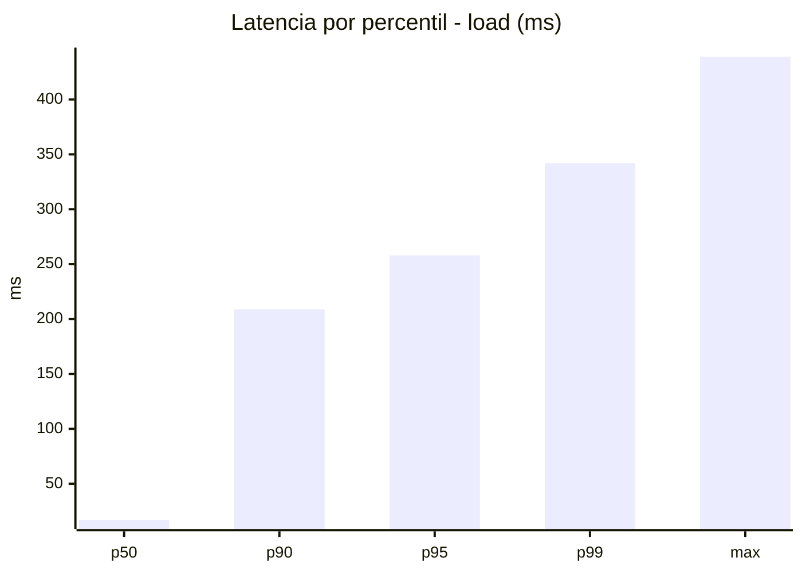
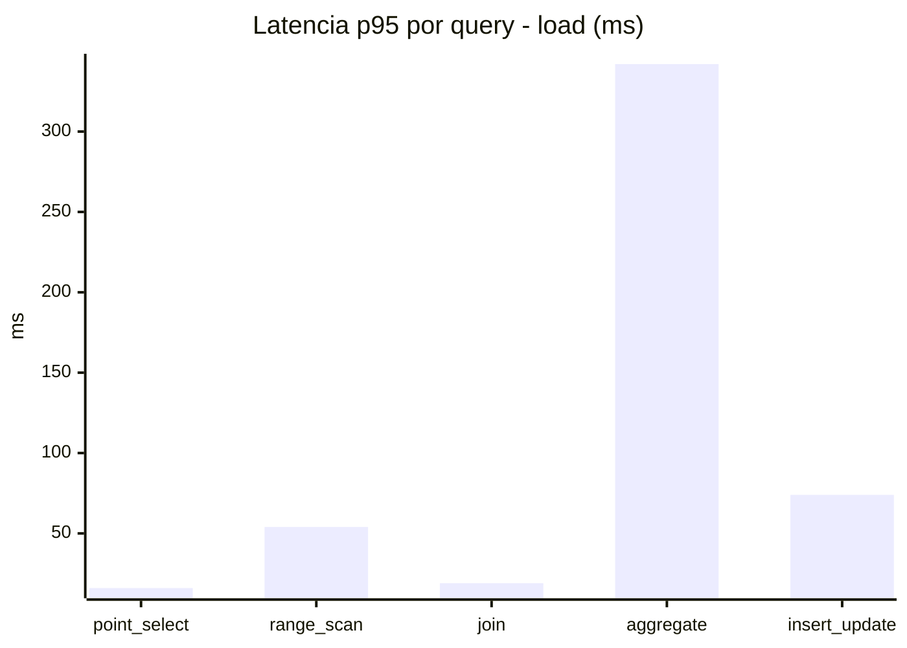
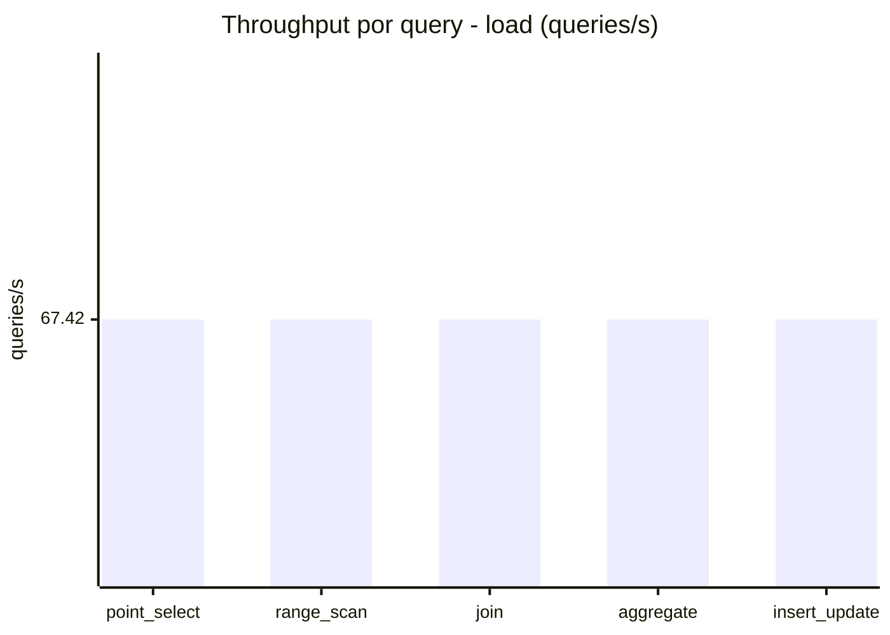
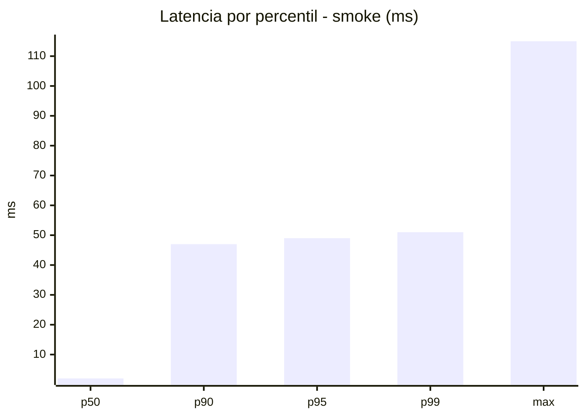
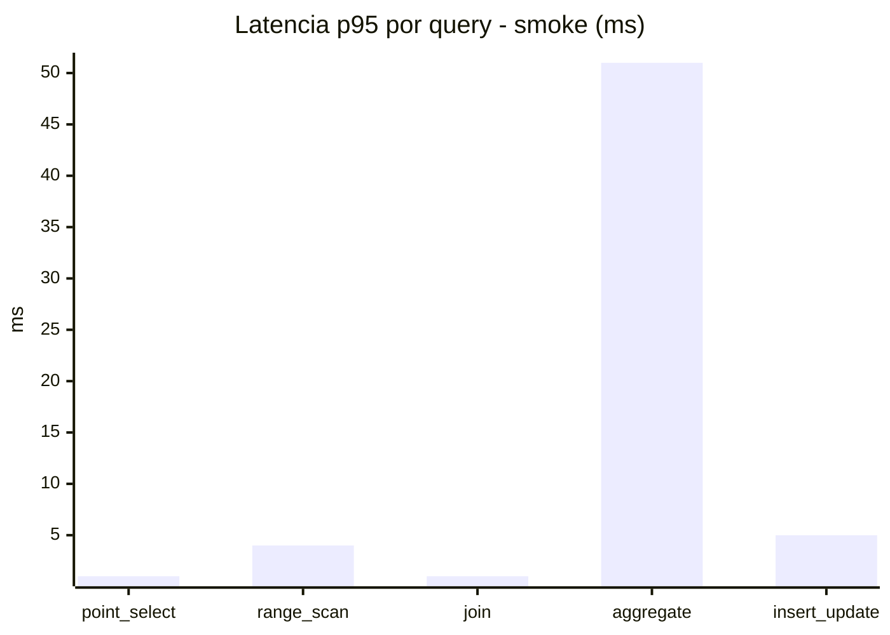
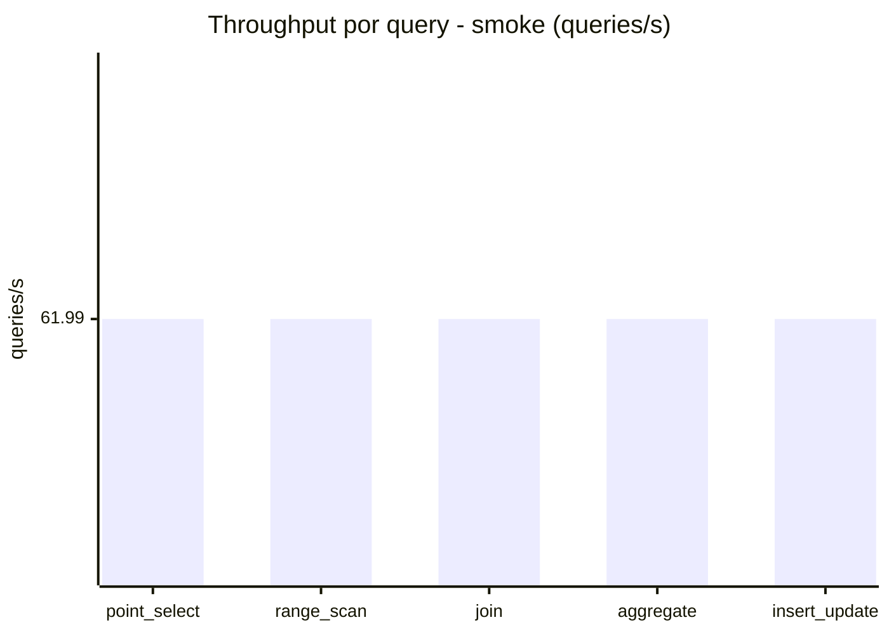
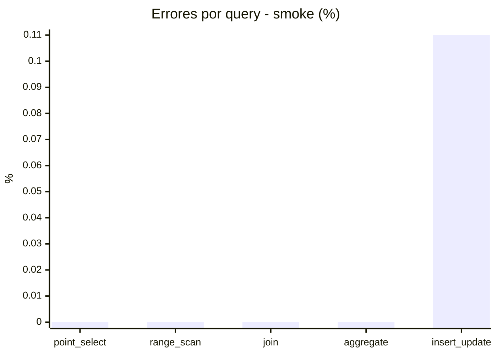

# Reporte de performance - SQL Server (k6)

**Fecha:** 2026-10-02 18:34 UTC  
**Veredicto (SLO):** `WARN`  
**Corrida:** [ver en GitHub Actions](https://github.com/lrbg/k6-sqlserver-lab/actions/runs/37048141457)  

## Analisis del agente de IA

WARN (fallback por umbrales)

- Error maximo: 0.02%
- p95 maximo: 258 ms

## Resultados

### Escenario: `load`

| Metrica | Valor |
| --- | --- |
| Queries ejecutadas | 20290 |
| Errores | 2 (0.01%) |
| Latencia media | 59.2 ms |
| p50 / p90 / p95 / p99 | 17 / 209 / 258 / 342 ms |
| Min / Max | 0 / 439 ms |
| Throughput | 337.12 queries/s |
| Duracion | 60.2 s |

Detalle por query

| Query | Ejecuciones | Error % | avg | p95 | p99 | q/s |
| --- | --- | --- | --- | --- | --- | --- |
| point_select | 4058 | 0% | 5.9 | 16 | 24 | 67.42 |
| range_scan | 4058 | 0% | 23 | 54 | 80.4 | 67.42 |
| join | 4058 | 0% | 8.7 | 19 | 24 | 67.42 |
| aggregate | 4058 | 0% | 223.7 | 342 | 366 | 67.42 |
| insert_update | 4058 | 0.05% | 34.8 | 74 | 102 | 67.42 |

### Escenario: `smoke`

| Metrica | Valor |
| --- | --- |
| Queries ejecutadas | 9305 |
| Errores | 2 (0.02%) |
| Latencia media | 9.6 ms |
| p50 / p90 / p95 / p99 | 2 / 47 / 49 / 51 ms |
| Min / Max | 0 / 115 ms |
| Throughput | 309.97 queries/s |
| Duracion | 30 s |

Detalle por query

| Query | Ejecuciones | Error % | avg | p95 | p99 | q/s |
| --- | --- | --- | --- | --- | --- | --- |
| point_select | 1861 | 0% | 0.6 | 1 | 1 | 61.99 |
| range_scan | 1861 | 0% | 2.7 | 4 | 5 | 61.99 |
| join | 1861 | 0% | 0.9 | 1 | 3 | 61.99 |
| aggregate | 1861 | 0% | 41.2 | 51 | 52 | 61.99 |
| insert_update | 1861 | 0.11% | 2.8 | 5 | 7 | 61.99 |

