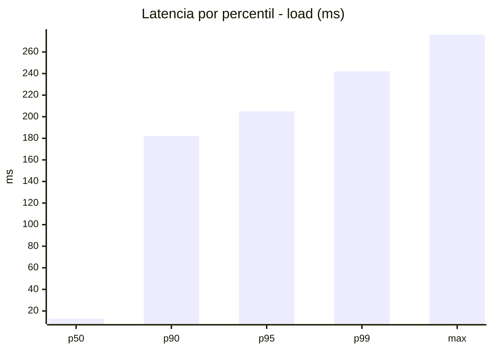
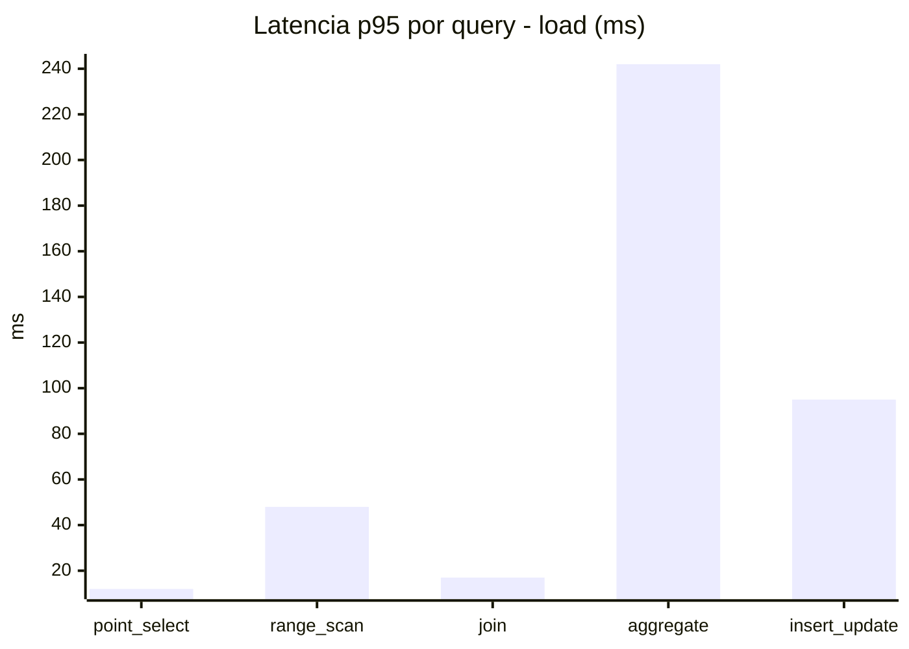
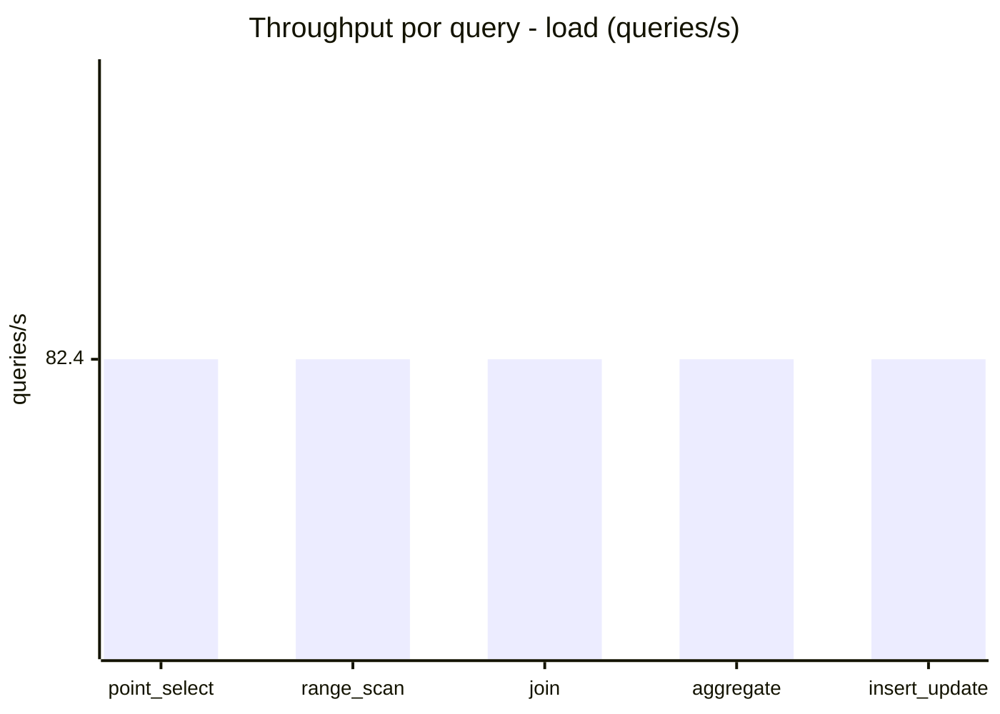
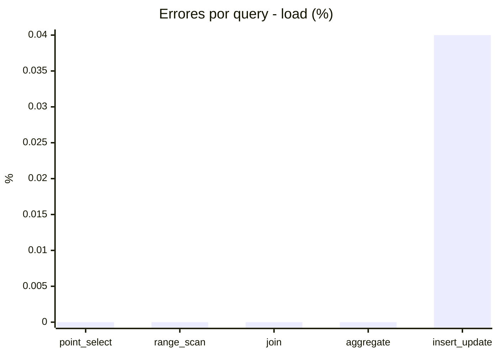
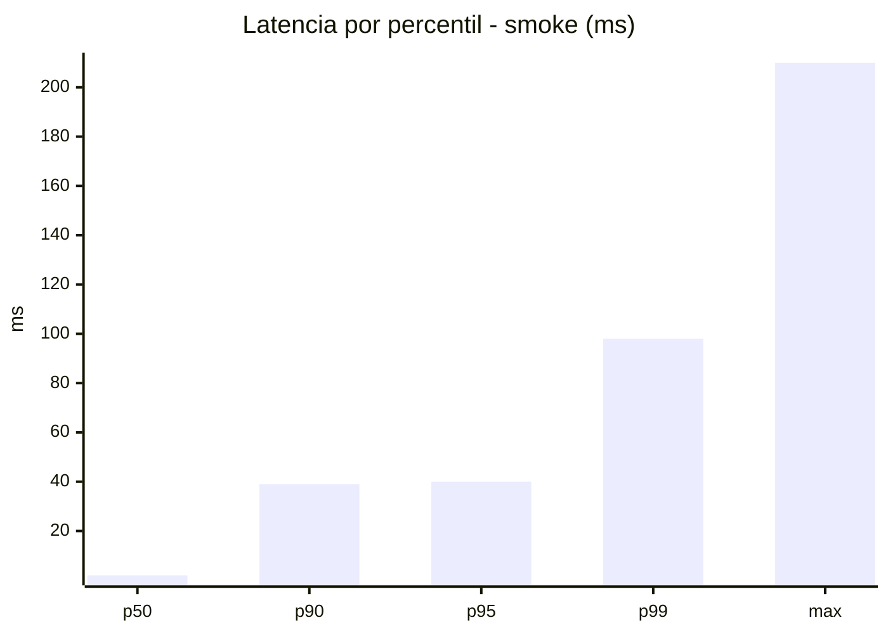
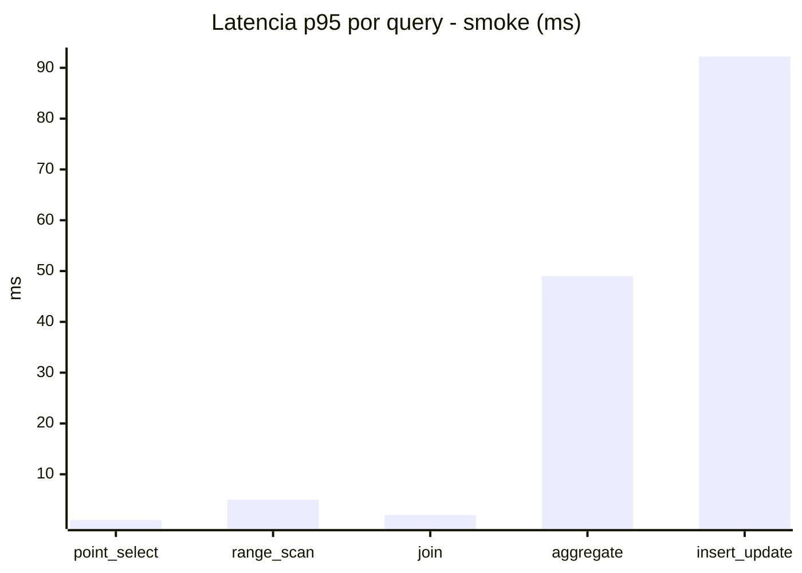
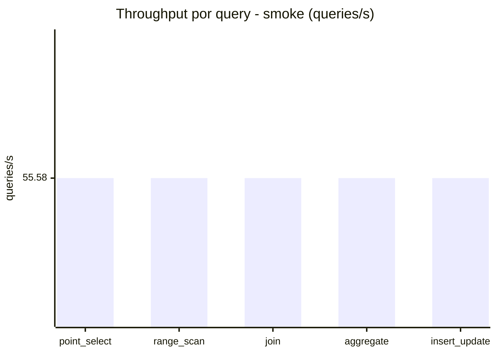
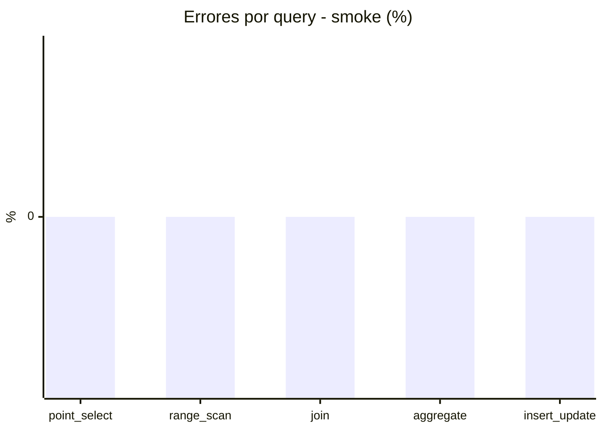

# Reporte de performance - SQL Server (k6)

**Fecha:** 2026-10-03 17:29 UTC  
**Veredicto (SLO):** `WARN`  
**Corrida:** [ver en GitHub Actions](https://github.com/lrbg/k6-sqlserver-lab/actions/runs/37140546037)  

## Analisis del agente de IA

WARN (fallback por umbrales)

- Error maximo: 0.01%
- p95 maximo: 205 ms

## Resultados

### Escenario: `load`

| Metrica | Valor |
| --- | --- |
| Queries ejecutadas | 24755 |
| Errores | 2 (0.01%) |
| Latencia media | 48.5 ms |
| p50 / p90 / p95 / p99 | 13 / 182 / 205 / 242 ms |
| Min / Max | 0 / 276 ms |
| Throughput | 412.02 queries/s |
| Duracion | 60.1 s |

Detalle por query

| Query | Ejecuciones | Error % | avg | p95 | p99 | q/s |
| --- | --- | --- | --- | --- | --- | --- |
| point_select | 4951 | 0% | 3.6 | 12 | 17 | 82.4 |
| range_scan | 4951 | 0% | 18.7 | 48 | 97 | 82.4 |
| join | 4951 | 0% | 7 | 17 | 21 | 82.4 |
| aggregate | 4951 | 0% | 178.4 | 242 | 252 | 82.4 |
| insert_update | 4951 | 0.04% | 34.8 | 95 | 166 | 82.4 |

### Escenario: `smoke`

| Metrica | Valor |
| --- | --- |
| Queries ejecutadas | 8365 |
| Errores | 0 (0%) |
| Latencia media | 10.8 ms |
| p50 / p90 / p95 / p99 | 2 / 39 / 40 / 98 ms |
| Min / Max | 0 / 210 ms |
| Throughput | 277.9 queries/s |
| Duracion | 30.1 s |

Detalle por query

| Query | Ejecuciones | Error % | avg | p95 | p99 | q/s |
| --- | --- | --- | --- | --- | --- | --- |
| point_select | 1673 | 0% | 0.6 | 1 | 4 | 55.58 |
| range_scan | 1673 | 0% | 3.2 | 5 | 16.3 | 55.58 |
| join | 1673 | 0% | 0.9 | 2 | 5 | 55.58 |
| aggregate | 1673 | 0% | 33.7 | 49 | 59 | 55.58 |
| insert_update | 1673 | 0% | 15.5 | 92.2 | 176.8 | 55.58 |

