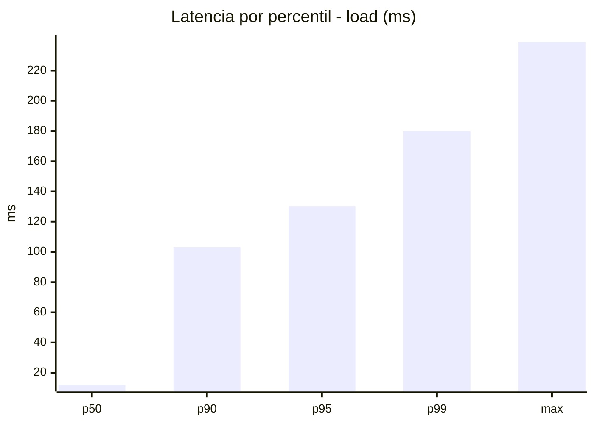
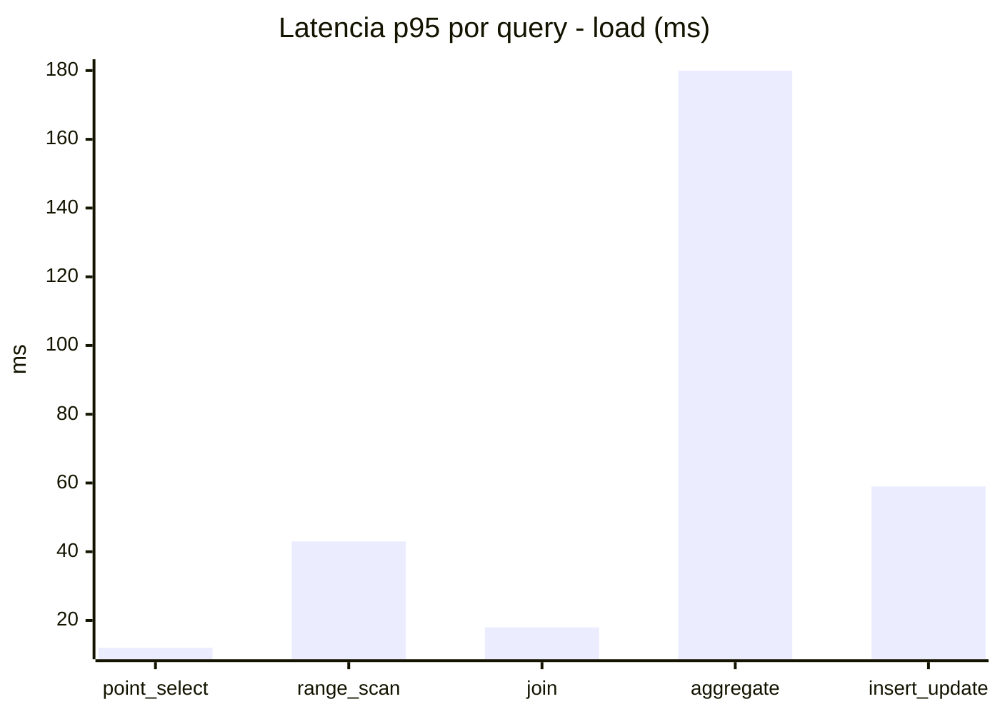
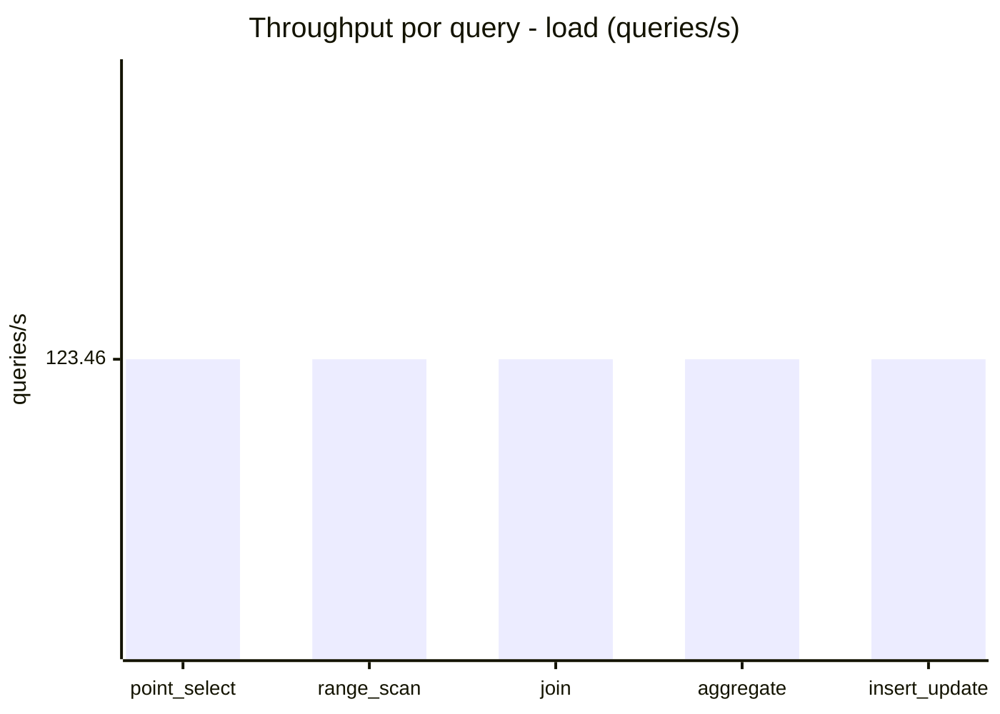
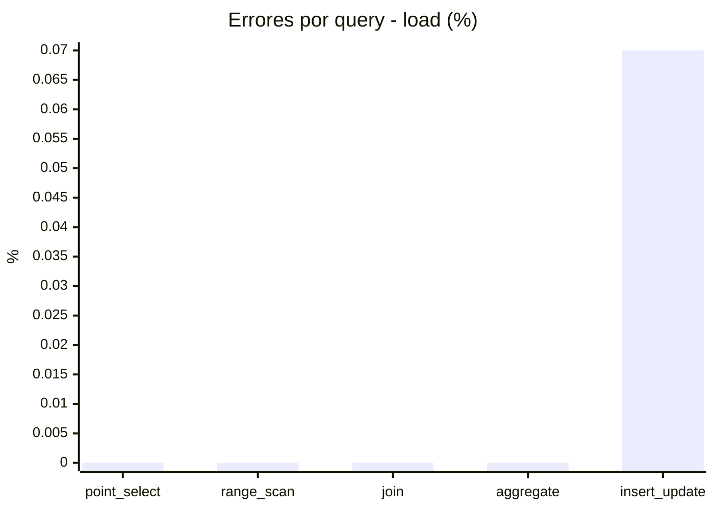
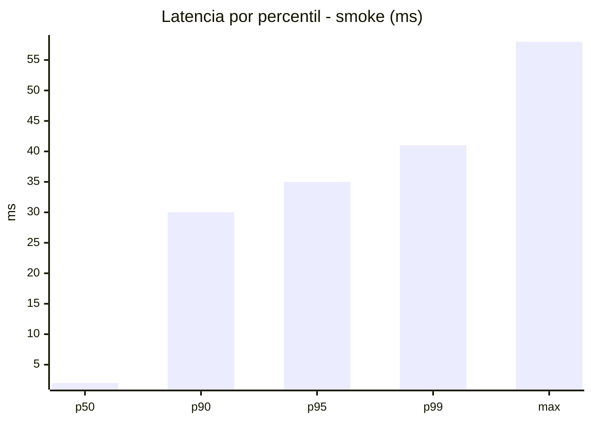
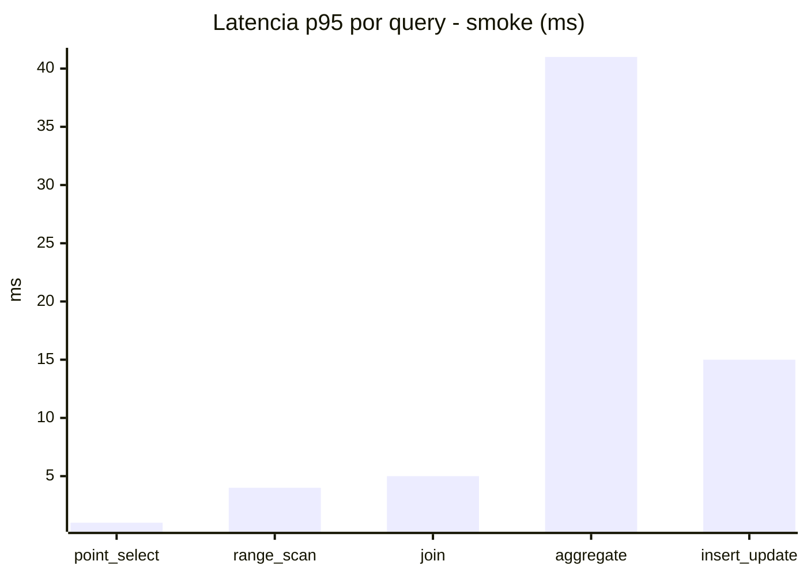
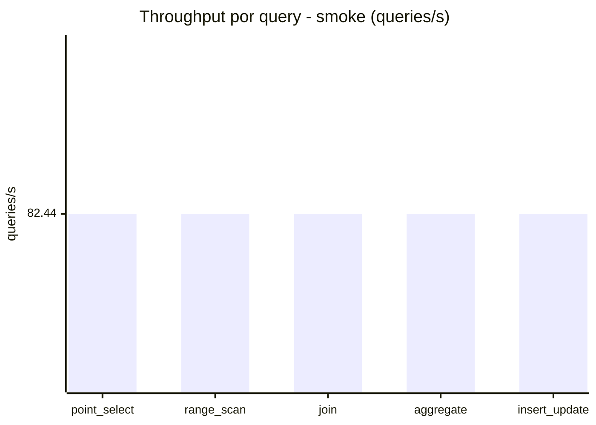
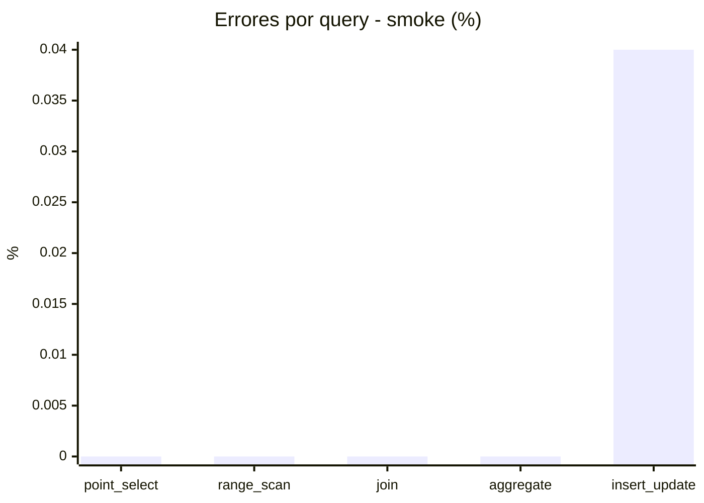

# Reporte de performance - SQL Server (k6)

**Fecha:** 2026-10-04 17:44 UTC  
**Veredicto (SLO):** `PASS`  
**Corrida:** [ver en GitHub Actions](https://github.com/lrbg/k6-sqlserver-lab/actions/runs/37221496372)  

## Analisis del agente de IA

PASS (fallback por umbrales)

- Error maximo: 0.01%
- p95 maximo: 130 ms

## Resultados

### Escenario: `load`

| Metrica | Valor |
| --- | --- |
| Queries ejecutadas | 37110 |
| Errores | 5 (0.01%) |
| Latencia media | 32.3 ms |
| p50 / p90 / p95 / p99 | 12 / 103.1 / 130 / 180 ms |
| Min / Max | 0 / 239 ms |
| Throughput | 617.29 queries/s |
| Duracion | 60.1 s |

Detalle por query

| Query | Ejecuciones | Error % | avg | p95 | p99 | q/s |
| --- | --- | --- | --- | --- | --- | --- |
| point_select | 7422 | 0% | 3.4 | 12 | 18 | 123.46 |
| range_scan | 7422 | 0% | 17.6 | 43 | 60 | 123.46 |
| join | 7422 | 0% | 6.5 | 18 | 25 | 123.46 |
| aggregate | 7422 | 0% | 109.4 | 180 | 195.8 | 123.46 |
| insert_update | 7422 | 0.07% | 24.8 | 59 | 83 | 123.46 |

### Escenario: `smoke`

| Metrica | Valor |
| --- | --- |
| Queries ejecutadas | 12380 |
| Errores | 1 (0.01%) |
| Latencia media | 7.3 ms |
| p50 / p90 / p95 / p99 | 2 / 30 / 35 / 41 ms |
| Min / Max | 0 / 58 ms |
| Throughput | 412.21 queries/s |
| Duracion | 30 s |

Detalle por query

| Query | Ejecuciones | Error % | avg | p95 | p99 | q/s |
| --- | --- | --- | --- | --- | --- | --- |
| point_select | 2476 | 0% | 0.5 | 1 | 2 | 82.44 |
| range_scan | 2476 | 0% | 2 | 4 | 11 | 82.44 |
| join | 2476 | 0% | 1.3 | 5 | 5 | 82.44 |
| aggregate | 2476 | 0% | 27.9 | 41 | 43 | 82.44 |
| insert_update | 2476 | 0.04% | 4.6 | 15 | 23 | 82.44 |

