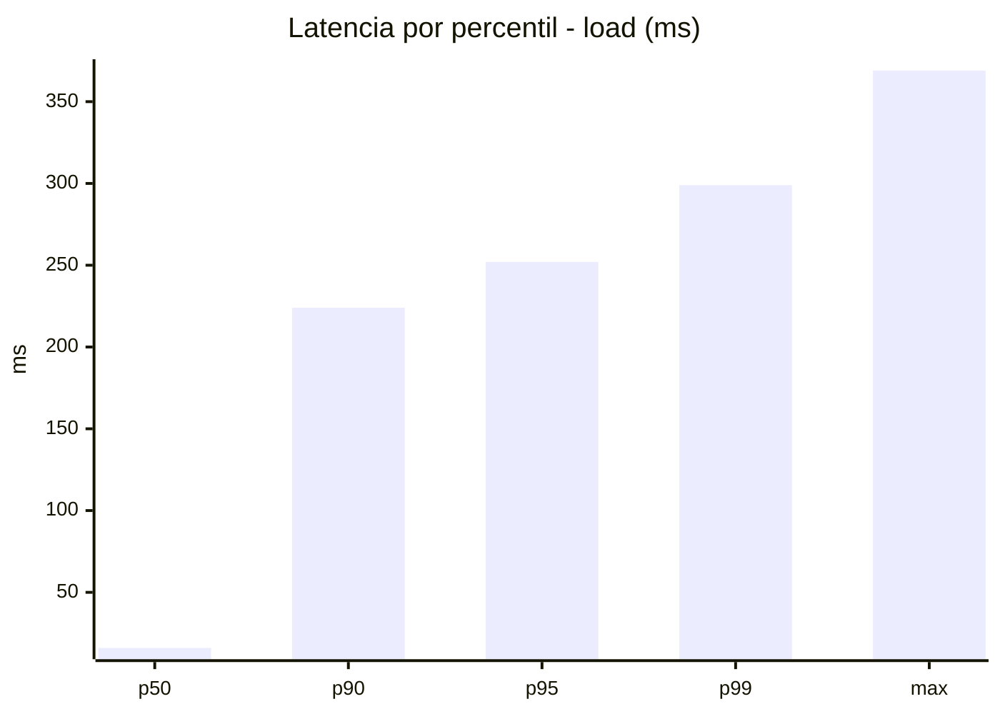
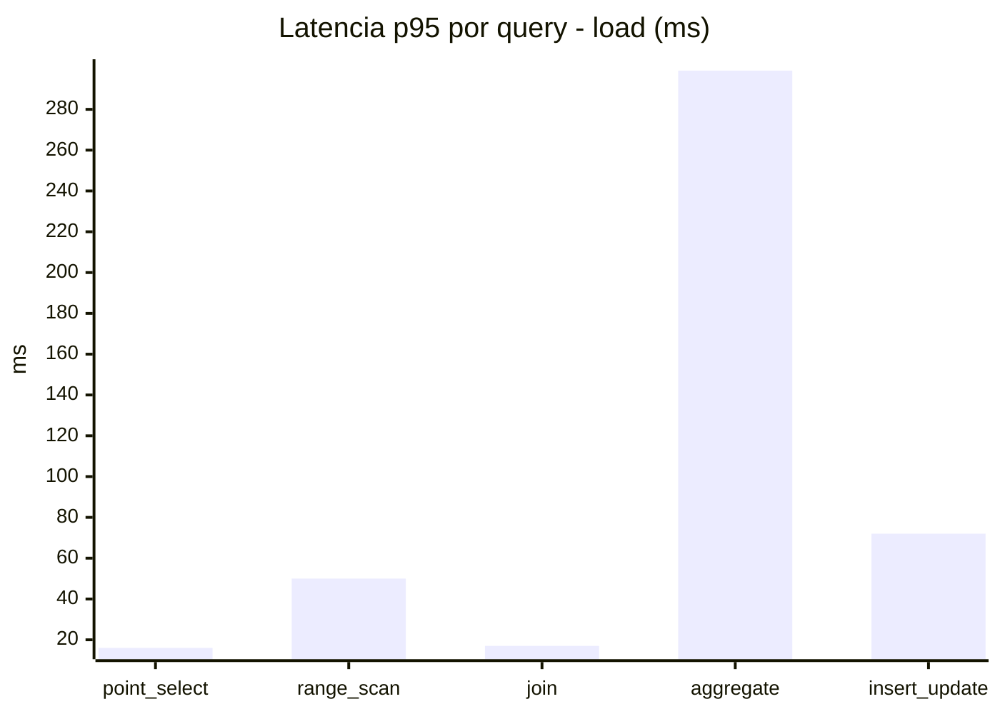
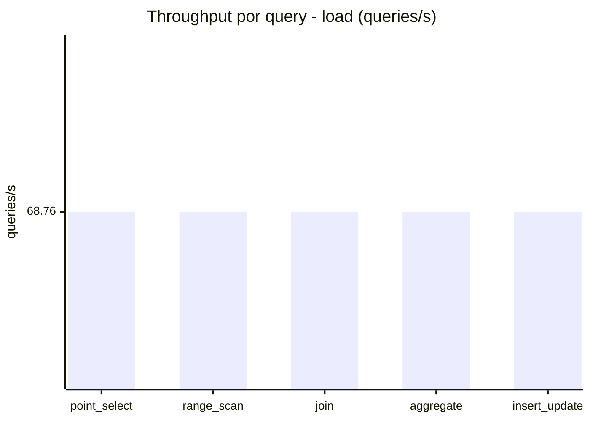
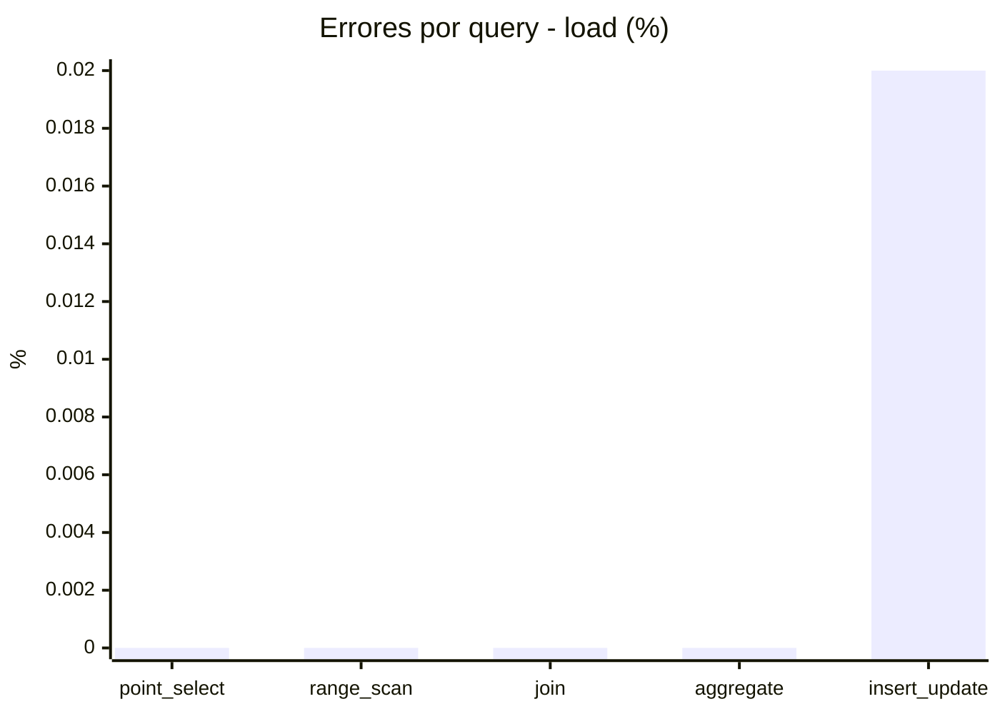
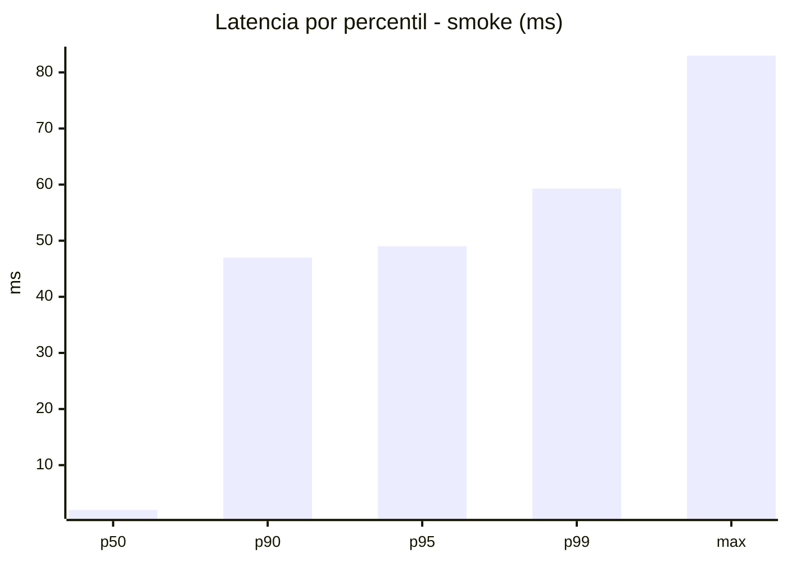
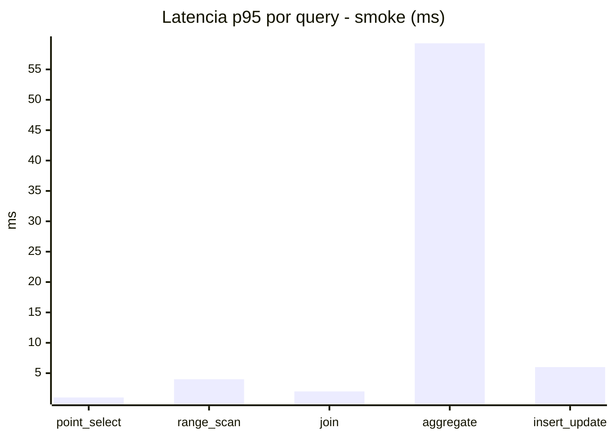
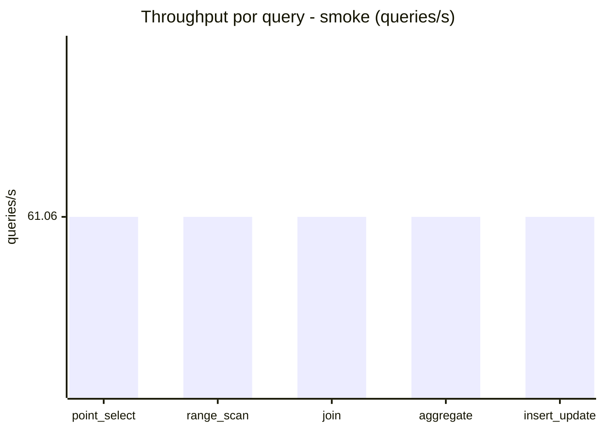
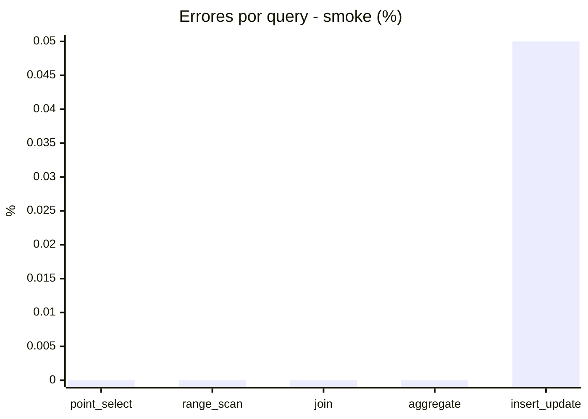

# Reporte de performance - SQL Server (k6)

**Fecha:** 2026-10-05 21:16 UTC  
**Veredicto (SLO):** `WARN`  
**Corrida:** [ver en GitHub Actions](https://github.com/lrbg/k6-sqlserver-lab/actions/runs/37374106335)  

## Analisis del agente de IA

WARN (fallback por umbrales)

- Error maximo: 0.01%
- p95 maximo: 252 ms

## Resultados

### Escenario: `load`

| Metrica | Valor |
| --- | --- |
| Queries ejecutadas | 20680 |
| Errores | 1 (0%) |
| Latencia media | 58.1 ms |
| p50 / p90 / p95 / p99 | 16 / 224 / 252 / 299 ms |
| Min / Max | 0 / 369 ms |
| Throughput | 343.8 queries/s |
| Duracion | 60.2 s |

Detalle por query

| Query | Ejecuciones | Error % | avg | p95 | p99 | q/s |
| --- | --- | --- | --- | --- | --- | --- |
| point_select | 4136 | 0% | 5.8 | 16 | 20 | 68.76 |
| range_scan | 4136 | 0% | 22 | 50 | 67 | 68.76 |
| join | 4136 | 0% | 8.4 | 17 | 21 | 68.76 |
| aggregate | 4136 | 0% | 221.5 | 299 | 317.7 | 68.76 |
| insert_update | 4136 | 0.02% | 32.8 | 72 | 91.7 | 68.76 |

### Escenario: `smoke`

| Metrica | Valor |
| --- | --- |
| Queries ejecutadas | 9170 |
| Errores | 1 (0.01%) |
| Latencia media | 9.8 ms |
| p50 / p90 / p95 / p99 | 2 / 47 / 49 / 59.3 ms |
| Min / Max | 0 / 83 ms |
| Throughput | 305.29 queries/s |
| Duracion | 30 s |

Detalle por query

| Query | Ejecuciones | Error % | avg | p95 | p99 | q/s |
| --- | --- | --- | --- | --- | --- | --- |
| point_select | 1834 | 0% | 0.7 | 1 | 3 | 61.06 |
| range_scan | 1834 | 0% | 2.7 | 4 | 6.7 | 61.06 |
| join | 1834 | 0% | 0.9 | 2 | 5 | 61.06 |
| aggregate | 1834 | 0% | 41.9 | 59.3 | 71 | 61.06 |
| insert_update | 1834 | 0.05% | 2.8 | 6 | 13 | 61.06 |

