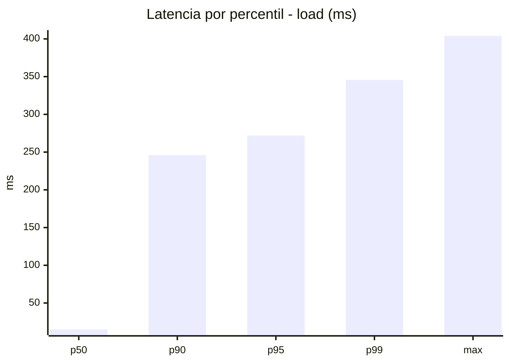
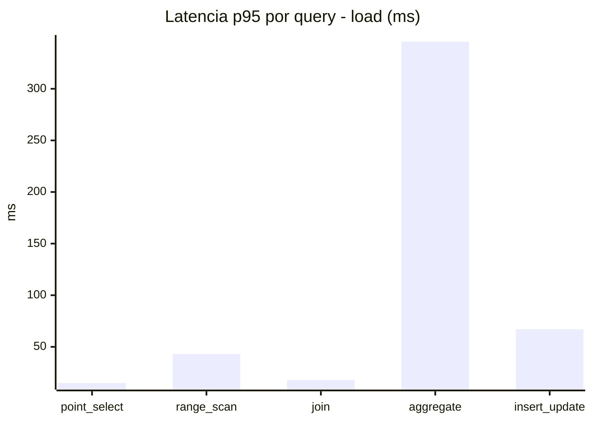
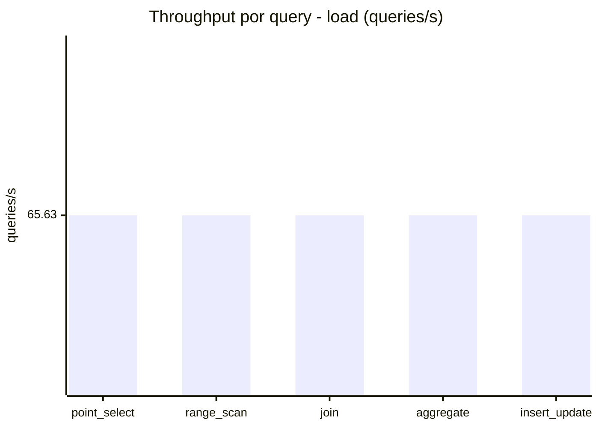
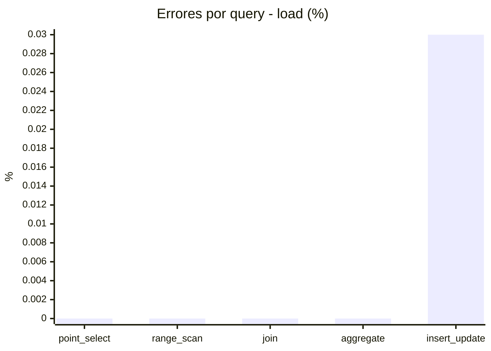
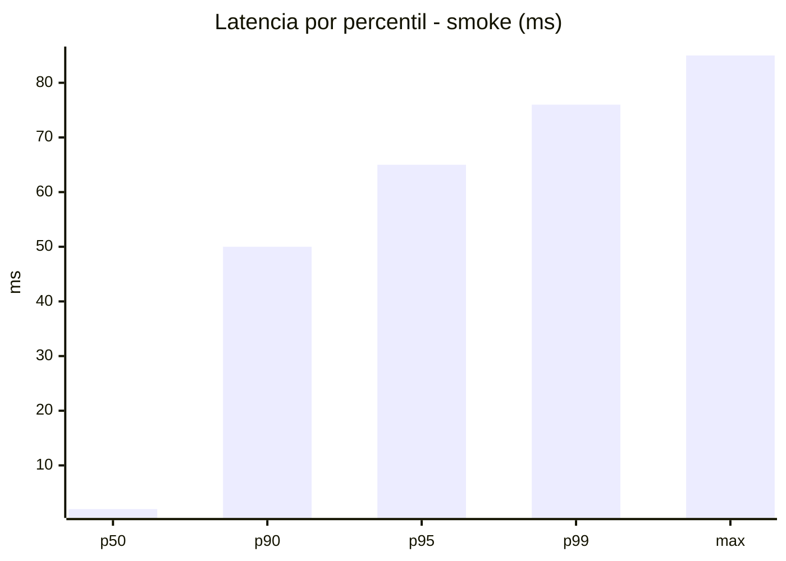
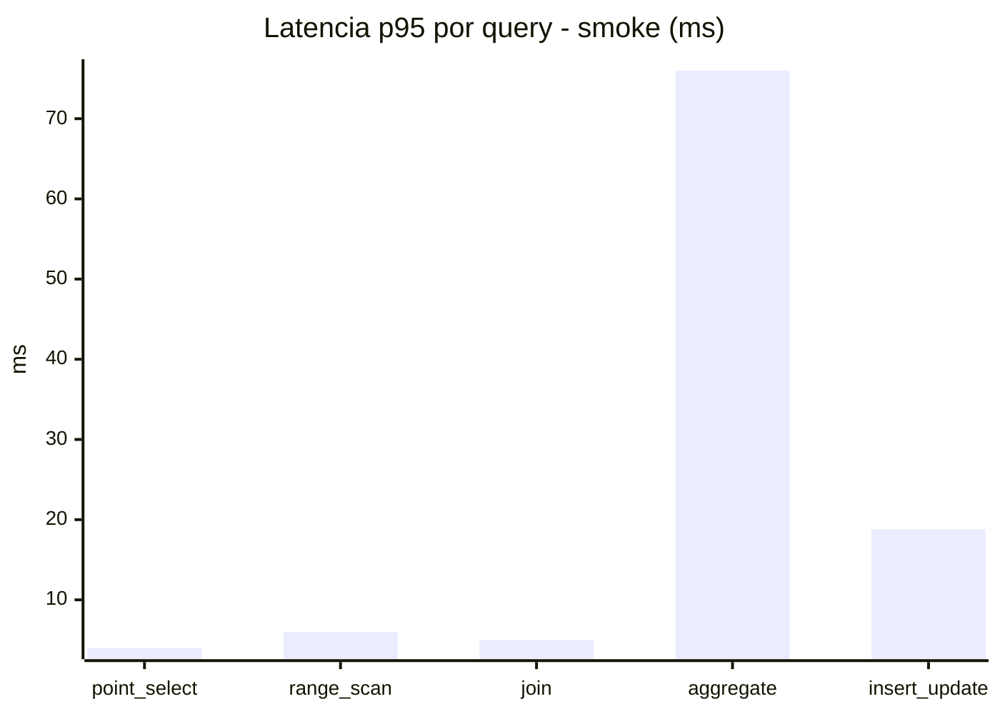
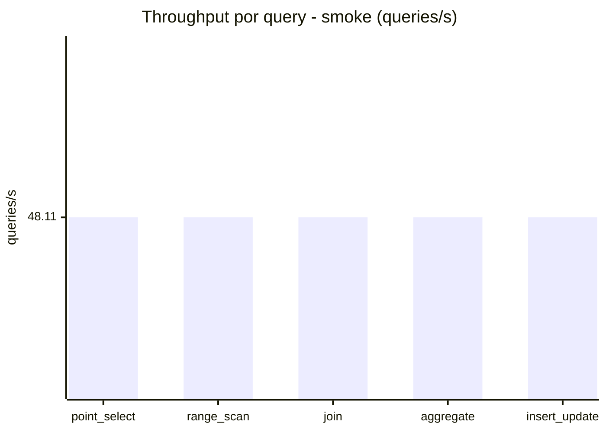
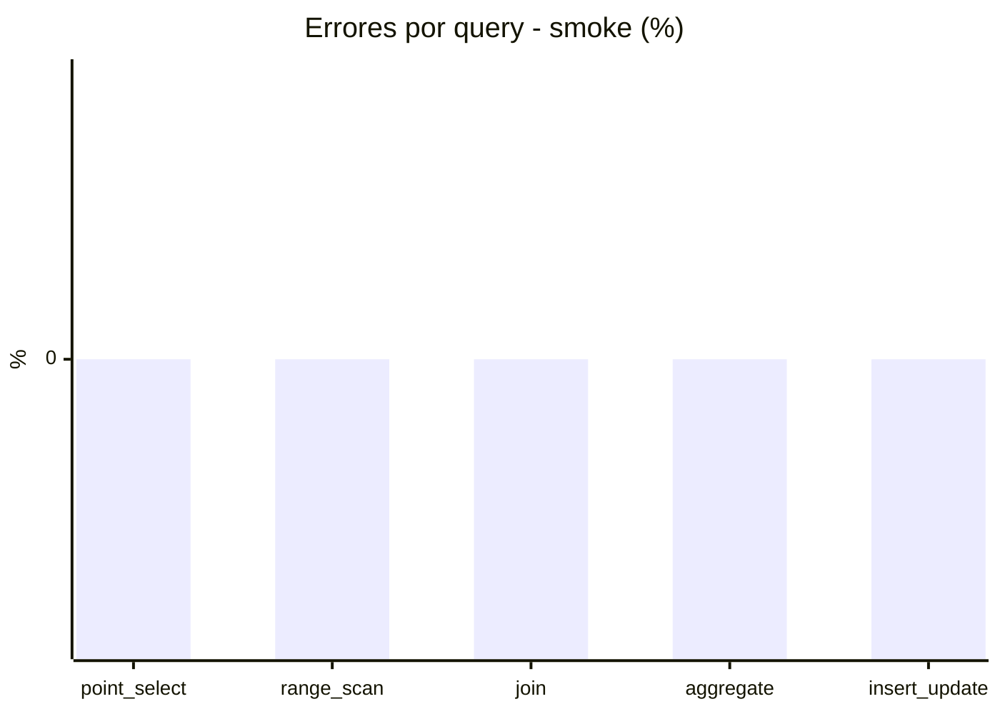

# Reporte de performance - SQL Server (k6)

**Fecha:** 2026-10-06 18:59 UTC  
**Veredicto (SLO):** `WARN`  
**Corrida:** [ver en GitHub Actions](https://github.com/lrbg/k6-sqlserver-lab/actions/runs/37515232546)  

## Analisis del agente de IA

WARN (fallback por umbrales)

- Error maximo: 0.01%
- p95 maximo: 272 ms

## Resultados

### Escenario: `load`

| Metrica | Valor |
| --- | --- |
| Queries ejecutadas | 19740 |
| Errores | 1 (0.01%) |
| Latencia media | 60.8 ms |
| p50 / p90 / p95 / p99 | 15 / 246 / 272 / 345.6 ms |
| Min / Max | 0 / 404 ms |
| Throughput | 328.15 queries/s |
| Duracion | 60.2 s |

Detalle por query

| Query | Ejecuciones | Error % | avg | p95 | p99 | q/s |
| --- | --- | --- | --- | --- | --- | --- |
| point_select | 3948 | 0% | 5.3 | 15 | 20 | 65.63 |
| range_scan | 3948 | 0% | 19.1 | 43 | 64 | 65.63 |
| join | 3948 | 0% | 8.6 | 18 | 23 | 65.63 |
| aggregate | 3948 | 0% | 242.1 | 345.6 | 379 | 65.63 |
| insert_update | 3948 | 0.03% | 29.1 | 67 | 89 | 65.63 |

### Escenario: `smoke`

| Metrica | Valor |
| --- | --- |
| Queries ejecutadas | 7220 |
| Errores | 0 (0%) |
| Latencia media | 12.4 ms |
| p50 / p90 / p95 / p99 | 2 / 50 / 65 / 76 ms |
| Min / Max | 0 / 85 ms |
| Throughput | 240.54 queries/s |
| Duracion | 30 s |

Detalle por query

| Query | Ejecuciones | Error % | avg | p95 | p99 | q/s |
| --- | --- | --- | --- | --- | --- | --- |
| point_select | 1444 | 0% | 1 | 4 | 5 | 48.11 |
| range_scan | 1444 | 0% | 3.2 | 6 | 10 | 48.11 |
| join | 1444 | 0% | 1.8 | 5 | 5 | 48.11 |
| aggregate | 1444 | 0% | 51.1 | 76 | 81 | 48.11 |
| insert_update | 1444 | 0% | 5.2 | 18.8 | 25 | 48.11 |

