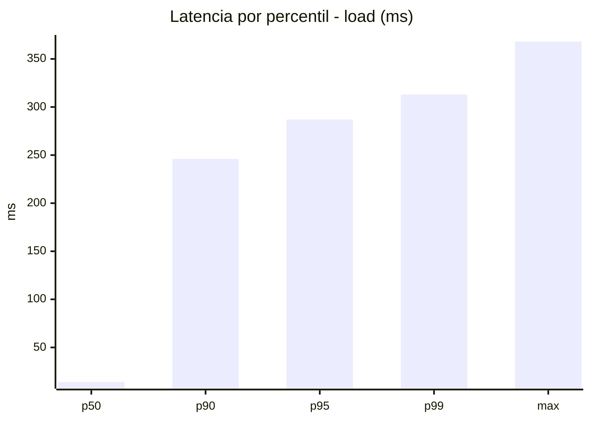
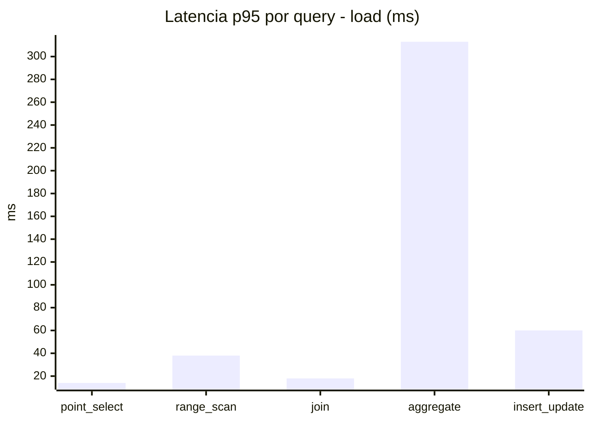
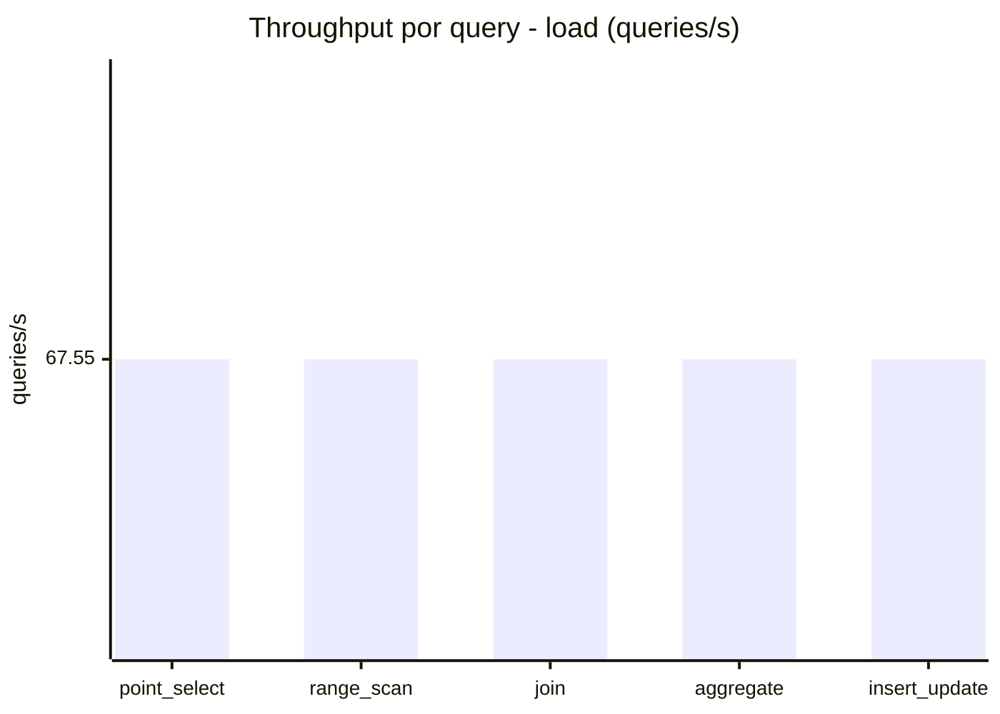
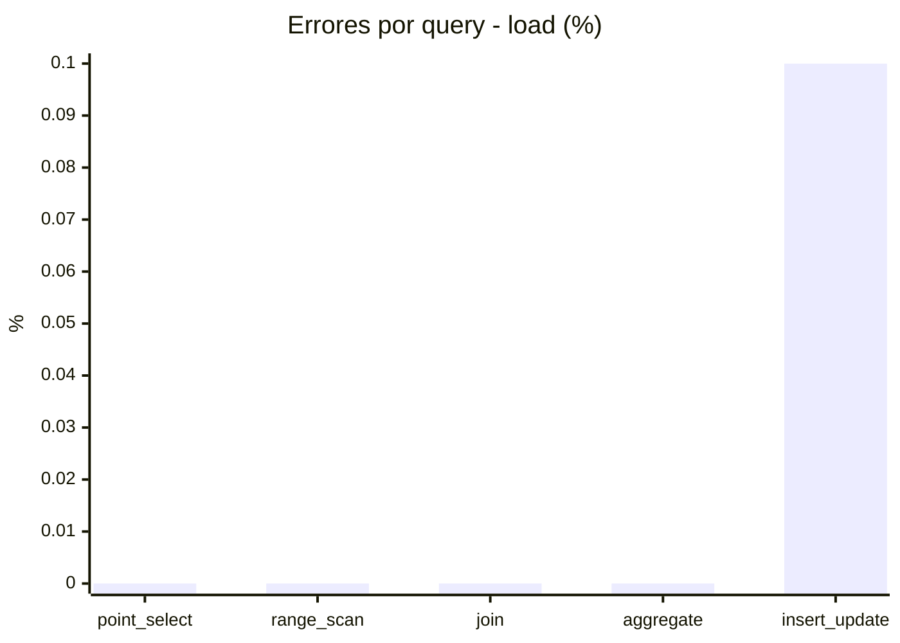
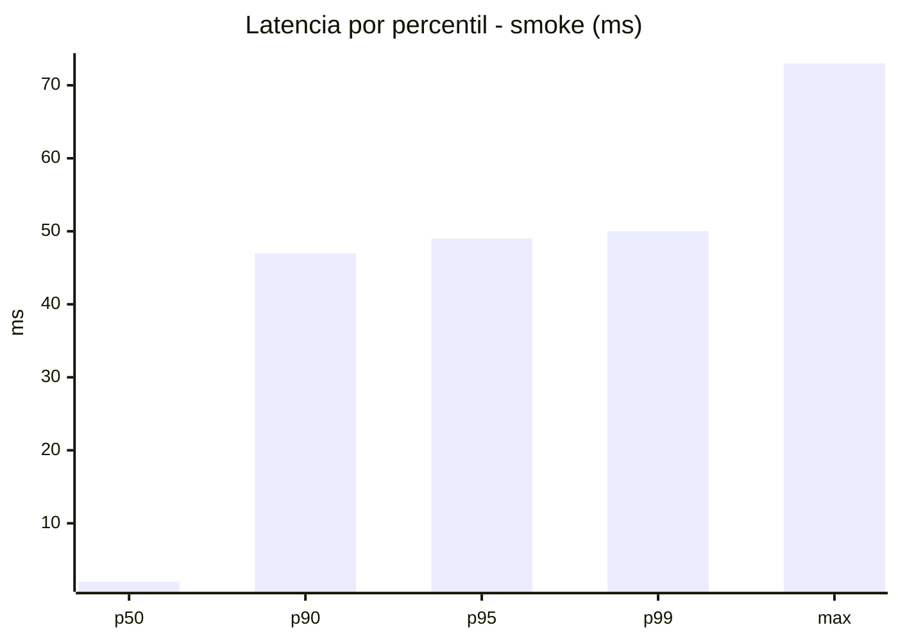
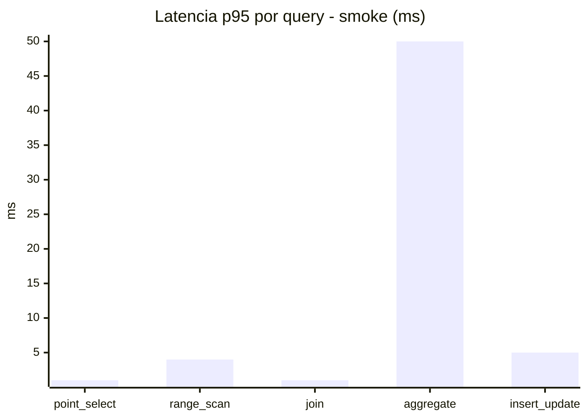
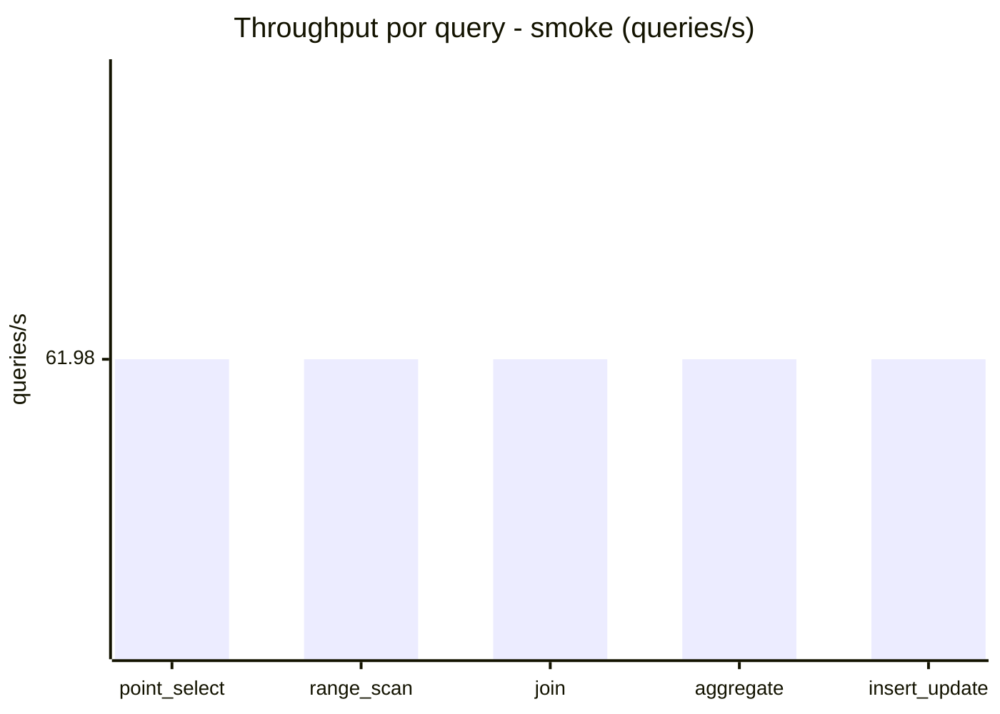
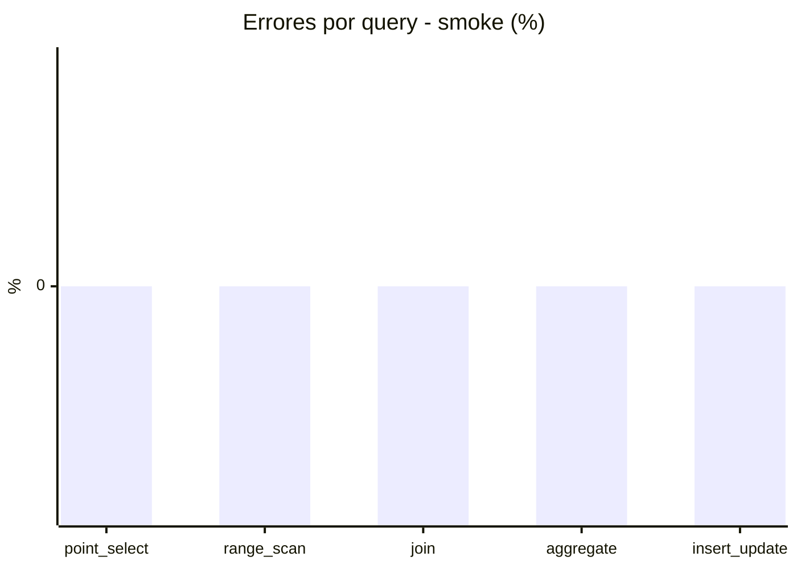

# Reporte de performance - SQL Server (k6)

**Fecha:** 2026-10-07 19:26 UTC  
**Veredicto (SLO):** `WARN`  
**Corrida:** [ver en GitHub Actions](https://github.com/lrbg/k6-sqlserver-lab/actions/runs/37674255921)  

## Analisis del agente de IA

WARN (fallback por umbrales)

- Error maximo: 0.02%
- p95 maximo: 287 ms

## Resultados

### Escenario: `load`

| Metrica | Valor |
| --- | --- |
| Queries ejecutadas | 20355 |
| Errores | 4 (0.02%) |
| Latencia media | 59.1 ms |
| p50 / p90 / p95 / p99 | 14 / 246 / 287 / 313 ms |
| Min / Max | 0 / 368 ms |
| Throughput | 337.76 queries/s |
| Duracion | 60.3 s |

Detalle por query

| Query | Ejecuciones | Error % | avg | p95 | p99 | q/s |
| --- | --- | --- | --- | --- | --- | --- |
| point_select | 4071 | 0% | 5.3 | 14 | 20 | 67.55 |
| range_scan | 4071 | 0% | 17.4 | 38 | 53 | 67.55 |
| join | 4071 | 0% | 8.7 | 18 | 21 | 67.55 |
| aggregate | 4071 | 0% | 236 | 313 | 322 | 67.55 |
| insert_update | 4071 | 0.1% | 27.9 | 60 | 78 | 67.55 |

### Escenario: `smoke`

| Metrica | Valor |
| --- | --- |
| Queries ejecutadas | 9305 |
| Errores | 0 (0%) |
| Latencia media | 9.6 ms |
| p50 / p90 / p95 / p99 | 2 / 47 / 49 / 50 ms |
| Min / Max | 0 / 73 ms |
| Throughput | 309.88 queries/s |
| Duracion | 30 s |

Detalle por query

| Query | Ejecuciones | Error % | avg | p95 | p99 | q/s |
| --- | --- | --- | --- | --- | --- | --- |
| point_select | 1861 | 0% | 0.6 | 1 | 2 | 61.98 |
| range_scan | 1861 | 0% | 2.8 | 4 | 6 | 61.98 |
| join | 1861 | 0% | 0.9 | 1 | 3 | 61.98 |
| aggregate | 1861 | 0% | 40.9 | 50 | 51 | 61.98 |
| insert_update | 1861 | 0% | 3.1 | 5 | 12.4 | 61.98 |

