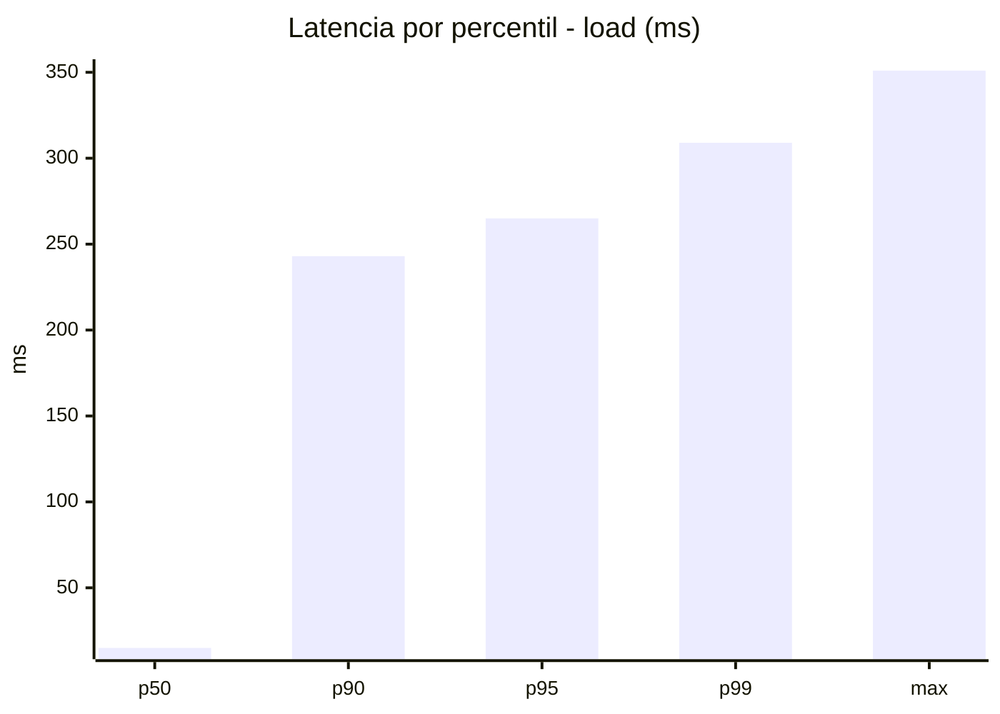
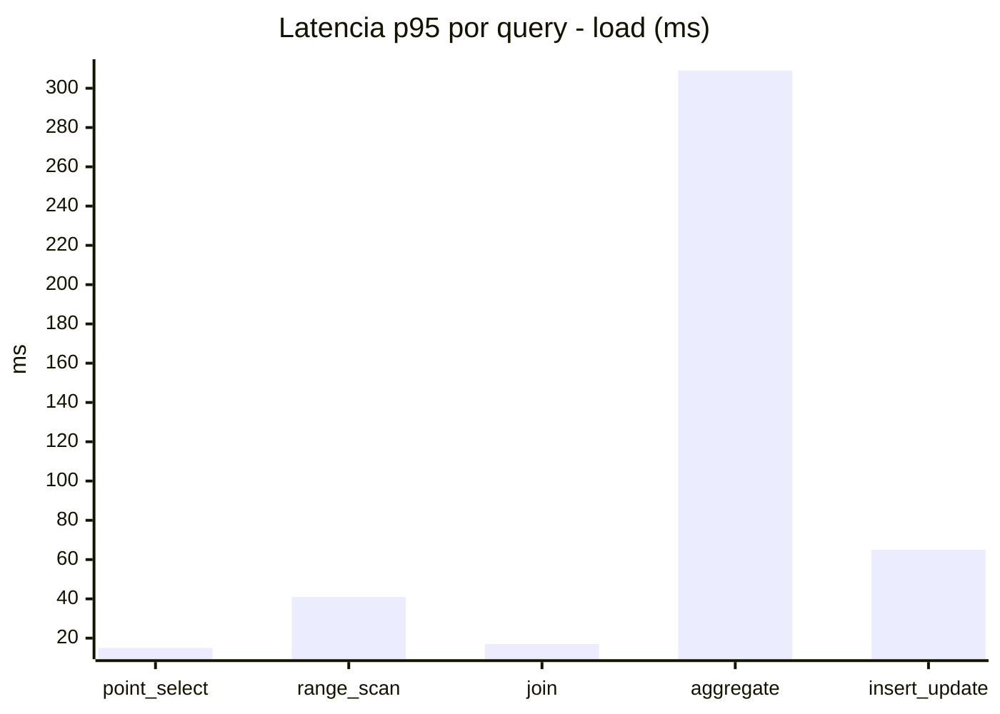
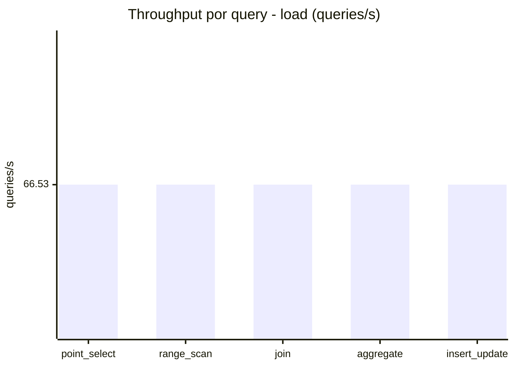
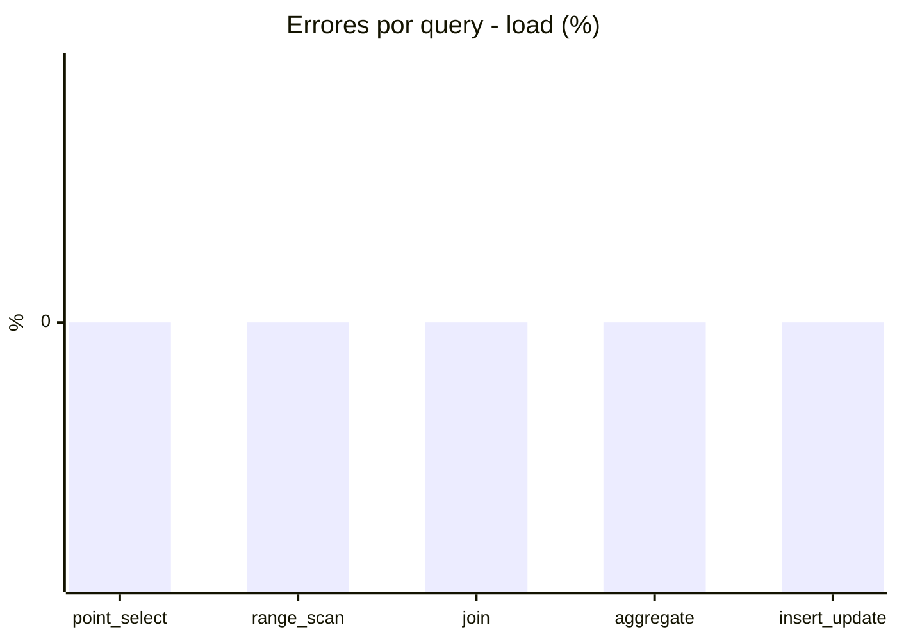
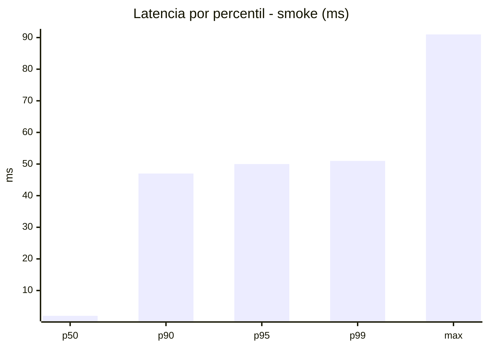
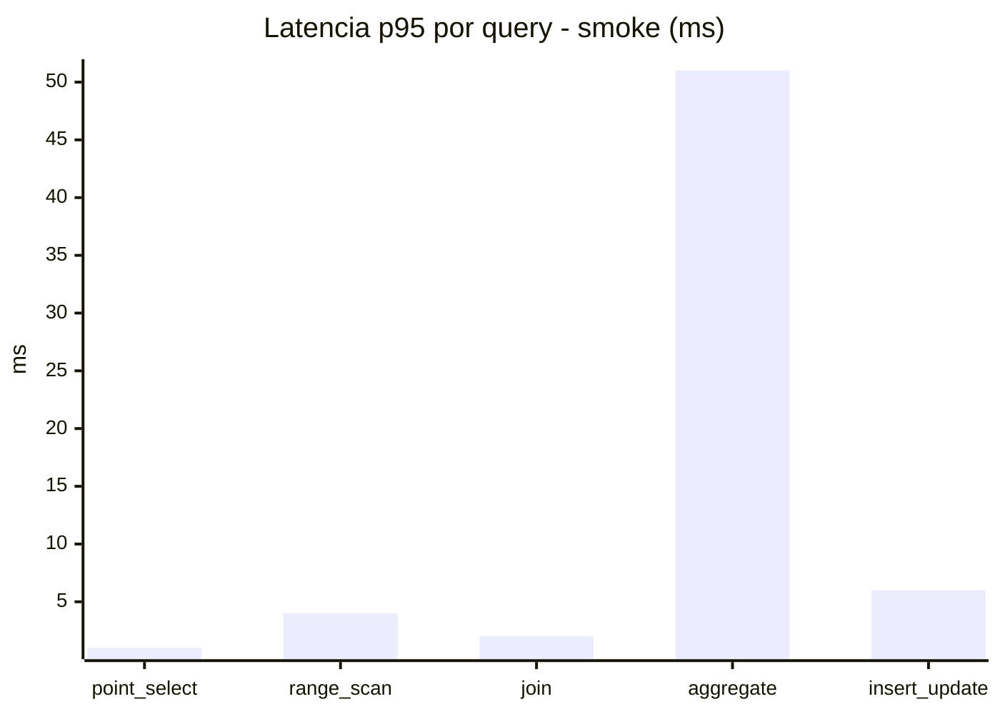
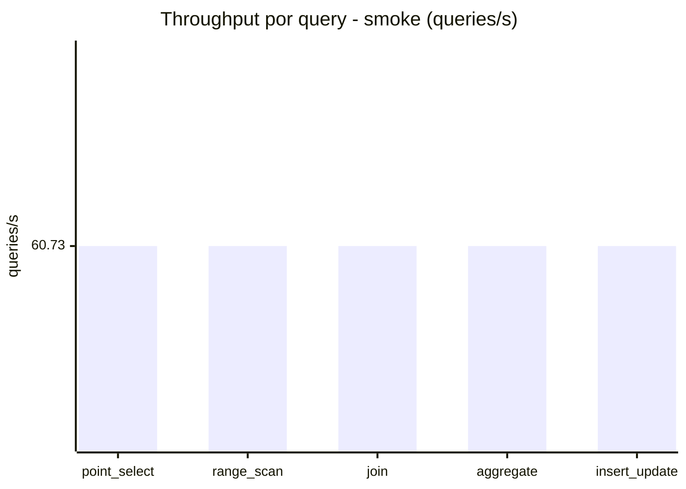
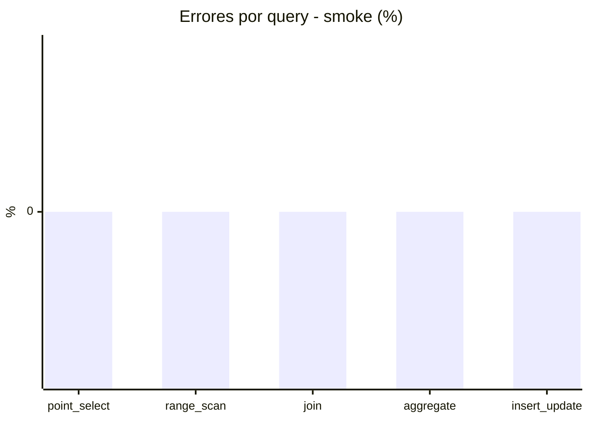

# Reporte de performance - SQL Server (k6)

**Fecha:** 2026-10-08 19:21 UTC  
**Veredicto (SLO):** `WARN`  
**Corrida:** [ver en GitHub Actions](https://github.com/lrbg/k6-sqlserver-lab/actions/runs/37831071076)  

## Analisis del agente de IA

WARN (fallback por umbrales)

- Error maximo: 0%
- p95 maximo: 265 ms

## Resultados

### Escenario: `load`

| Metrica | Valor |
| --- | --- |
| Queries ejecutadas | 20025 |
| Errores | 0 (0%) |
| Latencia media | 60 ms |
| p50 / p90 / p95 / p99 | 15 / 243 / 265 / 309 ms |
| Min / Max | 0 / 351 ms |
| Throughput | 332.66 queries/s |
| Duracion | 60.2 s |

Detalle por query

| Query | Ejecuciones | Error % | avg | p95 | p99 | q/s |
| --- | --- | --- | --- | --- | --- | --- |
| point_select | 4005 | 0% | 5.4 | 15 | 19 | 66.53 |
| range_scan | 4005 | 0% | 18.5 | 41 | 61 | 66.53 |
| join | 4005 | 0% | 8.9 | 17 | 21 | 66.53 |
| aggregate | 4005 | 0% | 237.7 | 309 | 322 | 66.53 |
| insert_update | 4005 | 0% | 29.7 | 65 | 79 | 66.53 |

### Escenario: `smoke`

| Metrica | Valor |
| --- | --- |
| Queries ejecutadas | 9125 |
| Errores | 0 (0%) |
| Latencia media | 9.8 ms |
| p50 / p90 / p95 / p99 | 2 / 47 / 50 / 51 ms |
| Min / Max | 0 / 91 ms |
| Throughput | 303.67 queries/s |
| Duracion | 30 s |

Detalle por query

| Query | Ejecuciones | Error % | avg | p95 | p99 | q/s |
| --- | --- | --- | --- | --- | --- | --- |
| point_select | 1825 | 0% | 0.6 | 1 | 2 | 60.73 |
| range_scan | 1825 | 0% | 2.8 | 4 | 6 | 60.73 |
| join | 1825 | 0% | 1 | 2 | 3 | 60.73 |
| aggregate | 1825 | 0% | 41.7 | 51 | 53.8 | 60.73 |
| insert_update | 1825 | 0% | 3.1 | 6 | 11 | 60.73 |

