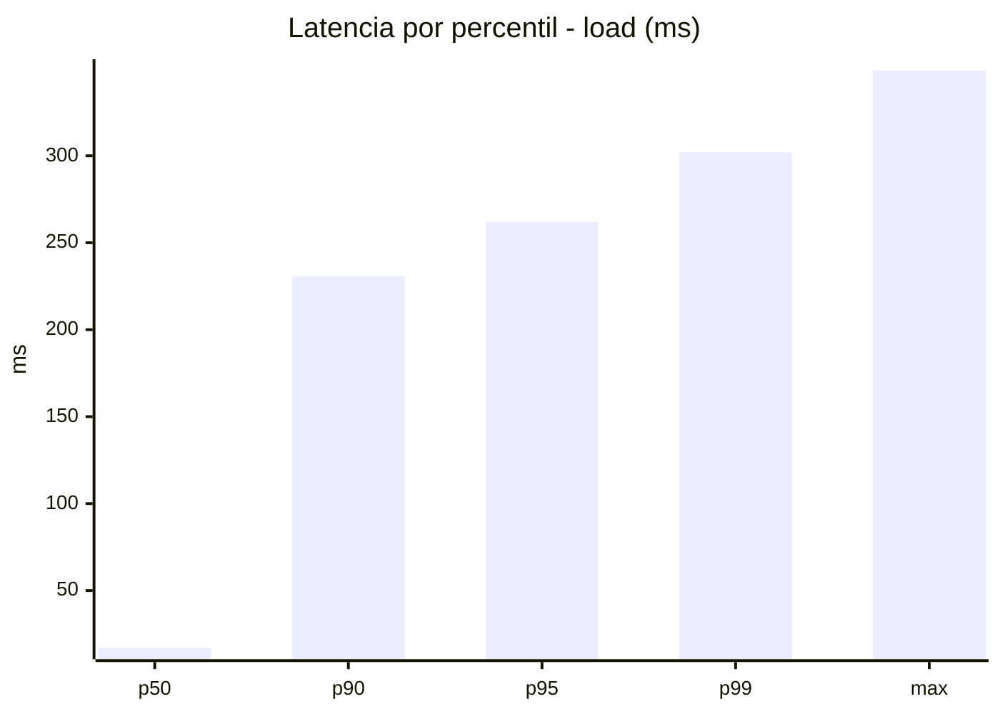
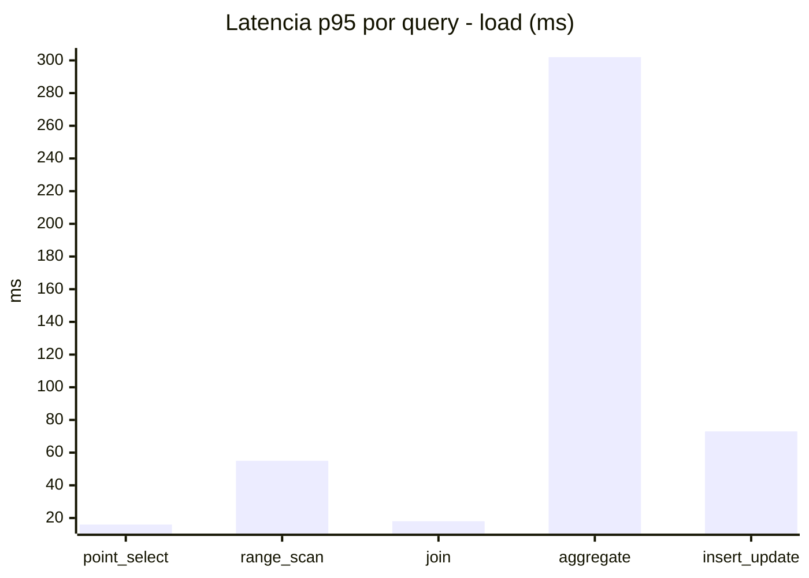
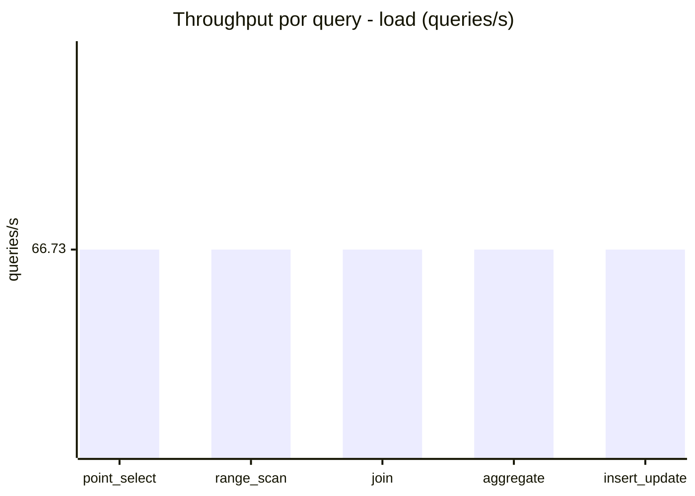
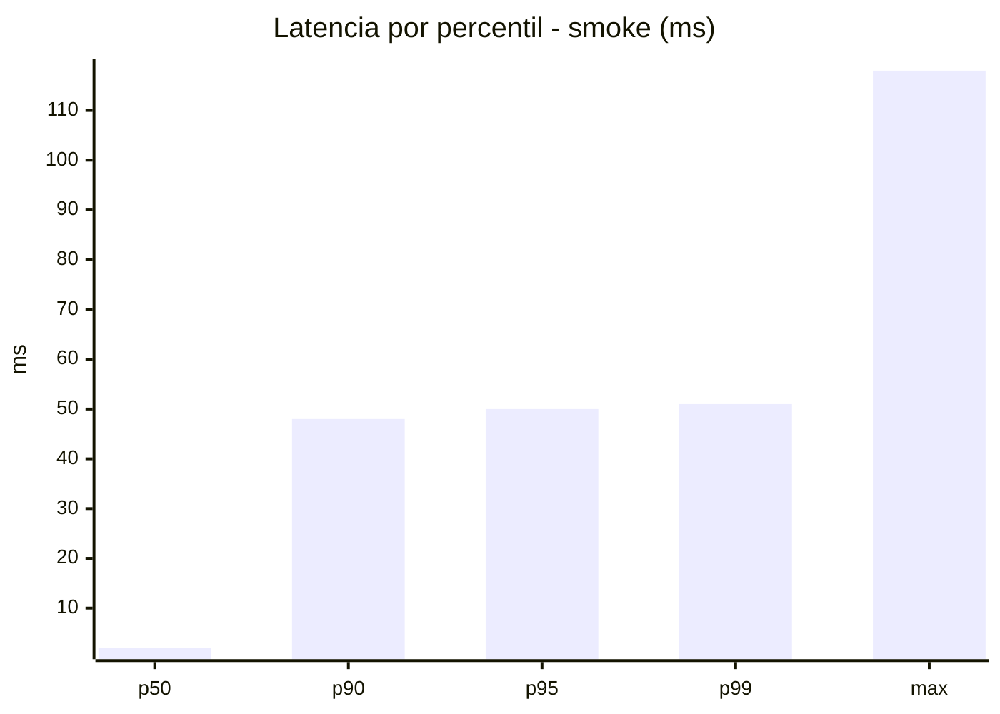
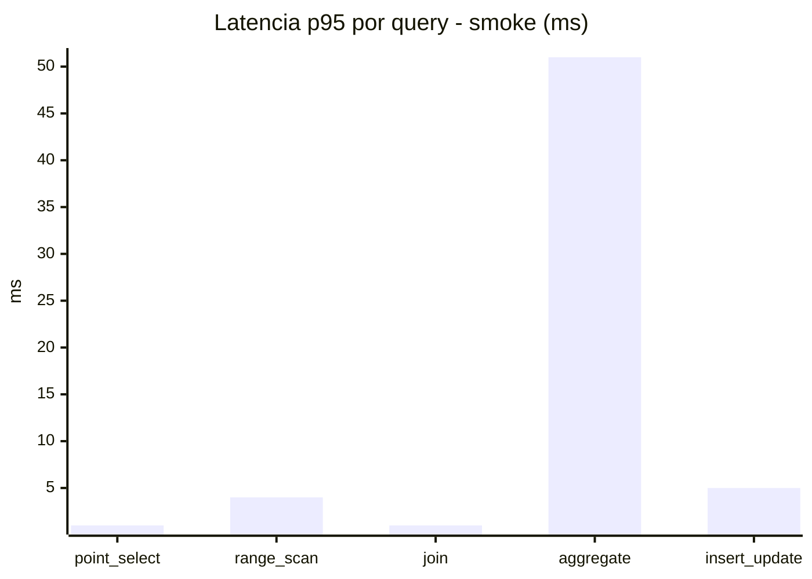
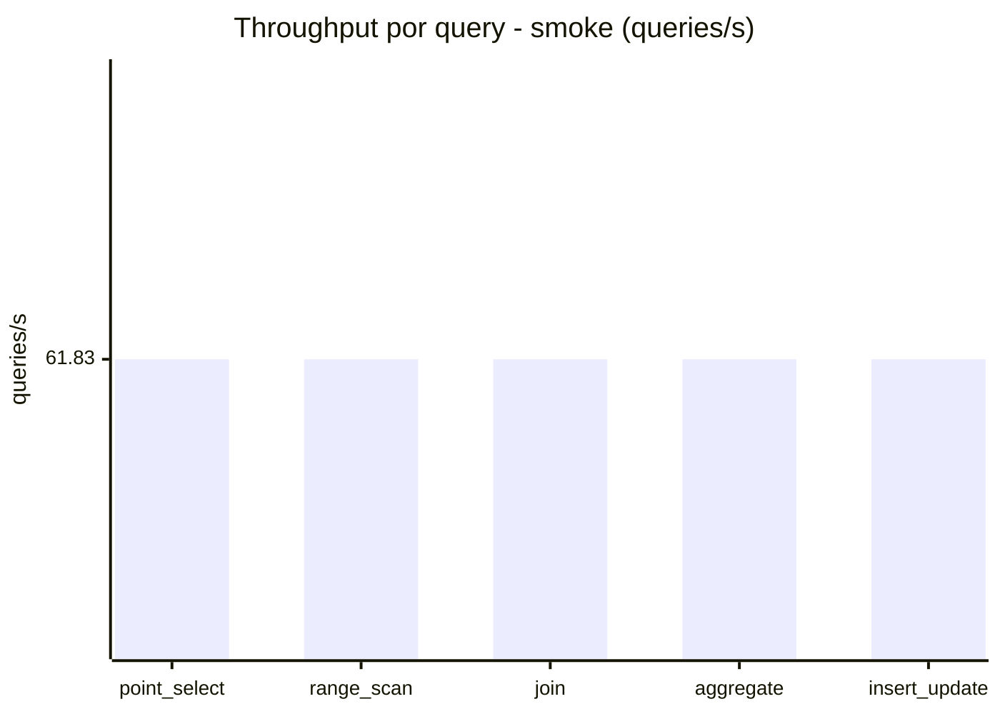
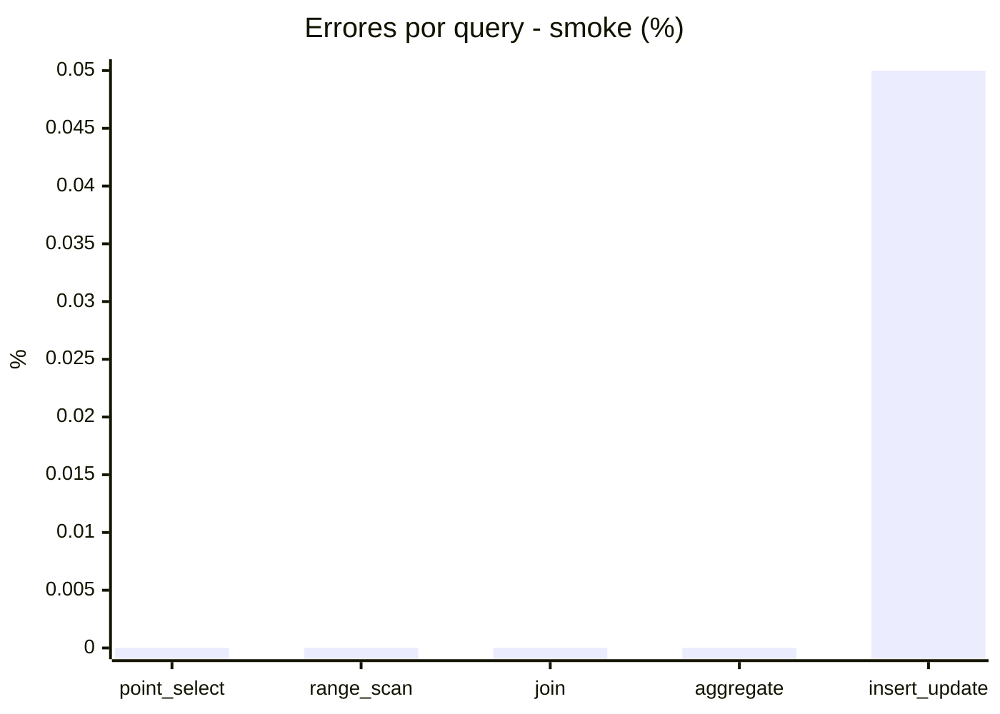

# Reporte de performance - SQL Server (k6)

**Fecha:** 2026-10-09 18:54 UTC  
**Veredicto (SLO):** `WARN`  
**Corrida:** [ver en GitHub Actions](https://github.com/lrbg/k6-sqlserver-lab/actions/runs/37976315712)  

## Analisis del agente de IA

WARN (fallback por umbrales)

- Error maximo: 0.01%
- p95 maximo: 262 ms

## Resultados

### Escenario: `load`

| Metrica | Valor |
| --- | --- |
| Queries ejecutadas | 20095 |
| Errores | 2 (0.01%) |
| Latencia media | 59.8 ms |
| p50 / p90 / p95 / p99 | 17 / 230.6 / 262 / 302 ms |
| Min / Max | 0 / 349 ms |
| Throughput | 333.64 queries/s |
| Duracion | 60.2 s |

Detalle por query

| Query | Ejecuciones | Error % | avg | p95 | p99 | q/s |
| --- | --- | --- | --- | --- | --- | --- |
| point_select | 4019 | 0% | 5.7 | 16 | 20 | 66.73 |
| range_scan | 4019 | 0% | 23.2 | 55 | 74 | 66.73 |
| join | 4019 | 0% | 8.6 | 18 | 21 | 66.73 |
| aggregate | 4019 | 0% | 226.6 | 302 | 319 | 66.73 |
| insert_update | 4019 | 0.05% | 35 | 73 | 94 | 66.73 |

### Escenario: `smoke`

| Metrica | Valor |
| --- | --- |
| Queries ejecutadas | 9285 |
| Errores | 1 (0.01%) |
| Latencia media | 9.7 ms |
| p50 / p90 / p95 / p99 | 2 / 48 / 50 / 51 ms |
| Min / Max | 0 / 118 ms |
| Throughput | 309.13 queries/s |
| Duracion | 30 s |

Detalle por query

| Query | Ejecuciones | Error % | avg | p95 | p99 | q/s |
| --- | --- | --- | --- | --- | --- | --- |
| point_select | 1857 | 0% | 0.6 | 1 | 1.4 | 61.83 |
| range_scan | 1857 | 0% | 2.7 | 4 | 10 | 61.83 |
| join | 1857 | 0% | 0.9 | 1 | 3 | 61.83 |
| aggregate | 1857 | 0% | 41.4 | 51 | 52.4 | 61.83 |
| insert_update | 1857 | 0.05% | 2.8 | 5 | 12 | 61.83 |

