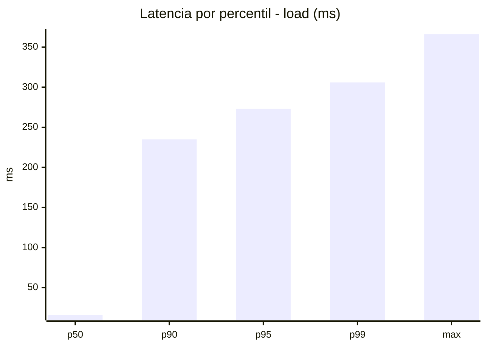
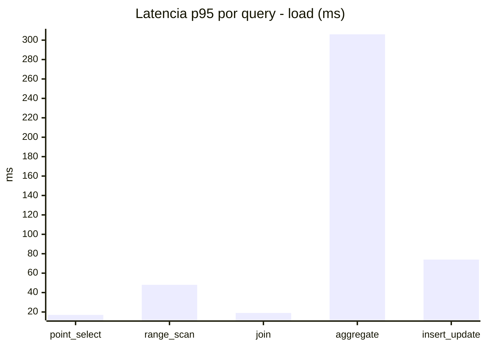
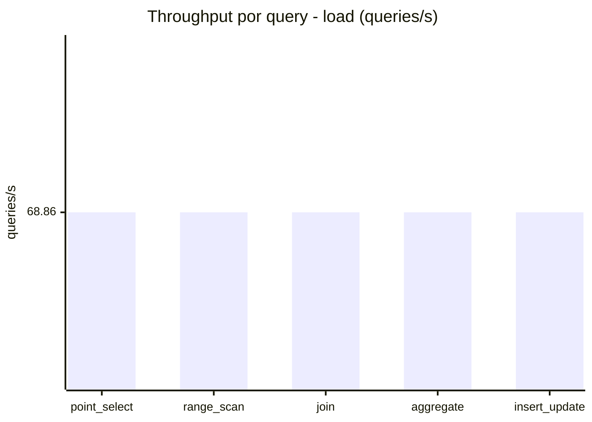
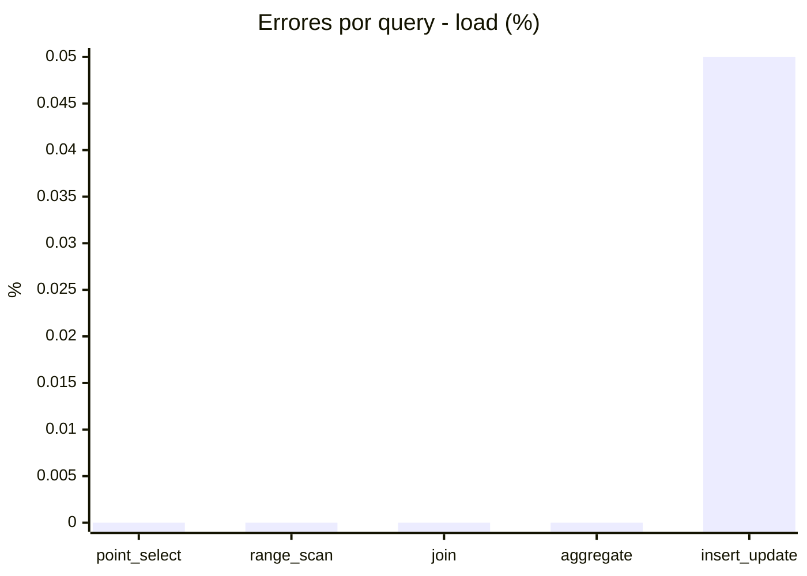
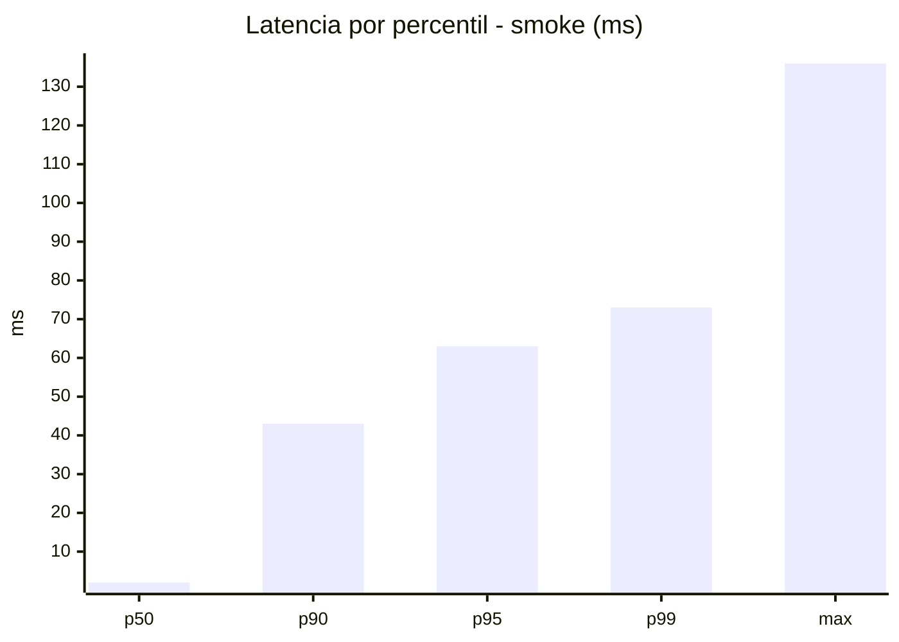
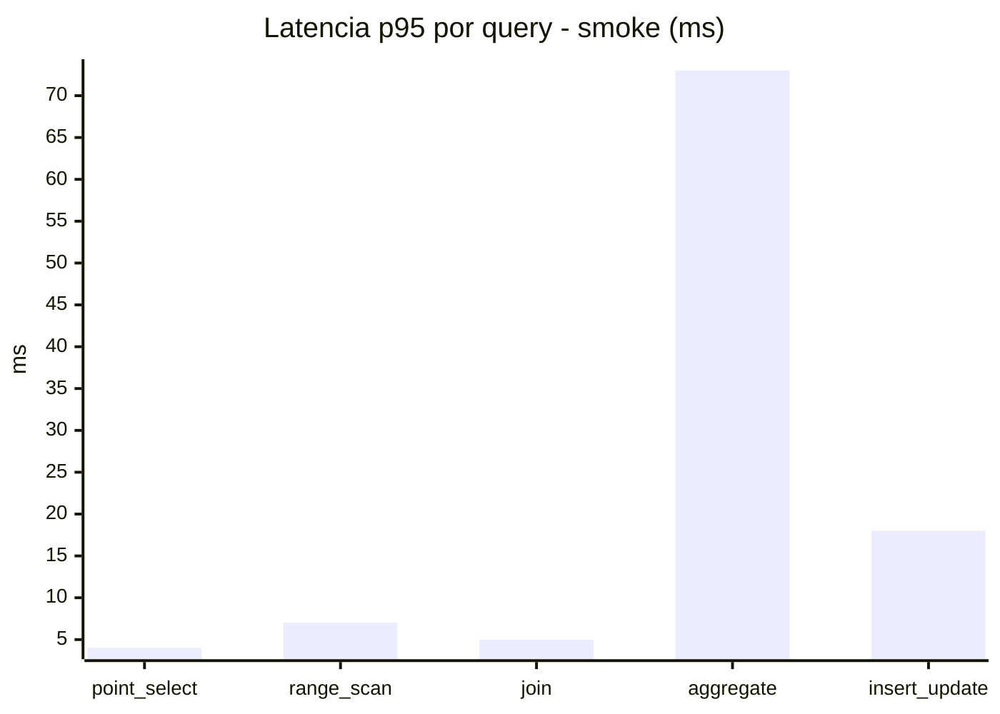
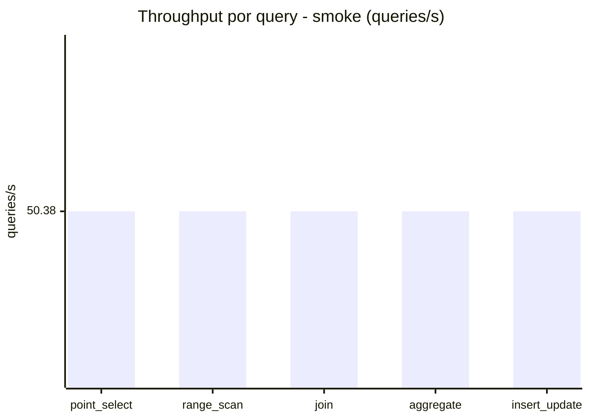
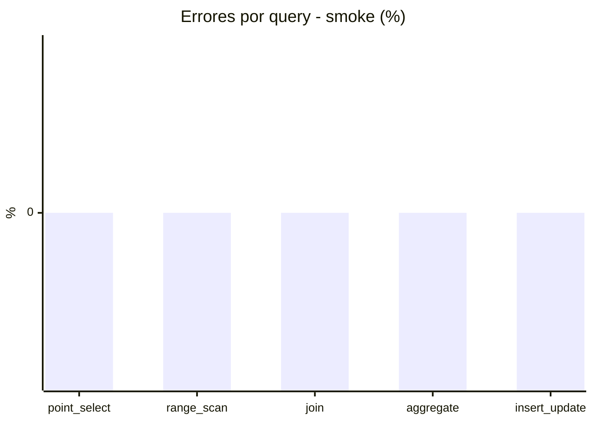

# Reporte de performance - SQL Server (k6)

**Fecha:** 2026-10-10 17:56 UTC  
**Veredicto (SLO):** `WARN`  
**Corrida:** [ver en GitHub Actions](https://github.com/lrbg/k6-sqlserver-lab/actions/runs/38073659646)  

## Analisis del agente de IA

WARN (fallback por umbrales)

- Error maximo: 0.01%
- p95 maximo: 273 ms

## Resultados

### Escenario: `load`

| Metrica | Valor |
| --- | --- |
| Queries ejecutadas | 20715 |
| Errores | 2 (0.01%) |
| Latencia media | 58 ms |
| p50 / p90 / p95 / p99 | 16 / 235 / 273 / 306 ms |
| Min / Max | 0 / 366 ms |
| Throughput | 344.29 queries/s |
| Duracion | 60.2 s |

Detalle por query

| Query | Ejecuciones | Error % | avg | p95 | p99 | q/s |
| --- | --- | --- | --- | --- | --- | --- |
| point_select | 4143 | 0% | 5.2 | 17 | 21 | 68.86 |
| range_scan | 4143 | 0% | 21.2 | 48 | 67 | 68.86 |
| join | 4143 | 0% | 8.5 | 19 | 22 | 68.86 |
| aggregate | 4143 | 0% | 223 | 306 | 324 | 68.86 |
| insert_update | 4143 | 0.05% | 32.2 | 74 | 97 | 68.86 |

### Escenario: `smoke`

| Metrica | Valor |
| --- | --- |
| Queries ejecutadas | 7565 |
| Errores | 0 (0%) |
| Latencia media | 11.9 ms |
| p50 / p90 / p95 / p99 | 2 / 43 / 63 / 73 ms |
| Min / Max | 0 / 136 ms |
| Throughput | 251.91 queries/s |
| Duracion | 30 s |

Detalle por query

| Query | Ejecuciones | Error % | avg | p95 | p99 | q/s |
| --- | --- | --- | --- | --- | --- | --- |
| point_select | 1513 | 0% | 0.9 | 4 | 5 | 50.38 |
| range_scan | 1513 | 0% | 3.1 | 7 | 11 | 50.38 |
| join | 1513 | 0% | 1.6 | 5 | 5 | 50.38 |
| aggregate | 1513 | 0% | 48.6 | 73 | 78 | 50.38 |
| insert_update | 1513 | 0% | 5.2 | 18 | 25.9 | 50.38 |

